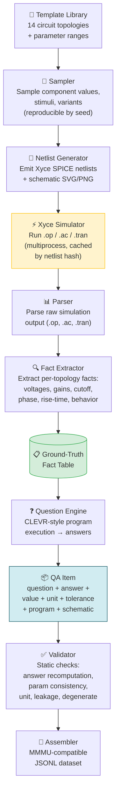

# electronics-qa-generator

A pipeline that generates **multimodal electronics circuit Q/A items** with
**SPICE/Xyce-grounded ground-truth answers**, targeting an
[MMMU](https://mmmu-benchmark.github.io/)-style benchmark for the Electronics
subfield.

Inspired by [**CLEVR**](docs/clevr_explained.md) (questions backed by
executable programs) and [**AutoCkt**](docs/autockt_explained.md)
(simulator-in-the-loop as source of truth).

> **Core principle:** Simulation establishes facts → code derives answers →
> the LLM only paraphrases or reviews truth that has already been computed.
> The LLM is never the source of numerical truth.

> **Design principle (question templates):** The solver sees only the
> **schematic image + question text** — never the netlist. So the key to every
> question template is that **(image + question) must cover every netlist fact
> the answer depends on.** A value the answer needs that appears in neither the
> drawing nor the prompt makes the item silently unanswerable. We enforce this
> with multiple independent layers — see
> [Multimodal self-containment](#multimodal-self-containment-the-non-negotiable-of-template-design).

See [`docs/plan.md`](docs/plan.md), [`docs/architecture.md`](docs/architecture.md),
and [`AGENTS.md`](AGENTS.md) for the full design and pipeline commands.

## Quick start

```bash
git clone https://github.com/xiechao06/electronics-qa-generator
cd electronics-qa-generator
```

Then prompt you favorite coding agent:

> *"Generate roughly 10,000 Q/A pairs."*

> *"Generate roughly 10,000 Q/A pairs without visual validation."*

> *"Generate roughly 10,000 Q/A pairs without visual validation, across topologies voltage_divider, rc_lowpass and rc_highpass"*

The agent reads `AGENTS.md`, runs the pipeline, and produces JSONL output
with schematics. No manual setup beyond `uv sync`.

To run directly:

```bash
uv sync --extra sim --extra data --extra render

# List available topologies
uv run python scripts/batch_generate.py --list-topologies

# Small batch (200 items, ~1 second):
uv run python scripts/batch_generate.py --total 200 --workers 4 -o output/batch

# Specific topologies only:
uv run python scripts/batch_generate.py --total 5000 --topologies voltage_divider,rc_lowpass

# Large batch (100k items, ~2 minutes):
uv run python scripts/batch_generate.py --total 100000 --workers 8 -o output/batch
```

### Batch generation options

| Option | Default | Description |
|---|---|---|
| `--total` | 100000 | Target number of QA pairs |
| `--topologies` | all 14 | Comma-separated topology names to generate |
| `--list-topologies` | — | Print available topologies with QA-per-seed counts and exit |
| `--workers` | 8 | Parallel simulation worker processes |
| `--start-seed` | 0 | First seed value (use with `--total` to avoid overlapping prior runs) |
| `-o, --out` | `output/batch/` | Output directory |
| `--cache-dir` | `cache/` | Fact cache directory; speeds repeated runs |
| `--humanize` | off | Reword questions via DeepSeek LLM (opt-in, slow; hand-written templates preferred) |

The script runs seeds through the pipeline in parallel. Each seed produces
one parameter sample per topology. Results are cached by netlist content hash
so re-running with overlapping seed ranges is near-instant. QA items with zero
or nonsensical simulation results are still produced and should be filtered
post-hoc.

## What it produces

| Artifact | Location |
|---|---|
| QA items (JSONL) | `output/batch/qa_items.jsonl` |
| Schematics (PNG) | `output/batch/images/<topology>/<seed>.png` |

Each QA item includes a `schematic_path`, `question`, `answer`, `answer_value`,
`unit`, `tolerance`, `question_type`, and a `program` (CLEVR-style instruction
sequence).

## Available topologies (14)

```
voltage_divider     rc_lowpass          rc_highpass         rlc_bandpass
half_wave_rectifier rc_step_response    rl_step_response    ac_phasor_rc
bjt_ce_amplifier    bjt_emitter_follower mosfet_cs_amplifier resistor_network
op_amp_inverting    rlc_series_resonance
```

## Question types

| Type | Example |
|---|---|
| `direct` | Determine the −3 dB cutoff frequency |
| `derived` | Compute the quality factor Q = f₀ / BW |
| `classification` | Classify this filter as low-pass, high-pass, or band-pass |
| `comparison` | Is V(out) greater than half of V(in)? |

All answers are computed deterministically from Xyce simulation facts
(`.op`, `.ac`, `.tran`) via a CLEVR-style program engine. Questions
use hand-written humanized templates — no LLM involved in truth creation.

## Requirements

- **Python 3.14** (pinned via `.python-version`)
- [`uv`](https://docs.astral.sh/uv/) for environment management
- **Xyce** SPICE simulator on PATH

## Pipeline architecture



> **Truth ownership:** Simulation + code own all answers. The LLM is never
> the source of numerical truth — it may only paraphrase or tag after answers
> are computed.

## CLI pipeline

```
emit → simulate → questions → validate → assemble
```

| Command | What it does |
|---|---|
| `uv run eqa emit <topology> --seed N --render` | Sample template, emit netlist + schematic |
| `uv run eqa simulate <topology> --seed N` | Run Xyce, extract facts |
| `uv run eqa questions <topology> --seed N` | Generate Q/A items from facts |
| `uv run eqa validate <topology> --seed N` | Static checks on QA items |
| `uv run eqa verify-templates` | Check question/SVG/netlist templates are mutually consistent |
| `uv run eqa assemble -o dataset` | Assemble MMMU-compatible dataset |

For batch generation across many seeds, use `scripts/batch_generate.py`.

## Multimodal self-containment: the non-negotiable of template design

This is the single most important constraint in the project. Because each QA
item is multimodal, the model that answers it is given **only two things**: the
rendered **schematic image** and the **question text**. The SPICE netlist —
the object that actually fixed the ground-truth answer — is never shown. It
follows that:

> **The union of (schematic image + question text) must convey every netlist
> fact the answer depends on.** If an answer needs a resistor value, a source
> level, or an analysis frequency that appears in neither the drawing nor the
> prompt, the item is *unanswerable* no matter how correct the ground truth is.

Designing a question template therefore is not "write a nice sentence" — it is
**deciding which netlist facts the image carries, and inlining the rest into the
prompt.** We defend this invariant with four independent layers, from
design-time discipline to an agent that actually tries to solve the item.

### Layer 1 — Design-time contract (`FACT_INPUTS`)

Every answer-relevant fact, per topology, is mapped to the **governing inputs** a
solver must read to derive it (a component designator whose value must be
visible, or the special `freq` token). This table lives in
[`validation/template_coverage.py`](src/electronics_qa_generator/validation/template_coverage.py)
and is the explicit, reviewed source of truth for "what does this answer
depend on." Hand-written templates in
[`questions/templates.py`](src/electronics_qa_generator/questions/templates.py)
then inline any value the schematic cannot show (e.g. a device β), so the prompt
is self-contained by construction.

### Layer 2 — Static coverage gate (`eqa verify-templates`)

A deterministic, fail-closed verifier checks, per topology, that the question
template, the SVG schematic, and the netlist are mutually consistent — **no
simulation, no LLM, no flakiness.** It runs two directions of coverage
(netlist → image, and netlist → image ∪ question) and reports three failure
kinds:

| Failure | Meaning |
|---|---|
| `missing_component` | a netlist part is not drawn on the schematic |
| `missing_node` | a question names a node the schematic does not label |
| `hidden_input` | an answer needs a value shown in neither image nor question |

It is **fail-closed**: any answer-relevant fact *not* present in `FACT_INPUTS`
is itself reported as a gap, so the contract can't silently rot as questions
evolve. This gates batch generation:

```bash
uv run eqa verify-templates          # exits non-zero on any coverage gap
uv run eqa verify-templates --json   # machine-readable report (for CI)
```

### Layer 3 — Agent-in-the-loop blind solve (`verify-qa-against-agent`)

Static coverage proves a value is *theoretically present*; it cannot prove a
real solver can *actually read and use it* from the rendered image. So we close
the loop with an agent that takes the exam. The
[`verify-qa-against-agent`](.pi/skills/verify-qa-against-agent/SKILL.md) skill:

1. asks which topologies and how many questions to check;
2. generates a small batch and **splits it** into a blind `solver_view`
   (question + image only) and a held-back `answer_key` (truth + netlist);
3. hands each question to the
   [`circuit-solver`](.pi/agents/circuit-solver.md) subagent, which runs in a
   **fresh context with only the `read` tool** — it physically cannot see the
   answer key, the netlist, or the conversation. The no-peek guarantee is
   *structural*, not a promise;
4. grades the returned answer with a **deterministic comparator**
   (`scripts/check_answer.py`, item tolerance + 1 % epsilon) — the script, not
   the LLM, decides PASS/FAIL;
5. on a wrong answer, **reruns the simulation** and reads the netlist against the
   image to classify the defect as `netlist_image_mismatch` (render/template
   bug), `unanswerable_from_image` (a real coverage gap to fix), or
   `hard_but_consistent` (the item is fine; the solver just missed).

This catches the failures static analysis can't: an unreadable label, an
ambiguous node, a value that is technically drawn but illegible at render scale.
Crucially, the LLM here is the *examinee*, never the answer key — simulation and
code still own all truth.

### Layer 4 — Static QA validation & optional VLM checks

`eqa validate` recomputes each answer from facts and checks that every stated
component value actually appears in the question text (`check_params`), plus
unit, leakage, degenerate-value, and tolerance checks. `eqa validate --visual`
optionally adds a local VLM pass (`topology_match`, `label_visibility`) via a
local Ollama model. Both are backed by the same invariant: the
(image + question) pair must stand on its own.

The optional visual pass requires Ollama:

```bash
brew install ollama
ollama serve
ollama pull deepseek-vl2-tiny
```

`.env` defaults:

```env
VISION_BASE_URL=http://localhost:11434/v1
VISION_MODEL=deepseek-vl2-tiny
```

## Reference data

- `mmmu_electronics/` — original MMMU Electronics parquet splits
- `mmmu_electronics_unpacked/` — JSONL/CSV + extracted images

Treat these as read-only target schema references.

## Layout

```
src/electronics_qa_generator/   # package, one subpackage per pipeline stage
  models.py                     # CircuitRecord, QAItem, Sample
  questions/templates.py        # hand-written humanized question templates
  render/svg/                   # SVG layout templates per topology
  graph/                        # circuit graph model
  simulation/                   # Xyce runner, fact cache
  extraction/                   # fact extractors per topology
  validation/                   # static + LLM + visual checks
  output/                       # dataset assembler
scripts/
  batch_generate.py             # high-throughput batch generation
docs/                           # design docs and paper explainers
tests/                          # pytest suite
.pi/
  skills/verify-qa-against-agent/  # agent-in-the-loop blind-solve verification
  agents/circuit-solver.md         # fresh-context blind solver subagent
```

## License

TBD.
