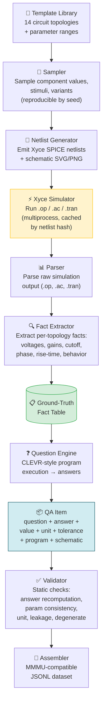

# electronics-qa-generator

A pipeline that generates **multimodal electronics circuit Q/A items** with
**SPICE/Xyce-grounded ground-truth answers**, targeting an
[MMMU](https://mmmu-benchmark.github.io/)-style benchmark for the Electronics
subfield.

Inspired by **CLEVR** (questions backed by executable programs) and **AutoCkt**
(simulator-in-the-loop as source of truth).

> **Core principle:** Simulation establishes facts → code derives answers →
> the LLM only paraphrases or reviews truth that has already been computed.
> The LLM is never the source of numerical truth.

See [`docs/plan.md`](docs/plan.md), [`docs/architecture.md`](docs/architecture.md),
and [`AGENTS.md`](AGENTS.md) for the full design and pipeline commands.

## Quick start

```bash
git clone https://github.com/xiechao06/electronics-qa-generator
cd electronics-qa-generator
```

Then prompt you favorite coding agent:

> *"Generate roughly 10,000 Q/A pairs."*
> *"Generate roughly 10,000 Q/A pairs without visual validation."*
> *"Generate roughly 10,000 Q/A pairs without visual validation, across topologies voltage_divider, rc_lowpass and rc_highpass"*

The agent reads `AGENTS.md`, runs the pipeline, and produces JSONL output
with schematics. No manual setup beyond `uv sync`.

To run directly:

```bash
uv sync --extra sim --extra data --extra render

# List available topologies
uv run python scripts/batch_generate.py --list-topologies

# Small batch (200 items, ~1 second):
uv run python scripts/batch_generate.py --total 200 --workers 4 -o output/batch

# Specific topologies only:
uv run python scripts/batch_generate.py --total 5000 --topologies voltage_divider,rc_lowpass

# Large batch (100k items, ~2 minutes):
uv run python scripts/batch_generate.py --total 100000 --workers 8 -o output/batch
```

### Batch generation options

| Option | Default | Description |
|---|---|---|
| `--total` | 100000 | Target number of QA pairs |
| `--topologies` | all 14 | Comma-separated topology names to generate |
| `--list-topologies` | — | Print available topologies with QA-per-seed counts and exit |
| `--workers` | 8 | Parallel simulation worker processes |
| `--start-seed` | 0 | First seed value (use with `--total` to avoid overlapping prior runs) |
| `-o, --out` | `output/batch/` | Output directory |
| `--cache-dir` | `cache/` | Fact cache directory; speeds repeated runs |
| `--humanize` | off | Reword questions via DeepSeek LLM (opt-in, slow; hand-written templates preferred) |

The script runs seeds through the pipeline in parallel. Each seed produces
one parameter sample per topology. Results are cached by netlist content hash
so re-running with overlapping seed ranges is near-instant. QA items with zero
or nonsensical simulation results are still produced and should be filtered
post-hoc.

## What it produces

| Artifact | Location |
|---|---|
| QA items (JSONL) | `output/batch/qa_items.jsonl` |
| Schematics (PNG) | `output/batch/images/<topology>/<seed>.png` |

Each QA item includes a `schematic_path`, `question`, `answer`, `answer_value`,
`unit`, `tolerance`, `question_type`, and a `program` (CLEVR-style instruction
sequence).

## Available topologies (14)

```
voltage_divider     rc_lowpass          rc_highpass         rlc_bandpass
half_wave_rectifier rc_step_response    rl_step_response    ac_phasor_rc
bjt_ce_amplifier    bjt_emitter_follower mosfet_cs_amplifier resistor_network
op_amp_inverting    rlc_series_resonance
```

## Question types

| Type | Example |
|---|---|
| `direct` | Determine the −3 dB cutoff frequency |
| `derived` | Compute the quality factor Q = f₀ / BW |
| `classification` | Classify this filter as low-pass, high-pass, or band-pass |
| `comparison` | Is V(out) greater than half of V(in)? |

All answers are computed deterministically from Xyce simulation facts
(`.op`, `.ac`, `.tran`) via a CLEVR-style program engine. Questions
use hand-written humanized templates — no LLM involved in truth creation.

## Requirements

- **Python 3.14** (pinned via `.python-version`)
- [`uv`](https://docs.astral.sh/uv/) for environment management
- **Xyce** SPICE simulator on PATH

## Pipeline architecture



> **Truth ownership:** Simulation + code own all answers. The LLM is never
> the source of numerical truth — it may only paraphrase or tag after answers
> are computed.

## CLI pipeline

```
emit → simulate → questions → validate → assemble
```

| Command | What it does |
|---|---|
| `uv run eqa emit <topology> --seed N --render` | Sample template, emit netlist + schematic |
| `uv run eqa simulate <topology> --seed N` | Run Xyce, extract facts |
| `uv run eqa questions <topology> --seed N` | Generate Q/A items from facts |
| `uv run eqa validate <topology> --seed N` | Static checks on QA items |
| `uv run eqa verify-templates` | Check question/SVG/netlist templates are mutually consistent |
| `uv run eqa assemble -o dataset` | Assemble MMMU-compatible dataset |

For batch generation across many seeds, use `scripts/batch_generate.py`.

## Template coverage (multimodal self-containment)

QA items are multimodal: the solver sees only the **schematic image** and the
**question text** — the netlist is never shown. So the (image + question) pair
must contain every fact an answer depends on. `eqa verify-templates` enforces
this per topology, reporting `missing_component` (a part not drawn),
`missing_node` (a question names an unlabelled node), and `hidden_input` (an
answer needs a value shown nowhere). Run it before batch generation:

```bash
uv run eqa verify-templates          # exits non-zero on any coverage gap
uv run eqa verify-templates --json   # machine-readable report
```

## Visual checks (opt-in)

`eqa validate --visual` runs a local Ollama VLM to verify schematics:

```bash
brew install ollama
ollama serve
ollama pull deepseek-vl2-tiny
```

`.env` defaults:

```env
VISION_BASE_URL=http://localhost:11434/v1
VISION_MODEL=deepseek-vl2-tiny
```

## Reference data

- `mmmu_electronics/` — original MMMU Electronics parquet splits
- `mmmu_electronics_unpacked/` — JSONL/CSV + extracted images

Treat these as read-only target schema references.

## Layout

```
src/electronics_qa_generator/   # package, one subpackage per pipeline stage
  models.py                     # CircuitRecord, QAItem, Sample
  questions/templates.py        # hand-written humanized question templates
  render/svg/                   # SVG layout templates per topology
  graph/                        # circuit graph model
  simulation/                   # Xyce runner, fact cache
  extraction/                   # fact extractors per topology
  validation/                   # static + LLM + visual checks
  output/                       # dataset assembler
scripts/
  batch_generate.py             # high-throughput batch generation
docs/                           # design docs and paper explainers
tests/                          # pytest suite
```

## License

TBD.
