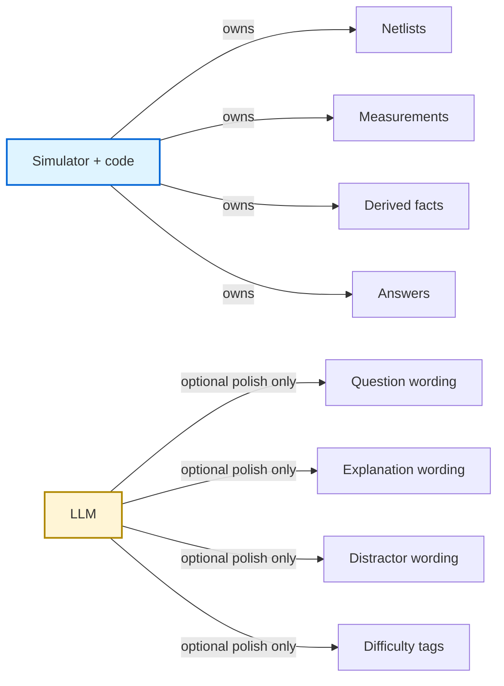
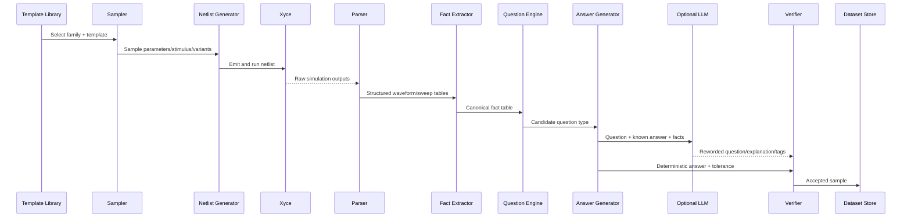
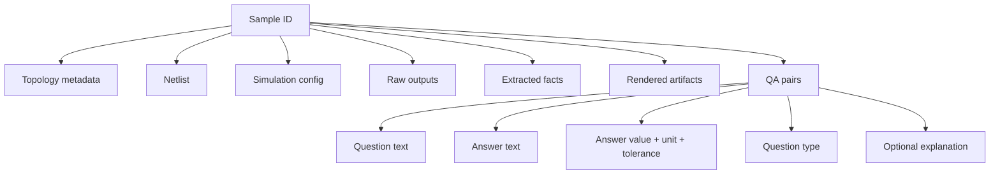
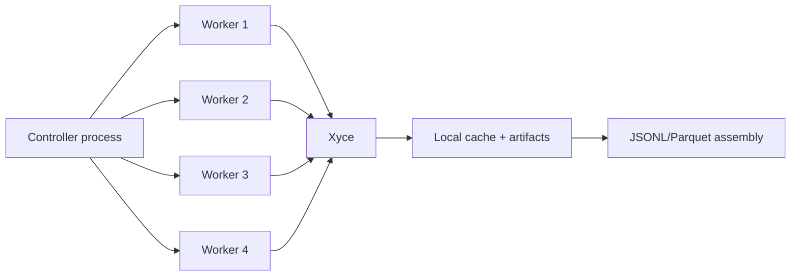
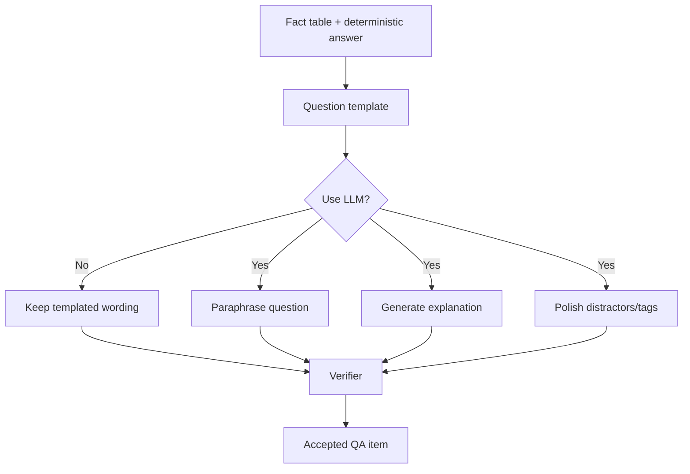

# Architecture Diagram: SPICE/Xyce-Grounded Electronics QA Dataset Pipeline

This document shows the full architecture for generating a simulator-grounded electronics question/answer dataset.

## High-level principles

- **Code + simulator own the truth**.
- **LLM is optional and only used after answers are known**.
- **Every answer must be traceable to a simulation-backed fact**.
- **Every generated sample should be reproducible from stored metadata**.

---

## End-to-end architecture

```mermaid
flowchart TD
    A[Template Library\nCircuit families + topologies + parameter ranges] --> B[Sampler\nSample values, stimuli, loads, temperatures, variants]
    B --> C[Netlist Generator\nEmit Xyce/SPICE netlists]
    C --> D[Simulation Orchestrator\nQueue jobs, retries, caching, parallel workers]
    D --> E[Xyce Simulator]
    E --> F[Raw Outputs\n.op / .dc / .ac / .tran files]
    F --> G[Result Parser\nParse voltages, currents, sweeps, waveforms]
    G --> H[Fact Extractor\nCutoff, gain, ripple, rise time, behavior, comparisons]
    H --> I[Ground-Truth Fact Table\nCanonical numeric + symbolic facts]
    I --> J[Question Template Engine\nDirect, derived, classification, comparison, trend, counterfactual]
    J --> K[Deterministic Answer Generator\nCompute exact answer + units + tolerances]
    K --> L[Optional LLM Layer\nParaphrase question, explanation, distractor wording, tags]
    L --> M[Verifier\nCheck wording vs facts, answer consistency, ambiguity]
    M --> N[Renderer\nSchematic images, waveform plots, Bode plots, tables]
    N --> O[Dataset Assembler\nJSONL/Parquet + images + metadata]
    O --> P[Quality Filters\nDedup, leakage checks, visibility checks, balance]
    P --> Q[Train/Val/Test Splitter\nBy family, topology, parameter regime]
    Q --> R[Final Dataset]
```



---

## Truth ownership diagram



---

## Component breakdown

### 1. Template library
Stores reusable circuit families, for example:
- voltage divider
- RC low-pass / high-pass
- RLC band-pass
- rectifier
- op-amp amplifier
- BJT/MOS amplifier stage

Each template defines:
- topology graph
- legal parameter ranges
- legal simulation types
- measurable outputs
- rejection rules

### 2. Sampler
Samples:
- component values
- supply voltage
- input stimulus
- load conditions
- temperature
- optional parasitics
- counterfactual variants

This stage should be **constrained randomization**, not arbitrary random wiring.

### 3. Netlist generator
Produces deterministic Xyce/SPICE netlists from the sampled template.

Outputs:
- main netlist
- optional sweep netlists
- optional counterfactual netlists

### 4. Simulation orchestrator
Responsible for:
- batching
- multiprocessing
- retries
- timeout handling
- caching duplicate simulations
- recording failures

### 5. Simulator
Runs Xyce on the generated netlists.

Typical analyses:
- `.op`
- `.dc`
- `.ac`
- `.tran`

### 6. Result parser
Converts raw simulator outputs into structured arrays/tables.

Examples:
- frequency vs gain
- time vs voltage
- DC sweep values
- node operating point tables

### 7. Fact extractor
Builds canonical ground truth from parsed outputs.

Examples:
- DC output voltage
- gain at 1 kHz
- -3 dB cutoff frequency
- phase at cutoff
- peak-to-peak ripple
- rise time / settling time
- output clipped or not
- low-pass / high-pass / band-pass label

### 8. Question template engine
Generates candidate question types from the fact table.

Question classes:
- direct numeric
- derived numeric
- multiple-choice
- classification
- comparison
- trend
- counterfactual
- fault diagnosis
- multimodal plot-reading

### 9. Deterministic answer generator
Produces:
- exact answer string
- canonical numeric value
- unit
- accepted tolerance
- correct MC option index

This stage must never depend on the LLM.

### 10. Optional LLM layer
LLM can be used for:
- paraphrasing questions
- generating explanations
- improving distractor wording
- assigning topic/difficulty tags
- naturalizing textbook/exam style

LLM should **not** be used for:
- computing answers
- deciding behavior from vague cues
- replacing simulation

### 11. Verifier
Checks:
- question matches the stored facts
- answer matches computed value
- no unit mismatch
- no wording ambiguity
- no answer leakage
- plots visibly support the question

### 12. Renderer
Produces multimodal artifacts:
- schematic images
- waveform plots
- Bode plots
- DC sweep charts
- optional tables or annotations

### 13. Dataset assembler
Packages each sample into a structured record.

Example fields:
- `id`
- `family`
- `topology`
- `netlist`
- `parameters`
- `simulation`
- `facts`
- `artifacts`
- `qa`

### 14. Quality filters
Reject samples that are:
- simulation failures
- numerically unstable
- trivial
- duplicated
- visually unreadable
- ambiguous
- outside task coverage goals

### 15. Splitter
Creates evaluation splits by:
- parameter regime
- topology variant
- family
- compositional difficulty

This avoids leakage from near-duplicate samples.

---

## Detailed data flow



---

## Sample record architecture



---

## Minimal folder architecture

```text
dataset_generator/
  templates/
    voltage_divider.py
    rc_lowpass.py
    rc_highpass.py
    rlc_bandpass.py
    rectifier.py
    opamp_inverting.py

  sampling/
    sampler.py
    constraints.py

  netlist/
    writer.py

  simulation/
    xyce_runner.py
    job_queue.py
    cache.py

  parsing/
    op_parser.py
    dc_parser.py
    ac_parser.py
    tran_parser.py

  extraction/
    dc_features.py
    ac_features.py
    tran_features.py
    classification.py

  questions/
    templates.py
    numeric.py
    classification.py
    comparison.py
    counterfactual.py

  llm/
    paraphrase.py
    explanation.py
    review.py

  rendering/
    schematic.py
    plots.py

  validation/
    verifier.py
    quality_filters.py
    split_checks.py

  output/
    assembler.py
    export_jsonl.py
    export_parquet.py

  generate_dataset.py
```

---

## Recommended execution mode on your MacBook



Suggested strategy:
- use moderate worker parallelism
- save every accepted sample immediately
- cache simulation results
- make the pipeline resumable
- keep the LLM step optional and asynchronous

---

## Final role of the LLM in the architecture



The key invariant is:

> **LLM never creates the truth; it only expresses or reviews truth already computed by code.**

---

## Bottom line

The architecture should be built so that:
- **simulation establishes facts**
- **code derives answers**
- **LLM improves language only after the answers are fixed**
- **verification happens before any sample enters the final dataset**
