# Schaum's Outline of Theory and Problems of Basic Circuit Analysis

## Exercises with Circuit Diagrams

> **Source:** *Schaum's Outline of Theory and Problems of Basic Circuit Analysis*, 2nd Edition, by John O'Malley, Ph.D.
>
> This document contains all exercises from the book that include circuit diagrams,
> together with their full solutions. Circuit images are saved in the `images/` subfolder.

---

## Table of Contents

- [Chapter 1 — Basic Concepts](#chapter-1--basic-concepts) &nbsp; *(7 exercises)*
- [Chapter 3 — Series and Parallel DC Circuits](#chapter-3--series-and-parallel-dc-circuits) &nbsp; *(16 exercises)*
- [Chapter 4 — DC Circuit Analysis](#chapter-4--dc-circuit-analysis) &nbsp; *(19 exercises)*
- [Chapter 5 — DC Equivalent Circuits, Network Theorems, and Bridge Circuits](#chapter-5--dc-equivalent-circuits-network-theorems-and-bridge-circuits) &nbsp; *(19 exercises)*
- [Chapter 6 — Operational-Amplifier Circuits](#chapter-6--operational-amplifier-circuits) &nbsp; *(15 exercises)*
- [Chapter 7 — Phasors and Complex Numbers](#chapter-7--phasors-and-complex-numbers) &nbsp; *(6 exercises)*
- [Chapter 8 — AC Power](#chapter-8--ac-power) &nbsp; *(9 exercises)*
- [Chapter 9 — Capacitors and Capacitance](#chapter-9--capacitors-and-capacitance) &nbsp; *(2 exercises)*
- [Chapter 10 — Inductors and Inductance](#chapter-10--inductors-and-inductance) &nbsp; *(9 exercises)*
- [Chapter 11 — AC Fundamentals](#chapter-11--ac-fundamentals) &nbsp; *(2 exercises)*
- [Chapter 12 — Series and Parallel AC Circuits](#chapter-12--series-and-parallel-ac-circuits) &nbsp; *(16 exercises)*
- [Chapter 13 — Mesh, Loop, Nodal, and PSpice Analyses of AC Circuits](#chapter-13--mesh-loop-nodal-and-pspice-analyses-of-ac-circuits) &nbsp; *(12 exercises)*
- [Chapter 14 — Transformers](#chapter-14--transformers) &nbsp; *(16 exercises)*
- [Chapter 15 — Transient Analysis](#chapter-15--transient-analysis) &nbsp; *(6 exercises)*
- [Chapter 16 — Complex Frequency, Filters, and Bode Plots](#chapter-16--complex-frequency-filters-and-bode-plots) &nbsp; *(22 exercises)*
- [Chapter 17 — Two-Port Networks](#chapter-17--two-port-networks) &nbsp; *(10 exercises)*

> **Total:** 186 exercises with circuit diagrams — 186 images in `images/`

---
## Chapter 1 — Basic Concepts

### Solved Problems

#### Fig. 1-4  *(page 15)*

*Fig. 1-4*

**Solution:**

DEPENDENT SOURCES
The sources of Figs. 1-2 and 1-4 are independent sources. An independent current source provides a 
certain current, and an independent voltage source provides a certain voltage, both independently of 
any other voltage or current. In contrast, a dependent source (also called a controlled source) provides 
a voltage or current that depends on a voltage or current elsewhere in a circuit. In a circuit diagram, a 
dependent source is designated by a diamond-shaped symbol. For an illustration, the circuit of Fig. 1-5 
contains a dependent voltage source that provides a voltage of 5F,, which is five times the voltage F, 
that appears across a resistor elsewhere in the circuit. (The resistors shown are discussed in the next 
chapter.) There are four types of dependent sources: a voltage-controlled voltage source as shown in 
Fig. 1-5, a current-controlled voltage source, a voltage-controlled current source, and a current-controlled 
current source. Dependent sources are rarely separate physical components. But they are important 
because they occur in models of electronic components such as operational amplifiers and transistors.

---

#### Fig. 1-5  *(page 15)*

*Fig. 1-5*

---

#### Problem 1.24  *(page 21)*

**Problem:**

1.24 Figure 1-8 shows a circuit diagram of a voltage source of V volts connected to a current source 
of / amperes. Find the power absorbed by the voltage source for
(a) V = 2 V, / = 4 A
(h) V = 3 V, / = -2 A
(c) V = -6 V, / = -8A

*Fig. 1-8*

**Solution:**

Because the reference arrow for I is into the positively referenced terminal for V, the current and voltage 
references for the voltage source are associated. This means that there is a positive sign (or the absence of 
a negative sign) in the relation between power absorbed and the product of voltage and current: P = VI. 
With the given values inserted.
(a) p = VI = 2 x 4 = 8 W
(b) P = VI = 3 x (-2) = -6 W
The negative sign for the power indicates that the voltage source delivers rather than absorbs power. 
(c) p = VI = -6 x (-8) = 48 W

---

#### Problem 1.25  *(page 21)*

**Problem:**

1.25 Figure 1-9 shows a circuit diagram of a current source of / amperes connected to an independent 
voltage source of 8 V and a current-controlled dependent voltage source that provides a voltage 
that in volts is equal to two times the current flow in amperes through it. Determine the power 
Pi absorbed by the independent voltage source and the power P2 absorbed by the dependent 
voltage source for (a) I = 4 A, (b) I = 5 mA, and (o) / = -3 A.

*Fig. 1-9*

**Solution:**

Because the reference arrow for / is directed into the negative terminal of the 8-V source, the 
power-absorbed formula has a negative sign: P, = -81. For the dependent source, though, the voltage 
and current references are associated, and so the power absorbed is P, = 2/(/| = 2/*. With the given current 
values inserted.

---

#### Problem 1.26  *(page 22)*

**Problem:**

1.26 Calculate the power absorbed by each component in the circuit of Fig. 1-10.
; 6 V

*Fig. 1-10*

**Solution:**

Since for the 10-A current source the current flows out of the positive terminal, the power it absorbs 
is P, = - 16(10) = - 160 W. The negative sign indicates that this source is not absorbing power but rather 
is delivering power to other components in the circuit. For the 6-V source, the 10-A current flows into the 
negative terminal, and so P2 = -6(10) = -60 W. For the 22-V source, P3 = 22(6) = 132 W. Finally, 
the dependent source provides a current of 0.4(10) = 4 A. This current flows into the positive terminal 
since this source also has 22 V, positive at the top, across it. Consequently, P4 = 22(4) = 88 W. Observe that
P, + P2 + P3 + P4 = - 160 - 60 + 132 + 88 = 0 W
The sum of 0 W indicates that in this circuit the power absorbed by components is equal to the power 
delivered. This result is true for every circuit.

---

#### Problem 1.56  *(page 25)*

**Problem:**

1.56 For the circuit of Fig. 1-11, find the power absorbed by the current source for (u) f = 4 V. / = 2 mA: 
(b) V = -50 V, / = -150/tA; (c) V = 10 mV, / = -15 mA; (4) V = - 120 mV. / = 80 mA.
Ans. (a) -8 mW, (b) - 7.5 mW, (c)150/<W, (d) 9.6 mW

*Fig. 1-11*

---

#### Problem 1.57  *(page 26)*

**Problem:**

1.57 For the circuit of Fig. 1-12. determine P,, P2, P3, which are powers absorbed, for (a) l = 2 A, (b) I = 
20 mA. and (r) I = -3 A.
Arts, (o) P, = 16 W. P2 = -24 W. P3 = -20 W; (ft) P, = 0.16 W, P2 = -2.4 mW, P3 = -0.2 W;
(<•! Pi = -24 W. P2 = -54 W, P3 = 30 W
P. /

*Fig. 1-12*

---

## Chapter 3 — Series and Parallel DC Circuits

### Solved Problems

#### Fig. 3-1  *(page 42)*

*Fig. 3-1*

**Solution:**

31

---

#### Fig. 3-3, 3-4  *(page 46)*

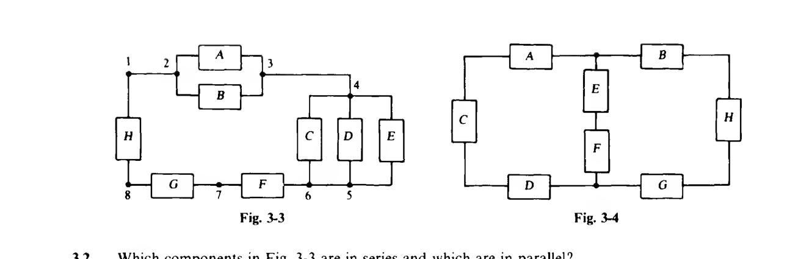
*Fig. 3-3, Fig. 3-4*

**Solution:**

Components F, G, and H are in series because they carry the same current. Components A and B, being 
connected together at both ends, have the same voltage and so are in parallel. The same is true for components 
C, D, and E- they are in parallel. Further, the parallel group of A and B is in series with the parallel group 
of C, D, and £, and both groups are in series with components F, G, and H.

---

#### Problem 3.5  *(page 46)*

**Problem:**

3.5 What is Facross the open circuit in the circuit shown in Fig. 3-6?
The sum of the voltage drops in a clockwise direction is, starting from the upper left corner,
60 - 40 + V - 10 + 20 = 0 from which V = -30 V
In the summation, the 40 and 10 V are negative because they are voltage rises in a clockwise direction. The 
negative sign in the answer indicates that the actual open-circuit voltage has a polarity opposite the shown 
reference polarity.

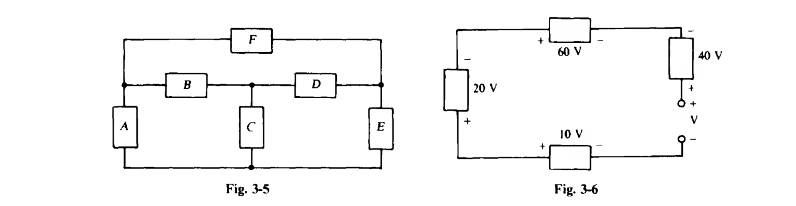
*Fig. 3-5, Fig. 3-6*

---

#### Problem 3.26  *(page 51)*

**Problem:**

3.26 Find F, in the circuit of Fig. 3-12.
First observe that no current flows in the single wire connecting the two halves of this circuit, a-, is 
evident from enclosing either half in a closed surface. Then only this single wire would cross this unlace, 
and since the sum of the currents leaving any closed surface must be zero, the current in this wire must be 
zero. From another point of view, there is no return path for a current that would flow in this wire

*Fig. 3-12*

---

#### Problem 3.28  *(page 52)*

**Problem:**

3.28 Determine the voltage drop K> across the open circuit in the circuit of Fig. 3-14.
ion 5 n
Because of the open circuit, no current flows in the 9-0 and 13-0 resistors and so there is zero volts 
across each of them. Also, then, all the 6-A source current flows through the 10-0 resistor and all the 8-A

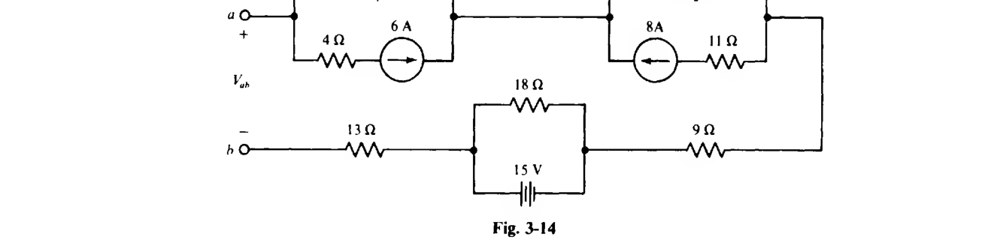
*Fig. 3-14*

---

#### Problem 3.29  *(page 53)*

**Problem:**

3.29 Find the unknown currents in the circuit shown in Fig. 3-15. Find / j, first.
The basic KCL approach is to find closed surfaces such that only one unknown current flows across 
each surface. In Fig. 3-15, the large dashed loop represents a closed surface drawn such that I { is the only 
unknown current flowing across it. Other currents flowing across it are the I0-, 8-, and 9-A currents. 11 and 
the 9-A currents leave this closed surface, and the 8-A and 10-A currents enter it. By KCL. the sum of the 
currents leaving is zero: lx + 9 - 8 - 10 = 0, or /[ = 9 A. /2 is readily found from summing the currents 
leaving the middle top node: /2 - 8 - 10 = 0. or I2 = 18 A. Similarly, at the right top node. /, + 8 - 
9 = 0. and /3 = 1 A. Checking at the left top node: 10 - 10 - 9 - 1 = 0, as it should be.

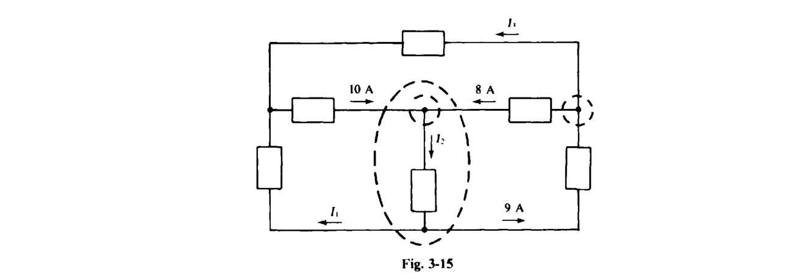
*Fig. 3-15*

---

#### Problem 3.31  *(page 53)*

**Problem:**

3.31 Find the short-circuit current /3 for the circuit shown in Fig. 3-17.
The short circuit places the 100 V of the left-hand voltage source across the 20-Q resistor, and it places 
the 200 V of the right-hand source across the 25-Q resistor. By Ohm’s law. /, = 100 20 = 5 A and
12 = -200/25 = -8 A. The negative sign occurs in the I2 formula because of nonassociated references.
-AAA/-' i-Wv-
=1100 V 
|/> i

*Fig. 3-16, Fig. 3-17*

---

#### Problem 3.42  *(page 55)*

**Problem:**

3.42 In the circuit shown in Fig. 3-20 find the total resistance RT with terminals a and b (a) 
open-circuited, and (b) short-circuited.
16 ft 3ft 80
40 n

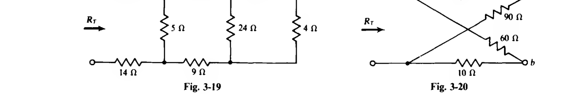
*Fig. 3-19*

---

#### Problem 3.44  *(page 56)*

**Problem:**

3.44 Find the voltage and unknown currents in the circuit shown in Fig. 3-21.
►8 s

*Fig. 3-21*

**Solution:**

Even though it has several dots, the top line is just a single node because the entire line is at the same 
potential. The same is true of the bottom line. Thus, there are just two nodes and one voltage V The total 
conductance of the parallel-connected resistors is G = 6 + 12 + 24 + 8 = 50 S. Also, the total current 
entering the top node from current sources is 190 - 50 + 60 = 200 A. This conductance and current can be 
used in the conductance version of Ohm's law, I = GV, to obtain the voltage: V = I G = 200 50 = 4 V. 
Since this is the voltage across each resistor, the resistor currents are /, = 6 x 4 = 24 A, /2=-12x4 =
- 48 A, I} = 24 x 4 = 96 A, and /4 = - 8 x 4 = - 32 A. The negative signs are the result of non- 
associated references. Of course, all the actual resistor currents leave the top node.
Note that the parallel current sources have the same effect as a single current source, the current of 
which is the algebraic sum of the individual currents from the sources.

---

#### Fig. 3-24, 3-25  *(page 58)*

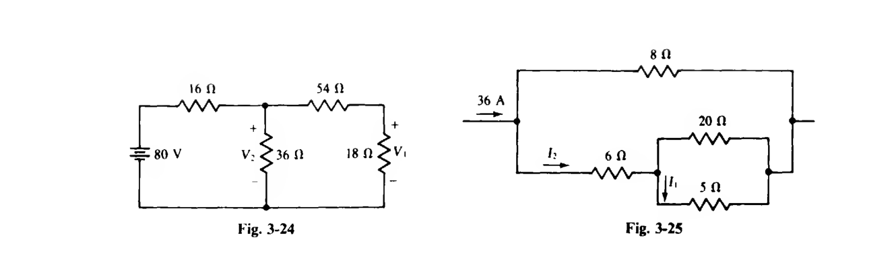
*Fig. 3-24, Fig. 3-25*

---

#### Problem 3.53  *(page 58)*

**Problem:**

3.53 Four resistors in series have a total resistance of 500 O. If three of the resistors have resistances of 100, 150, 
and 200 Q. what is the resistance of the fourth resistor?
Ans. 50 Q
13V 18V 15V

*Fig. 3-26*

---

#### Problem 3.60  *(page 59)*

**Problem:**

3.60 Find Vab in the circuit shown in Fig. 3-27.
Ans. 20 V

*Fig. 3-27*

---

#### Problem 3.75  *(page 61)*

**Problem:**

3.75 Find the total resistance RT of the resistor ladder network shown in Fig. 3-33.
Ans. 26.6 kft
15 kn 6 kn 3 kO

*Fig. 3-33*

---

#### Problem 3.88  *(page 63)*

**Problem:**

3.88 Use voltage division twice to find the voltage V in the circuit shown in Fig. 3-40.
Arts. 36 V
16 O 15 0

*Fig. 3-40*

---

#### Problem 3.89  *(page 64)*

**Problem:**

3.89 In the circuit shown in Fig. 3-41, use current division twice to calculate the current / in the load resistor 
Rl for (a) Rl = 0 Q, (b) R,, = 5 fl, and (c) RL = 20 Q.
Ans. (a) 16 A, (6) 9.96 A, (c) 4.67 A

*Fig. 3-41*

---

#### Problem 3.90  *(page 64)*

**Problem:**

3.90 Use repeated current division in finding / in the circuit of Fig. 3-42.
Ans. 4 mA

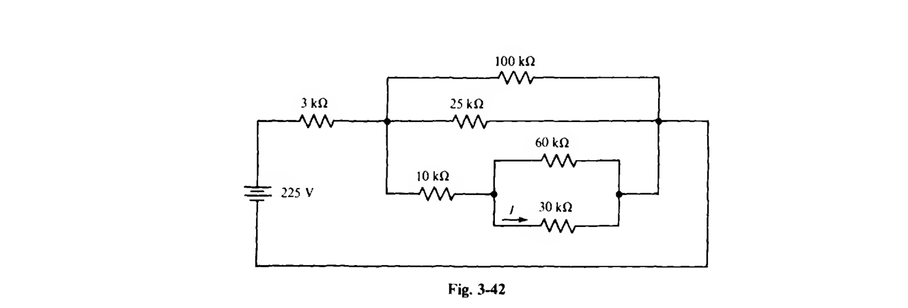
*Fig. 3-42*

---

## Chapter 4 — DC Circuit Analysis

### Solved Problems

#### Fig. 4-1  *(page 67)*

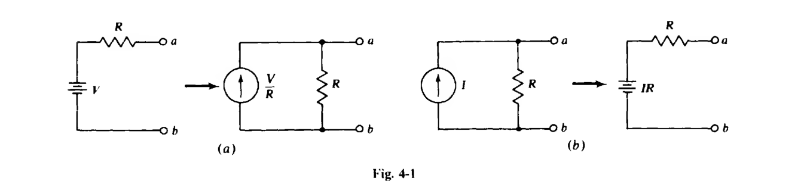
*Fig. 4-1*

**Solution:**

As shown, in the transformation of a voltage source to an equivalent current source, the same resistor
is in parallel with the current source, and the source current equals the original source voltage divided 
by the resistance of this resistor. The current source arrow is directed toward the terminal nearest the 
positive terminal of the voltage source. In the transformation from a current source to an equivalent voltage 
source, the same resistor is in series with the voltage source, and the source voltage equals the original 
source current times the resistance of this resistor. The positive terminal of the voltage source is nearest 
the terminal toward which the arrow of the current source is directed. This same procedure applies to 
the transformations of dependent sources.
MESH ANALYSIS
In mesh analysis. KVL is applied with mesh currents, which are currents assigned to meshes, and 
preferably referenced to flow clockwise, as shown in Fig. 4-2a.
KVL is applied to each mesh, one at a time, using the fact that in the direction of a current /. the 
voltage drop across a resistor is IR. as shown in Fig. 4-26. The voltage drops across the resistors taken 
in the direction of the mesh currents are set equal to the voltage rises across the voltage sources. As an 
illustration, in the circuit shown in Fig. 4-2«, around mesh 1 the drops across resistors R, and R_, are

---

#### Problem 4.7  *(page 73)*

**Problem:**

4.7 Find the currents down through the resistors in the circuit shown in Fig. 4-8. Then transform 
the current source and 2-Q resistor to an equivalent voltage source and again find the resistor 
currents. Compare results.
By current division, the current down through the 2-Q resistor is
6 
-x 16 = 12 A 
2 + 6
The remainder of the source current (16 -12 = 4 A) flows down through the 6-Q resistor.
Transformation of the current source produces a voltage source of 16 x 2 = 32 V in series with a 2-Q 
resistor, all in series with the 6-Q resistor, as shown in the circuit of Fig. 4-9. In this circuit, the same 
current 32/(2 + 6) = 4 A flows through both resistors. The 6-Q resistor current is the same as for the 
original circuit, but the 2-Q resistor current is different. This result illustrates the fact that although a 
transformed source produces the same voltages and currents in the circuit exterior to the source, the voltages 
and currents inside the source usually change.

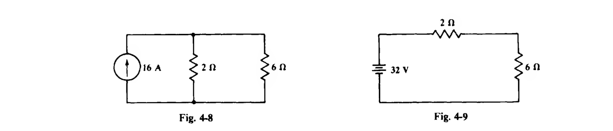
*Fig. 4-8, Fig. 4-9*

---

#### Problem 4.8  *(page 74)*

**Problem:**

4.8 For the circuit of Fig. 4-10, use repeated source transformations to obtain a single mesh circuit, 
and then find the current /.
50 50 / 
40 
-VW
50 / 
A/W=n
+
-=- 30 V
312

*Fig. 4-10, Fig. 4-11*

**Solution:**

The first step is to transform the voltage source and series resistor into a current source and parallel 
resistor. The resistance does not change, but the source current is 37.5/5 = 7.5 A directed upward. The 
5-ft resistor from the source transformation is in parallel with the 20-ft resistor. Consequently, the combined 
resistance is (5 x 20)/(5 + 20) = 4 ft. The next step is to transform the 7.5-A current source and the parallel 
4-ft resistor into a series voltage source and resistor. The resistance remains the same, and the voltage of 
the voltage source is 4(7.5) = 30 V, positive upward, as shown in the circuit of Fig. 4-11, which is a single 
mesh circuit.
The KVL equation for this circuit is 3/2 + 9/ - 30 = 0, from which the current / can be obtained 
by applying the quadratic formula:
s - 9 ± v//92 - 4f3)(-^30)
2(3)
The solutions are / = 2 A and / = -5 A. Only the / = 2 A is physically possible. The current must 
be positive since in the circuit of Fig. 4-11 there is only one source, and current must flow out of the positive 
terminal of this source.

---

#### Problem 4.9  *(page 74)*

**Problem:**

4.9 Find the mesh currents in the circuit shown in Fig. 4-12.
The self-resistance of mesh 1 is 5 + 6 = 11 ft, and the resistance mutual with mesh 2 is 6 ft. The sum 
of the source voltage rises in the direction of /, is 62 - 16 = 46 V. So, the mesh 1 KVL equation 
is 11/] - 6/2 = 46.
No KVL equation is needed for mesh 2 because I2 is the only current flowing through the 4-A current 
source, with the result that /2 = - 4 A. The current I2 is negative because its reference direction is down 
through the current source, but the 4-A source current actually flows up. Incidentally, a KVL equation 
cannot be written for mesh 2 without introducing a variable for the voltage across the current source because 
this voltage is unknown.
The substitution of /2 = - 4 A into the mesh 1 equation results in
22 
11/, -6(-4) = 46 and /, = - = 2 A
11
5ft '6 V

*Fig. 4-12*

---

#### Problem 4.13  *(page 77)*

**Problem:**

4.13 Find the mesh currents in the circuit shown in Fig. 4-17.
3 n 5fi 57 v 7 0

*Fig. 4-17*

**Solution:**

The self-resistances are 3 + 4 = 7 Q for mesh 1, 4 + 5 + 6= 15Q for mesh 2, and 6 + 7 =
13 SI for mesh 3. The mutual resistances are 4 SI for meshes 1 and 2, 6 Q for meshes 2 and 3, and 0 O for 
meshes 1 and 3. The aiding source voltages are 42 + 25 = 67 V for mesh 1. -25 - 57 - 70 =
- 152 V for mesh 2, and 70 + 4 = 74 V for mesh 3. So, the mesh equations arc
Notice the indicated symmetry of the mutual coefficients about the principal diagonal, shown as a dashed 
line. Because of the common mutual resistances, this symmetry always occurs - unless a circuit has dependent 
sources. Also, notice for each mesh that the self-resistance is equal to or greater than the sum of the mutual 
resistances because the self-resistance includes the mutual resistances.
By Cramer's rule.
67 
-4 
0 
7 
67 
0 
-152 
15 
-6 
-4 
-152 
-6
74 
-6 
13 
4525
0 
74 
13 
-7240
5 A 
li =
7 
-4 
0 
905 
905" 
905 
-4 
15 
-6
0 
-6 
13
7 
-4 
67 
-4 
15 
-152
0 
-6 
74 
1810
2 A 
905 
“ 905" ~~

---

#### Fig. 4-18  *(page 78)*

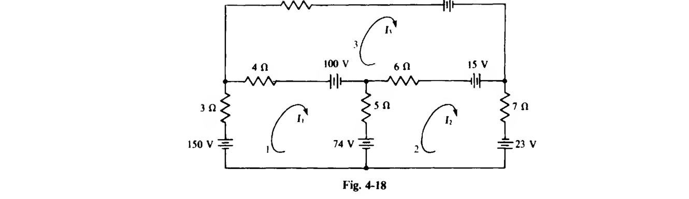
*Fig. 4-18*

**Solution:**

By Cramer’s rule.
-24 -5 
-4
12 
-24 
-4 
-5 
112 
-6 
-4 
-106 
18 
9912 
=-= 4 A 
2478 
2478
112 18 
-6
-106 -6 
r 
18 
-4956 
i i -
12 -5 
-4 
2478 
-5 18 
-6 
-4 -6 
18
12 -5 
-24 
-5 18 
112 
-4 -6 - 
I3 = -
■106 
-12 390
2478
2478

---

#### Fig. 4-21  *(page 80)*

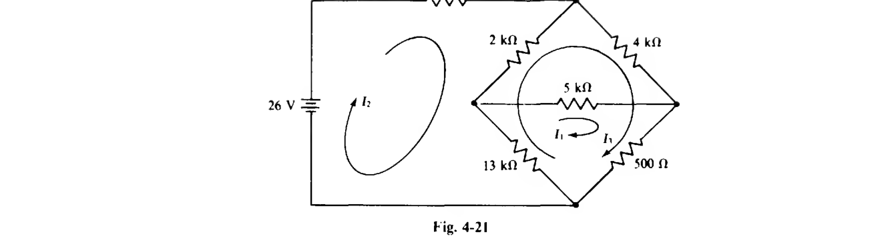
*Fig. 4-21*

**Solution:**

As has been mentioned, since working with kilohms is inconvenient, a common practice is to drop 
those units to divide each resistance by 1000. But then the current answers will be in milliamperes. With 
this approach, and from self-resistances, mutual resistances, and aiding source voltages, the loop equations are
18.5/, - 13/, + 13.5/., = 0 
-13/, + 16/,- 15/., = 26
13.5/, - 15/, + 19.5/., = 0
Notice the symmetry of the / coefficients about the principal diagonal, just as for mesh equations. But there
is the difference that some of these coefficients are positive. This is the result of two loop currents flowing 
through a mutual resistor in the same direction something that cannot happen in mesh analysis if all mesh 
currents are selected in the clockwise direction, as is conventional.
From Cramer’s rule.
0 
- 13 
13.5
26 
16 
- 15
0 
- 15 
19.5
1326
= 2 mA

---

#### Problem 4.18  *(page 80)*

**Problem:**

4.18 Use loop analysis to find the current down through the 8-fi resistor in the circuit shown in Fig. 
4-22.
Because the circuit has three meshes, the analysis requires three loop currents. The loops can be selected 
as shown, with only one current /, flowing through the 8-f2 resistor so that only one current needs to be

*Fig. 4-22*

---

#### Problem 4.20  *(page 81)*

**Problem:**

4.20 Determine the node voltages in the circuit shown in Fig. 4-23,

*Fig. 4-23*

---

#### Problem 4.37  *(page 87)*

**Problem:**

4.37 Solve for the mesh currents in the circuit shown in Fig 4-34
Ans. /, - 5 mA, /, = -2 mA
7 A

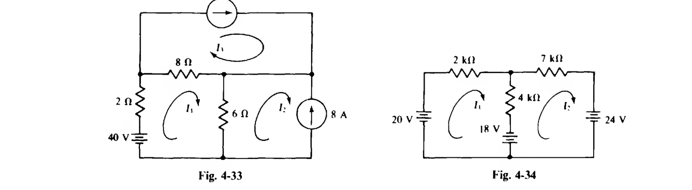
*Fig. 4-33, Fig. 4-34*

---

#### Problem 4.48  *(page 89)*

**Problem:**

4.48 Obtain the mesh currents in the circuit of Fig. 4-38.
4 kit 60 V
Arts, /j = -0.879 mA, /2 = -6.34 mA, /, = -10.1 mA

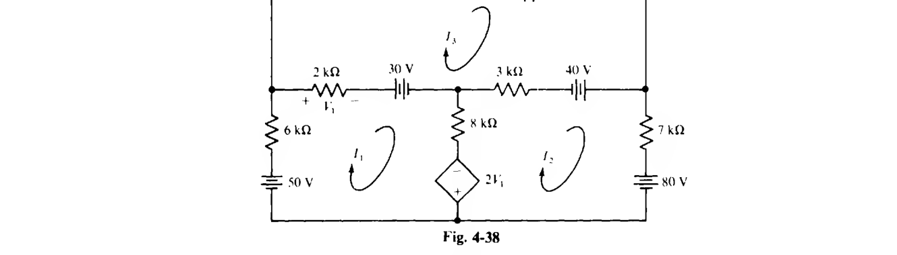
*Fig. 4-38*

---

#### Problem 4.52  *(page 90)*

**Problem:**

4.52 Use loop analysis to find the current / in the circuit shown in Fig. 4-40.
Ans. 0.375 A

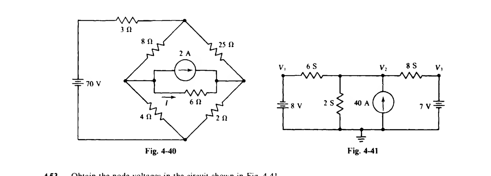
*Fig. 4-40, Fig. 4-41*

**Solution:**

Ans. V, = - 8 V, K, = 3 V, V3 = 7 V

---

#### Problem 4.54  *(page 90)*

**Problem:**

4.54 Find the node voltages in the circuit shown in Fig. 4-42.
Ans. Vl = 5 V, V2 = - 2 V
18 A

*Fig. 4-42*

---

#### Problem 4.58  *(page 91)*

**Problem:**

4.58 Find F0 for the circuit shown in Fig. 4-43.
Ans. - 50 V
2 kft I

*Fig. 4-43*

**Solution:**

5 n / to a

---

#### Problem 4.58  *(page 91)*

**Problem:**

4.58 Find F0 for the circuit shown in Fig. 4-43.
Ans. - 50 V
2 kft I
5 n / to a

*Fig. 4-44*

---

#### Problem 4.60  *(page 91)*

**Problem:**

4.60 Calculate the node voltages in the circuit of Fig. 4-45.
Ans. F, = -63.5 V. V2 = 105.9 V
20 kn

*Fig. 4-45*

---

#### Fig. 4-46  *(page 92)*

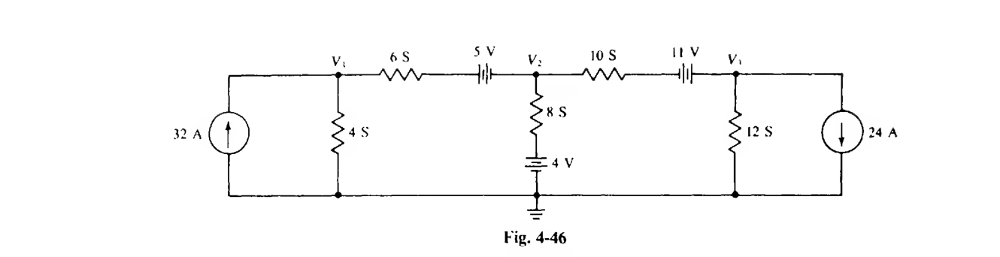
*Fig. 4-46*

---

#### Fig. 4-47  *(page 92)*

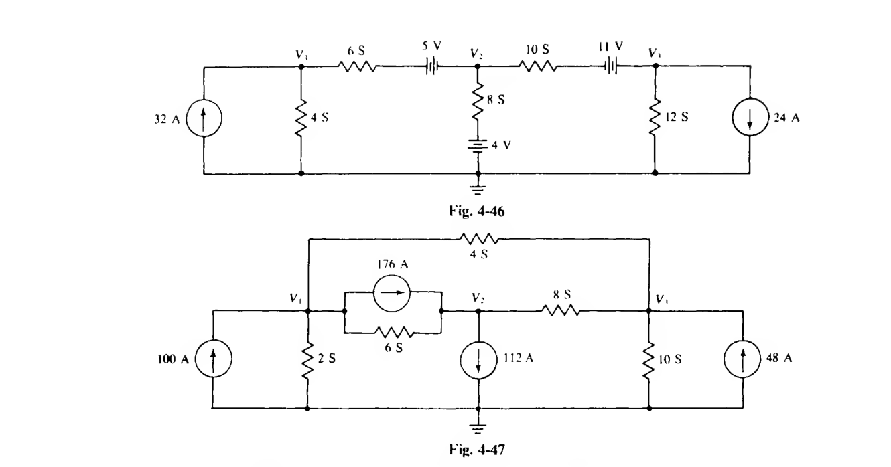
*Fig. 4-47*

**Solution:**

Ans. 1', = 3 V, 1, =4V. F, = 5 V

---

#### Problem 4.66  *(page 92)*

**Problem:**

4.66 In the circuit shown in Fig. 4-48. find I,if /, = 301h and Ilu = 0.7 V.
Ans. 3.68 V

*Fig. 4-48*

**Solution:**

Ans. 2.89 V

---

## Chapter 5 — DC Equivalent Circuits, Network Theorems, and Bridge Circuits

### Solved Problems

#### Fig. 5-1  *(page 93)*

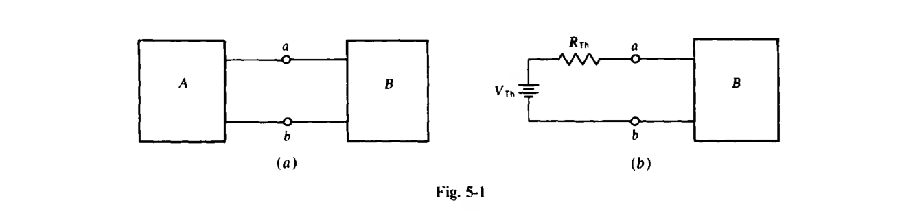
*Fig. 5-1*

**Solution:**

Thevenin’s theorem specifies that the linear, bilateral part, say part A, can be replaced by a 
Thevenin equivalent circuit consisting of a voltage source and a resistor in series, as shown in Fig. 
5-lb, without any changes in voltages or currents in part B. The voltage ^Th of the voltage source is 
called the Thevenin voltage, and the resistance RTh of the resistor is called the Thevenin resistance.
As should be apparent from Fig. 5-lb, is the voltage across terminals a and b if part B is replaced 
by an open circuit. So, if the wires are cut at terminals a and b in either circuit shown in Fig. 5-1, and 
if a voltmeter is connected to measure the voltage across these terminals, the voltmeter reading is <v 
This voltage is almost always different from the voltage across terminals a and b with part B connected. 
The Thevenin or open-circuit voltage KTh is sometimes designated by Vqc.
With the joining wires cut, as shown in Fig. 5-2a, Rrh is the resistance of part A with all independent 
sources deactivated. In other words, if all independent sources in part A are replaced by their internal 
resistances, an ohmmeter connected to terminals a and b reads Thevenin’s resistance.
82

---

#### Fig. 5-2  *(page 94)*

*Fig. 5-2*

**Solution:**

If in Fig. 5-2a the resistors in part A are in a parallel-series configuration, then KTh can be obtained 
readily by combining resistances. If, however, part A contains dependent sources (remember, they are 
not deactivated), then, of course, resistance combination is not applicable. But in this case the approach 
shown in Fig. 5-2b can be used. An independent source is applied, either voltage or current and of any 
value, and Rn obtained from the resistance “seen” by this source. Mathematically,
So, if a source of voltage Vs is applied, then Is is calculated for this ratio. And if a source of current 
Is is applied, then Vs is calculated. The preferred source, if any, depends on the configuration of part A.
Thevenin's theorem guarantees only that the voltages and currents in part B do not change when 
part A is replaced by its Thevenin equivalent circuit. The voltages and currents in the Thevenin 
circuit itself are almost always different from those in the original part A, except at terminals a and h 
where they are the same, of course.
Although RTh is often determined by finding the resistance at terminals a and b with the connecting 
wires cut and the independent sources deactivated, it can also be found from the current lsc that flows 
in a short circuit placed across terminals a and h, as shown in Fig. 5-3a. As is apparent from Fig. 5-3b, 
this short-circuit current from terminal a to b is related to the Thevenin voltage and resistance. 
Specifically,
So, /?Th is equal to the ratio of the open-circuit voltage at terminals a and b and the short-circuit 
current between them. With this approach to determining RTh, no sources are deactivated.
From t'rh - ^sc RTh, it is evident that the Thevenin equivalent can be obtained by determining 
any two of the quantities FTh, lsc, and RJh. Common sense dictates that the two used should be the 
two that are the easiest to determine.
The Norton equivalent circuit can be derived by applying a source transformation to the Thevenin 
equivalent circuit, as illustrated in Fig. 5-4u. The Norton equivalent circuit is sometimes illustrated as 
in Fig. 5-4b, in which /n = ^Th f?Th and Rs = Rn. Notice that, if a short circuit is placed across 
terminals a and b in the circuit shown in Fig. 5-4fi. the short-circuit current /sc from terminal a to b is

---

#### Fig. 5-4  *(page 95)*

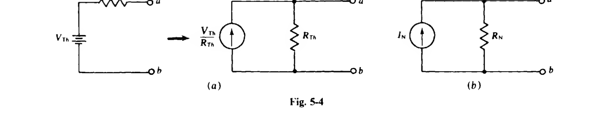
*Fig. 5-4*

**Solution:**

equal to the Norton current /N. Often in circuit diagrams, the notation /st is used for the source current 
instead of /N. Also, often RTh is used for the resistance instead of Rv.
Fn electronic circuit literature, an electronic circuit with a load is often described as having an output 
resistance R0UI. If the load is disconnected and if the source at the input of the electronic circuit is replaced 
by its internal resistance, then the output resistance Rou, of the electronic circuit is the resistance "looking 
in” at the load terminals. Clearly, it is the same as the Thevenin resistance.
An electronic circuit also has an input resistance Rin, which is the resistance that appears at the 
input of the circuit. In other words, it is the resistance “seen” by the source. Since an electronic circuit 
typically contains the equivalent of dependent sources, the input resistance is determined in the same 
way that a Thevenin resistance is often obtained by applying a source and determining the ratio 
of the source voltage to the source current.
MAXIMUM POWER TRANSFER THEOREM
The maximum power transfer theorem specifies that a resistive load receives maximum power from 
a linear, bilateral dc circuit if the load resistance equals the Thevenin resistance of the circuit as 
"seen" by the load. The proof is based on calculus. Selecting the load resistance to be equal to the circuit 
Thevenin resistance is called matching the resistances. With matching, the load voltage is UTh 2. and 
so the power consumed by the load is (l'rh 2)~ RTh = Kfh 4RXh.
SUPERPOSITION THEOREM
The superposition theorem specifies that, in a linear circuit containing several independent sources, 
the current or voltage of a circuit element equals the algebraic sum of the component voltages or currents 
produced by the independent sources acting alone. Put another way, the voltage or current contribution 
from each independent source can be found separately, and then all the contributions algebraically added 
to obtain the actual voltage or current with all independent sources in the circuit.
This theorem applies only to independent sources not to dependent ones. Also, it applies only to 
finding voltages and currents. In particular, it cannot be used to find power in dc circuits. Additionally, 
the theorem applies to each independent source acting alone, which means that the other independent 
sources must be deactivated. In practice, though, it is not essential that the independent sources be 
considered one at a time; any number can be considered simultaneously.
Because applying the superposition theorem requires several analyses, more work may be done than 
with a single mesh, loop, or nodal analysis with all sources present. So, using the superposition theorem 
in a dc analysis is seldom advantageous. It can be useful, though, in the analyses of some of the 
operational-amplifier circuits of the next chapter.
MILLMAN’S THEOREM
Millman’s theorem is a method for reducing a circuit by combining parallel voltage sources into a 
single voltage source. It is just a special case of the application of Thevenin's theorem.

---

#### Problem 5.5  *(page 100)*

**Problem:**

5.5 What resistor draws a current of 5 A when connected across terminals a and b of the circuit 
shown in Fig. 5-10?
5ft 6ft

*Fig. 5-10*

**Solution:**

A good approach is to use Thevenin’s theorem to simplify the circuit to the Thevenin equivalent 
of a VTh voltage source in series with an Rn resistor. Then the load resistor R is in series with these, and 
Ohm's law can be used to find R\
y V 
5 =--- from which R = - - RTh
Rn + R 5
The open-circuit voltage at terminals a and b is the voltage across the 20-fi resistor since there is 
0 V across the 6-Q resistor because no current flows through it. By voltage division this voltage is
20 
KTh =- x 100 = 80 V
20 + 5
RTh is the resistance at terminals a and b with the 100-V source replaced by a short circuit. This short 
circuit places the 5-and 20-D resistors in parallel for a net resistance of 5!! 20 = 4 Q. So, RTh = 6 + 4 = 10Q
With KXh and RTh known, the load resistance R for a 5-A current can be found from the previously 
derived equation:
Vn 80 
R = - - Rn =-10 = 6ft
5 5

---

#### Problem 25.1  *(page 101)*

**Problem:**

25.1
Of course, the simplifying kilohm-milliampere method was used in some of the calculations.

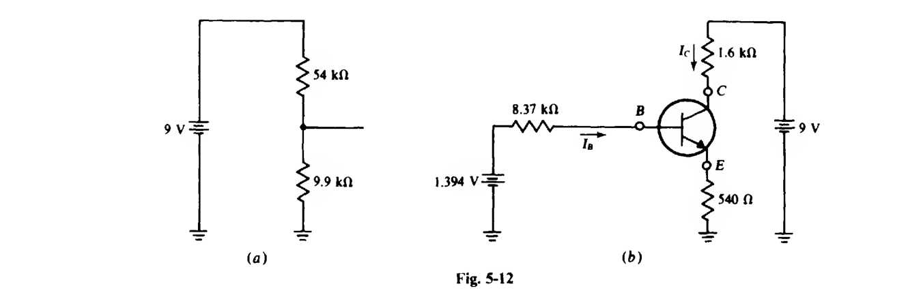
*Fig. 5-12*

---

#### Problem 5.10  *(page 103)*

**Problem:**

5.10 Find the Thevenin equivalent of the circuit shown in Fig. 5-18.

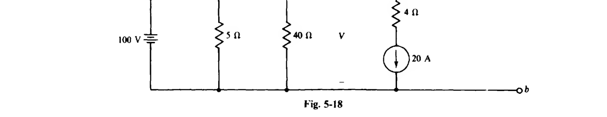
*Fig. 5-18*

---

#### Problem 5.11  *(page 104)*

**Problem:**

5.11 Obtain the Thevenin equivalent of the circuit of Fig. 5-20a.
By inspection, Fxh = 0 V because the circuit does not contain any independent sources. For a 
determination of RXh, it is necessary to apply a source and calculate the ratio of the source voltage to the 
source current. Any independent source can be applied, but often a particular one is best. Here, if a 12-V 
voltage source is applied positive at terminal a, as shown in Fig. 5-206, then / = 12/12 = 1 A, which is 
the most convenient current. As a result, the dependent source provides a voltage of 8/ = 8 V. So, by KCL,
12 12 
/s --1-- +
12-8
12 6
4 A
4
K
Finally,

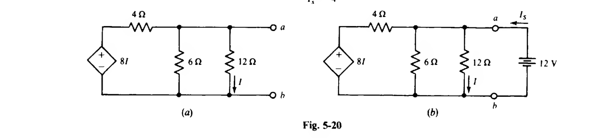
*Fig. 5-20*

---

#### Problem 5.14  *(page 106)*

**Problem:**

5.14 Find the input resistance Rin of the circuit shown in Fig. 5-24.
Since this circuit has a dependent source but no independent sources, the approach to finding the input 
resistance is to apply a source at the input. Then the input resistance is equal to the input voltage divided 
by the input current. A good source to apply is a 1-A current, as shown in Fig. 5-25.
/

*Fig. 5-25*

---

#### Problem 5.16  *(page 107)*

**Problem:**

5.16 Figure 5-26a shows an emitter-follower circuit for obtaining a large input resistance for resistance 
matching. The load is a 30-£2 resistor, as shown. Find the input resistance Rin.
Because the circuit has a dependent source and no independent sources, the preferable way to find Rln 
is from the input voltage when a I-A current source is applied, as shown in Fig. 5-26b. Here, /„ = I A, and 
so the total current to the parallel resistors is lB -t- 100/B = 101/B = 101 A, and the voltage V is
V = 101(2501130) V = 2.7 kV
The input resistance is R,„ = Vj\ = 2.7 kf2, which is much greater than the 30 Q of the load.

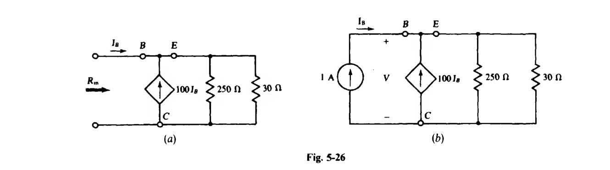
*Fig. 5-26*

---

#### Problem 5.23  *(page 110)*

**Problem:**

5.23 For the circuit shown in Fig. 5-18, use superposition to find ^Th referenced positive on terminal a.
Clearly, the 30-V source contributes 30 V to FTh because this source, being in series with an open circuit, 
cannot cause any currents to flow. Zero currents mean zero resistor voltage drops, and so the only voltage 
in the circuit is that of the source.
Figure 5-3la shows the circuit with all independent sources deactivated except the 100-V source. Notice 
that the voltage across the 40-0 resistor appears across terminals a and 6 because there is a zero voltage 
drop across the 8-0 resistor. By voltage division this component of FTh is
40 
Vnv =-x 100 = 80 V 
40+10
Figure 5-316 shows the circuit with the current source as the only independent source. The voltage 
across the 40-0 resistor is the open-circuit voltage since there is a zero voltage drop across the 8-0 resistor. 
Note that the short circuit replacing the 100-V source prevents the 5-0 resistor from having an effect, and 
also it places the 40- and 10-0 resistors in parallel for a net resistance of 40|| 10 = 8 0. So, the component 
of FTh from the current source is VThc = - 20 x 8 = - 160 V.
ion 8 n ion 8 n

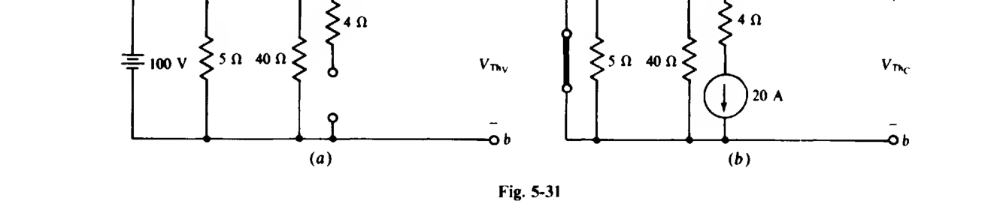
*Fig. 5-31*

---

#### Problem 5.27  *(page 111)*

**Problem:**

5.27 Use Millman’s theorem to find / for the circuit shown in Fig. 5-32.

*Fig. 5-32*

---

#### Fig. 5-35  *(page 113)*

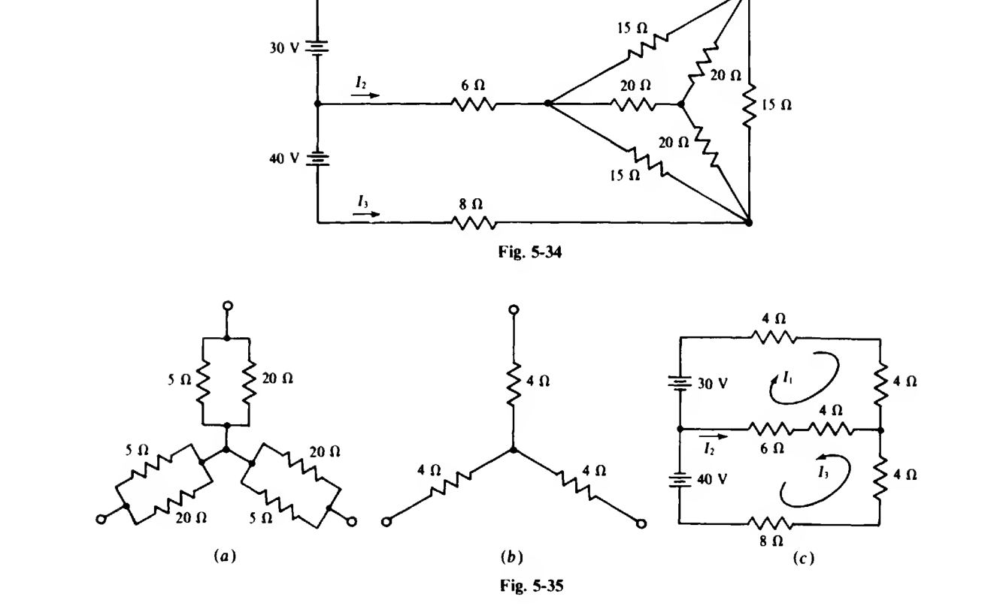
*Fig. 5-35*

**Solution:**

resistors of the two Y’s are in parallel, as shown in Fig. 5-35«. The two Y’s can be reduced to the single Y 
shown in Fig. 5-35b, in which each Y resistance is 5|i20 = 4 0. With this Y replacing the A-Y combination, 
the circuit is as shown in Fig. 5-35c.
With the consideration of /, and /3 as loop currents, the corresponding KVL equations are
30 =18/! + 10/3 and 40 = 10/, + 22/3
the solutions to which are /, = 0.88 A and /3 = 1.42 A. Then, from KCL applied at the right-hand 
node, I2 = - /, - l} = -2.3 A.

---

#### Problem 5.31  *(page 113)*

**Problem:**

5.31 Using a Y-to-A transformation, find the total resistance RT of the circuit shown in Fig. 5-36, 
which has a bridged-T attenuator.
800 fl

*Fig. 5-36*

---

#### Problem 0.76  *(page 115)*

**Problem:**

0.76 Rw
30 = 95 Q
K.v =
0.24R„ X

*Fig. 5-40*

---

#### Problem 5.37  *(page 116)*

**Problem:**

5.37 Find the Thevenin equivalent of the circuit shown in Fig. 5-41. Reference VJh positive toward terminal a.
Ans. 12 fi, 12 V
8 n 
A/W-o a
5 A

*Fig. 5-4*

---

#### Problem 5.40  *(page 116)*

**Problem:**

5.40 
Find the Norton equivalent of the circuit of Fig. 5-43. Reference /N up.
Ans. 8 D, 8 A
40 n

*Fig. 5-43*

---

#### Fig. 5-56  *(page 121)*

*Fig. 5-56*

---

#### Problem 5.68  *(page 121)*

**Problem:**

5.68 Use a A-to-Y transformation in finding the voltage V that causes 2 A to flow down through the 3-ft resistor 
in the circuit shown in Fig. 5-59.
Ans. 17.8 V

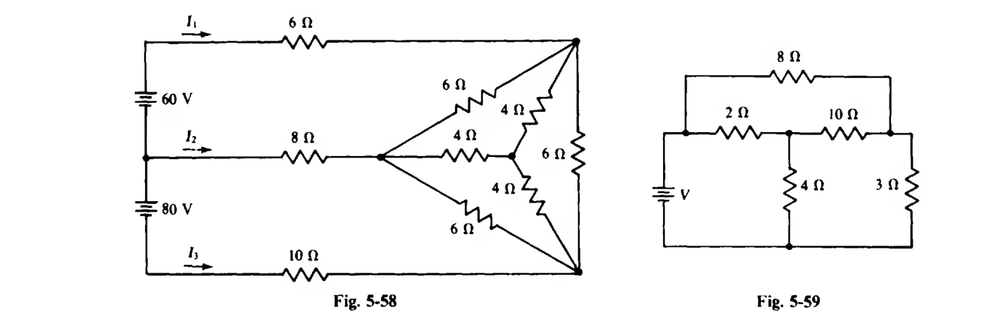
*Fig. 5-58, Fig. 5-59*

---

#### Problem 5.73  *(page 122)*

**Problem:**

5.73 In the circuit of Fig. 5-62, what resistor R, will absorb maximum power, and what is this power?
Ans. 30 0, 1.48 W
30 0

*Fig. 5-62*

---

## Chapter 6 — Operational-Amplifier Circuits

### Solved Problems

#### Fig. 6-6  *(page 126)*

*Fig. 6-6*

---

#### Fig. 6-7  *(page 127)*

*Fig. 6-7*

**Solution:**

There are applications, in which a voltage signal is to be converted to a proportional output current 
such as, for example, in driving a deflection coil in a television set. If the load is floating (neither end 
grounded), then the circuit of Fig. 6-8 can be used. This is sometimes called a uoltage-to-current converter. 
Since there is zero volts across the op-amp input terminals, the current in resistor is iL = r, Ra, and 
this current also flows through the load resistor R,. Clearly, the load current i, is proportional to the 
signal voltage r,.
The circuit of Fig. 6-8 can also be used for applications in which the load resistance RL varies but 
the load current iL must be constant, v, is made a constant voltage and r, and Ra are selected such that 
iy'Ra is the desired current . Consequently, when R, varies, the load current iL does not change. Of 
course, the load current cannot exceed the maximum allowable op-amp output current, and the load 
voltage plus the source voltage cannot exceed the maximum obtainable output voltage.
CIRCUITS WITH MULTIPLE OPERATIONAL AMPLIFIERS
Often, op-amp circuits are cascaded, as shown, for example, in the circuit of Fig. 6-9. In a cascade 
arrangement, the input to each op-amp stage is the output from a preceding op-amp stage, except, of

---

#### Problem 6.5  *(page 131)*

**Problem:**

6.5 In the circuit of Fig. 6-13o, a 10-kQ load resistor is energized by a source of voltage rs that has 
an internal resistance of 90 kft. Determine vL, and then repeat this for the circuit of Fig. 6-13b.
90 kn

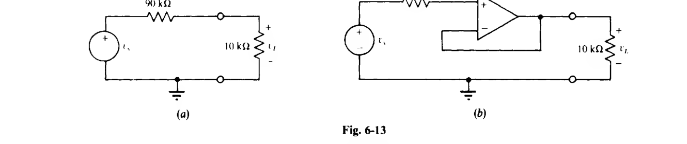
*Fig. 6-13*

**Solution:**

Voltage division applied to the circuit of Fig. 6-13a gives
vt =-vs = 0.1 r,
10 + 90
So, only 10 percent of the source voltage reaches the load. The other 90 percent is lost across the 
internal resistance of the source.
For the circuit of Fig. 6-136, no current flows in the signal source because of the large op-amp 
input resistance. Consequently, there is a zero voltage drop across the source internal resistance, and 
the entire source voltage appears at the noninverting input terminal. Finally, since there is zero volts 
across the op-amp input terminals, vL = i\. So, the insertion of the voltage follower results in an 
increase in the load voltage from O.lr, to l\.
Note that although no current flows in the 90-kQ resistor in the circuit of Fig. 6-136, there is 
current flow in the 10-kQ resistor, the path for which is not evident from the circuit diagram. For a 
positive r,, this current flows down through the 10-kQ resistor to ground, then through the op-amp 
power supplies (not shown), and finally through the op-amp internal circuitry to the op-amp output 
terminal.

---

#### Problem 6.6  *(page 131)*

**Problem:**

6.6 Obtain the input resistance Rtn of the circuit of Fig. 6-14a.
The input resistance Rin can be determined in the usual way, by applying a source and obtaining the 
ratio of the source voltage to the source current that flows out of the positive terminal of the source. 
Figure 6-146 shows a source of voltage Vs applied. Because of the zero current flow into the op-amp 
noninverting input terminal, all the source current /s flows through Rf, thereby producing a voltage 
of l,Rf across it, as shown. Since the voltage across the op-amp input terminals is zero, this voltage is 
also across R„ and results in a current flow to the riyhi of lsRf!Ra. Because of the zero current flow
«/ */

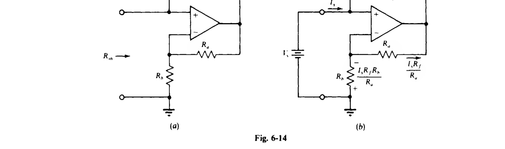
*Fig. 6-14*

---

#### Problem 6.10  *(page 133)*

**Problem:**

6.10 Obtain an expression for the voltage gain of the op-amp circuit of Fig. 6.16.
R,

*Fig. 6-16*

**Solution:**

Superposition is a good approach to use here. If rb = 0 V, then the voltage at the noninverting input 
terminal is zero, and so the amplifier becomes an inverting amplifier. Consequently, the contribution of iu 
to the output voltage t’0 is - {Rf/Ra)v„. On the other hand, if va = 0 V, the circuit becomes a noninverting 
amplifier that amplifies the voltage at the noninverting input terminal. By voltage division, this voltage is 
RcvJ{Rb + Rc). Therefore, the contribution of ih to the output voltage v0 is
Rc f R A R,(R0 + Rf)
I 1 + - |r\ - ~ ■ i'h 
R„ + R, V RJ R0(R„ + Re)
Finally, by superposition the output voltage is
RfRa + Rf) Rf 
r„ =-<+-i'„
R0(R„ + RC) Ra
This voltage-gain formula can be simplified by the selection of resistances such that RJRf = R(,/Rr. 
The result is
Rf
V° = ~R ll't “
in which case the output voltage v0 is a constant times the difference r„ - r0 of the two input voltages. This 
constant can, of course, be made 1 by the selection of Rf - R„. For obvious reasons the circuit of Fig. 
6-16 is called a difference amplifier.

---

#### Problem 6.18  *(page 137)*

**Problem:**

6.18 Assume for the op amp in the circuit of Fig. 6-23 that the saturation voltages are V0 = 
± 14 V and that Rf = 6 kfl Then determine the maximum resistance of Ra that results in the 
saturation of the op amp.
The circuit of Fig. 6-23 is a noninverting amplifier, the voltage gain of which is G = I + 6/2 = 4. 
Consequently, F„ =4F+, and for saturation at the positive level (the only saturation possible), - 
14/4 = 3.5 V. The resistance of Ra that will result in this voltage can be obtained by using voltage division:
10 
K+ = - x 4.9 = 3.5 or 49 = 35 + 3.5Ra
10+ Ra

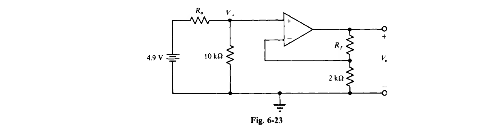
*Fig. 6-23*

---

#### Problem 6.20  *(page 138)*

**Problem:**

6.20 
Obtain the Thevenin equivalent of the circuit of Fig. 6-24 with ^Th referenced positive at 
terminal a.
l kQ

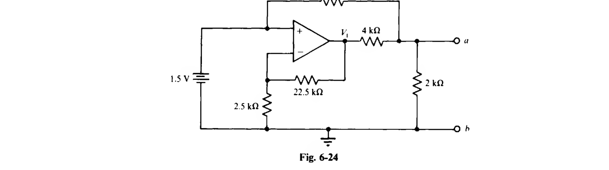
*Fig. 6-24*

**Solution:**

By inspection, the part of the circuit comprising the op amp and the 2.5-kfi and 22.5-kfi resistors is a 
noninverting amplifier. Consequently,
22.53, 
+ - x 1.5 = 15 V 
2.5
y, =
Since PTh = Vab, the node voltage equation at terminal a is
^Th FTh - 1.5 ^ VTh - 15 - o
and so
2 
FTh = 3 V 
1 
4

---

#### Problem 6.22  *(page 139)*

**Problem:**

6.22 Find V0 in the circuit of Fig. 6-26.
The circuit of Fig. 6-26 can be viewed as two cascaded summers, with V0 being one of the two inputs 
to the first summer. The other input is 3 V. Then, the output Vl of the first summer is
y, = - t¥(3>+ ¥!'.]= - 18 - 2 K0
6kn

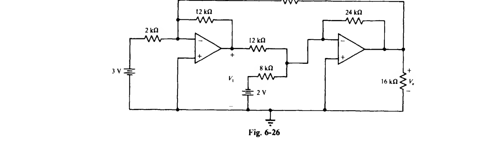
*Fig. 6-26*

---

#### Problem 6.23  *(page 140)*

**Problem:**

6.23
4kft

*Fig. 6-27*

**Solution:**

In this cascaded arrangement, the first op-amp circuit is an inverting amplifier. Consequently, the 
op-amp output voltage is - (6/2X - 3) = 9 V. For the second op amp, observe that F_ = F+ = 2 V. Thus, 
the nodal equation at the inverting input terminal is
9-2 K - 2 
-+ --= 0 and so V0 = - 12 V
2 4
Perhaps a better approach for the second op-amp circuit is to apply superposition, as follows:
K= - j(9) + (1 +|X2)= -18 + 6= -12 V

---

#### Problem 6.24  *(page 140)*

**Problem:**

6.24 Find Vl0 and V2o in the circuit of Pig. 6-28.

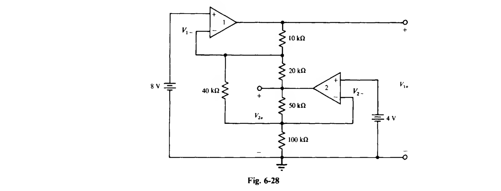
*Fig. 6-28*

---

#### Problem 6.30  *(page 142)*

**Problem:**

6.30 Repeat Prob. 6.29 for Va = 16 V and Vk = 4 V.
16 kfi 24 kfi
Ans. 10 V, 1.08 mA

*Fig. 6-32*

---

#### Problem 6.33  *(page 143)*

**Problem:**

6.33 In the circuit of Fig. 6-33, let V5 = 4 V and calculate V0 and /„.
Ans. 7.2 V, 1.8 mA
12 kn

*Fig. 6-33*

---

#### Problem 6.39  *(page 144)*

**Problem:**

6.39 Obtain V„ and /„ in the circuit of Fig. 6-36 for Va = 12 V and LJ, = 0 V.
Ans. 10.8 V, 4.05 mA
2 kil

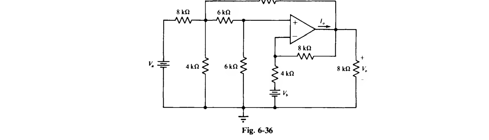
*Fig. 6-36*

---

#### Problem 6.41  *(page 144)*

**Problem:**

6.41 In the circuit of Fig. 6-37, calculate V0 if Vs = 4 V.
Ans. -3.10 V
8kn

*Fig. 6-37*

---

#### Problem 6.51  *(page 146)*

**Problem:**

6.51 Determine Vl0 and V20 in the circuit of Fig 6-42.
Arts. Vlo = 1.6 V, V2o= 10.5 V
+ 6

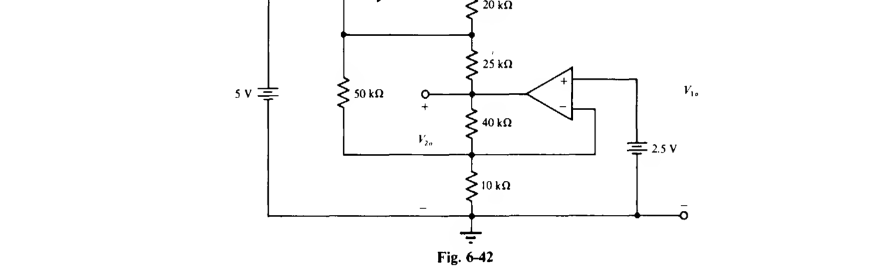
*Fig. 6-42*

---

## Chapter 7 — Phasors and Complex Numbers

### Solved Problems

#### Fig. 7-3  *(page 150)*

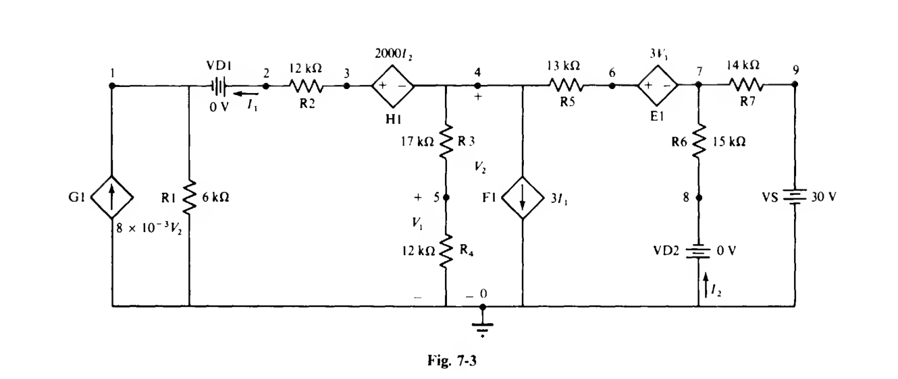
*Fig. 7-3*

**Solution:**

CIRCUIT FILE FOR THE CIRCUIT OF FIG. 7-3 
G1 
0 1 
4 0 
8M 
R1 
1 0 
6K 
VD1 
2 
1 
0 
R2 
3 
2 
12K 
HI 
3 4 
VD2 
2K 
R3 
4 
5 
17K 
R4 
5 0 
12K 
FI 
4 0 
VD1 
3 
R5 
4 
6 
13K 
El 
6 7 
5 0 
3 
R6 
8 7 
15K 
VD2 
0 8 
0 
R7 
7 9 
14K 
VS 
9 0 
30 
.END
For each dependent source statement, the first two nodes specified are the nodes between which the 
dependent source is positioned. Further, the arrangement of these nodes is the same as for an independent 
source with regard to voltage polarity or current direction.
For a voltage-controlled dependent source, there is a second pair of specified nodes. These are the 
nodes across which the controlling voltage occurs, with the first node being the node at which the 
controlling voltage is referenced positive. For a current-controlled dependent source, there is an 
independent voltage source designator instead of a second pair of nodes. This is the name of the 
independent voltage source through which the controlling current flows from the first specified node of 
the voltage source to the second. The last field in each dependent source statement is for the scale factor 
or multiplier.
PSpice does not have a built-in component for an ideal operational amplifier. From the model shown 
in Fig. 6-2b, though, it should be apparent that all that is required to effectively obtain an ideal op amp 
is a single voltage-controlled voltage source with a huge voltage gain, say 500 000 or more. If a nonideal 
op amp is desired, resistors can be included as shown in Fig. 6-2a.
.DC AND .PRINT CONTROL STATEMENTS
So far, the only voltages and currents obtained have been node voltages and independent voltage 
source currents. Obtaining others requires the inclusion of a .DC control statement, and also a .PRINT 
statement in the source file.

---

#### Fig. 7-4  *(page 152)*

*Fig. 7-4*

**Solution:**

CIRCUIT FILE FOR THE CIRCUIT OF FIG. 7-4 
El 10 45 0.5 
R1 1 2 8 
R2 2 3 6 
VI 3 0 120 
R3 2 4 2 
R4 4 5 4 
V2 50 60
.DC VI 120 120 1 
.PRINT DC I(R1) I(R3) 
.END 
********************************************************************
VI I(R1) I(R3) 
1.200E+02 -8.000E+00 1.000E+00

---

#### Problem 7.2  *(page 152)*

**Problem:**

7.2 Repeat Prob. 4.15 using PSpice. Specifically, find the power absorbed by the dependent source 
in the circuit of Fig. 4-19.
Figure 7.5 is the PSpice circuit corresponding to the circuit of Fig. 4-19.

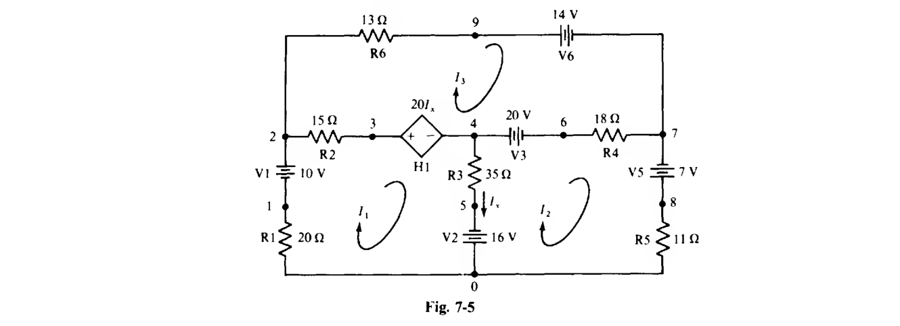
*Fig. 7-5*

**Solution:**

Since PSpice does not provide a power output except for the total power produced by independent 
voltage sources, the power absorbed by the dependent source must be calculated by hand after PSpice is 
used to obtain the voltage across the dependent source and the current flowing into the positive terminal 
of this source.
In the following circuit file, observe in the V2 statement (V2 5 0 - 16) that node 5 is the first 
specified node, which in turn means that the specified voltage must be negative since node 5 is not the

---

#### Problem 7.3  *(page 153)*

**Problem:**

7.3 Repeat Prob. 4.22 using PSpice. Specifically, determine the current / in the circuit of Fig. 4-25.
Figure 7-6 is the PSpice circuit corresponding to the circuit of Fig. 4-25. This PSpice circuit, though, 
has an added dummy voltage source VD. It is the current in this source that is the controlling current for 
the two dependent sources. Again, remember that a controlling current must flow through an independent 
voltage source.
Below is the corresponding circuit file along with the printed output obtained when this file is run 
with PSpice. The output l(R3) = 3 A agrees with the answer to Prob. 4.22.
R2

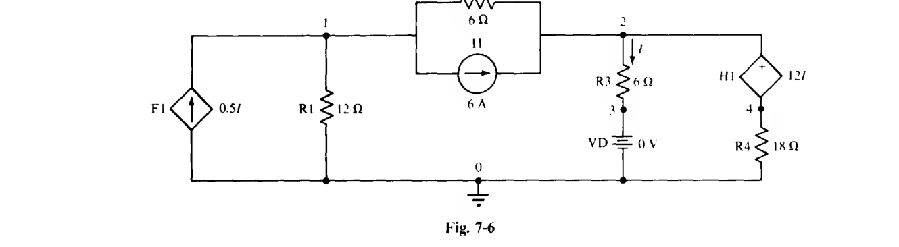
*Fig. 7-6*

---

#### Problem 7.5  *(page 155)*

**Problem:**

7.5 Repeat Prob. 5.11 using PSpice. In other words, obtain the Thevenin equivalent of the circuit 
of Fig. 5-20a.
Figure 7-8 is Ihe PSpice circuit corresponding to the circuit of Fig. 5-20a. This PSpice circuit has a 
dummy voltage source VI inserted for sensing the controlling current /.
1 4 0 2

*Fig. 7-8*

**Solution:**

CIRCUIT FILE FOR THE CIRCUIT OF FIG. 7-8 
HI 1 0 VI 8 
R1 1 2 4 
R2 2 0 6 
R3 23 12 
VI 3 0
.TF V (2,0) VI 
.END 
********************************************************************
NODE VOLTAGE NODE VOLTAGE NODE VOLTAGE
(1) 0.0000 (2) 0.0000 (3) 0.0000
**** SMALL-SIGNAL CHARACTERISTICS
V(2,0)/V1 = -2.500E-01
INPUT RESISTANCE AT VI = 9.600E+00
OUTPUT RESISTANCE AT V(2,0) = 3.000E+00
Above is the corresponding circuit file along with the PSpice output. In the circuit file a TF statement 
has been included to obtain the Thevenin resistance. The format of this statement is
.TF (output variable) (independent source)
The resulting output consists of three parts:
1. The ratio of the output variable to the specified source quantity. For example, in the case in which the 
independent source provides an input voltage and the output is the output voltage, this ratio is the 
voltage gain of the circuit.
2. The second is the resistance "seen" by the independent source. It is the ratio of the source voltage to 
the source current flowing out of the positive source terminal with the other independent sources 
deactivated. In an electronic circuit, this resistance may be the input resistance.
3. The final output part consists of the output resistance at the terminals of the output variable, 
and includes the resistance of any resistor connected across these terminals. For the present case, this 
output resistance is the Thevenin resistance, which is the desired quantity.
The voltage gain and the input resistance parts of the output are not of interest. The printed output resistance 
of 3 Q. the Thevenin resistance, agrees with the answer to Prob. 5.11. The Thevenin voltage is zero, of course,
as is specified by the printed node 2 voltage.

---

#### Problem 7.9  *(page 159)*

**Problem:**

7.9 Repeat Prob. 6.24 using PSpice. Specifically, obtain the voltages F,„ and V*. in the circuit of Fig. 
6-28.
Figure 7-12a is the same as Fig. 6-28 and is included solely for convenience. Figure 7-126 is the 
corresponding PSpice circuit in which the two op amps have been replaced by models El and F.2, which 
are voltage-controlled voltage sources.
Following is the corresponding circuit file and the pertinent part of the output file. The results 
of V(3) = F,„ = 12.5 V and V(4) = F2|, = 1 V agree with the answers to Prob. 6.24.
1 3
(a)
+ 6

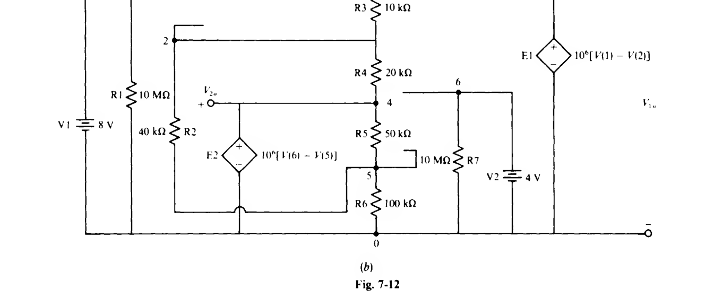
*Fig. 7-12*

---

## Chapter 8 — AC Power

### Solved Problems

#### Fig. 8-5  *(page 168)*

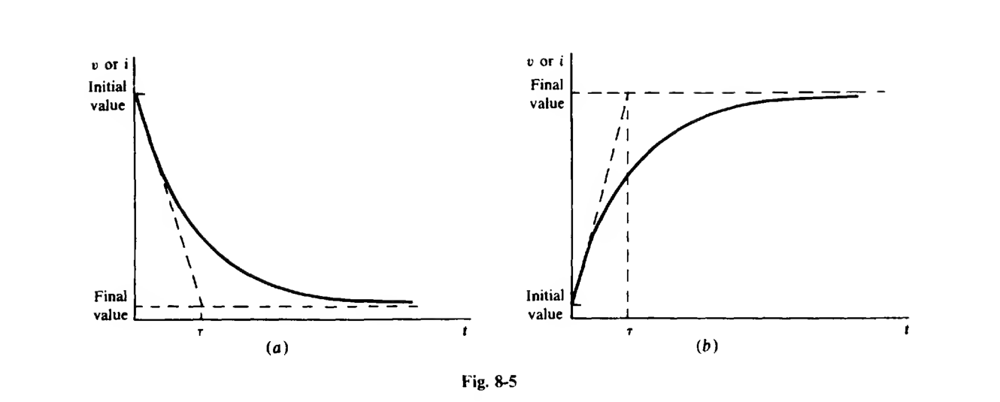
*Fig. 8-5*

**Solution:**

for all time greater than zero (t > 0 s). In these equations, t'(0 + ) and i(0 + ) are initial values 
immediately after switching; r(x) and /(x) are final values; e = 2.718, the base of natural logarithms; 
and t is the time constant of the circuit of interest. These equations apply to all voltages and currents 
in a linear, RC, single-capacitor circuit in which the independent sources, if any, are all dc.
By letting t = x in these equations, it is easy to see that, in a time equal to one time constant, 
the voltages and currents change by 63.2 percent of their total change of r(x) - r(0 + ) or i(x) - i(0 + ). 
And by letting t = 5t, it is easy to see that, after five time constants, the voltages and currents change 
by 99.3 percent of their total change, and so can be considered to be at their final values for most 
practical purposes.
RC TIMERS AND OSCILLATORS
An important use for capacitors is in circuits for measuring time timers. A simple timer consists 
of a switch, capacitor, resistor, and dc voltage source, all in series. At the beginning of a time interval 
to be measured, the switch is closed to cause the capacitor to start charging. At the end of the time 
interval, the switch is opened to stop the charging and "trap” the capacitor charge. The corresponding 
capacitor voltage is a measure of the time interval. A voltmeter connected across the capacitor can have 
a scale calibrated in time to give a direct time measurement.
As indicated in Fig. 8-5, for times much less than one time constant, the capacitor voltage changes 
almost linearly. Further, the capacitor voltage would get to its final value in one time constant if the 
rate of change were constant at its initial value. This linear change approximation is valid if the time to 
be measured is one-tenth or less of a time constant, or, what amounts to the same thing, if the voltage 
change during the time interval is one-tenth or less of the difference between the initial and final voltages.
A timing circuit can be used with a gas tube to make an oscillator a circuit that produces a repeating 
waveform. A gas tube has a very large resistance approximately an open circuit for small voltages. 
But at a certain voltage it will fire or, in other words, conduct and have a very low resistance approx¬ 
imately a short circuit for some purposes. After beginning to conduct, it will continue to conduct even 
if its voltage drops, provided that this voltage does not drop below a certain low voltage at which the 
tube stops firing (extinguishes) and becomes an open circuit again.
The circuit illustrated in Fig. 8-6a is an oscillator for producing a sawtooth capacitor voltage as 
shown in Fig. 8-6b. If the firing voltage VF of the gas tube is one-tenth or less of the source voltage Fs, 
the capacitor voltage increases almost linearly, as shown in Fig. 8-6h, to the voltage VF, at which time 
T the gas tube fires. If the resistance of the conducting gas tube is small and much less than that of the 
resistor R, the capacitor rapidly discharges through the tube until the capacitor voltage drops to VE. the

---

#### Fig. 8-6  *(page 169)*

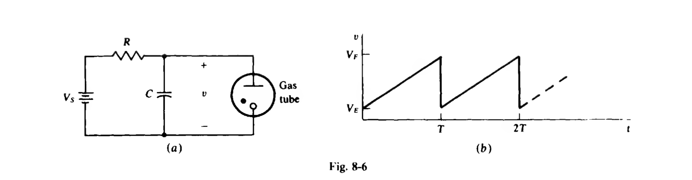
*Fig. 8-6*

**Solution:**

extinguishing voltage, which is not great enough to keep the tube conducting. Then the tube cuts off. 
the capacitor starts charging again, and the process keeps repeating indefinitely. The time T for one 
charging and discharging cycle is called a period.
Solved Problems
Find the capacitance of an initially uncharged capacitor for which the movement of 3 x 1015 
electrons from one capacitor plate to another produces a 200-V capacitor voltage.

---

#### Problem 8.9  *(page 170)*

**Problem:**

8.9 Find the total capacitance C, of the circuit shown in Fig. 8-7.
60 ixF
90 n F 
30 jiF
-It- --It-
-It-
= 10/iF ^ z 25 nF ^ 
60 nF
Ct

*Fig. 8-7*

**Solution:**

At the end opposite the input, the series 30- and 60-gF capacitors have a total capacitance of 30 x 
60 (30 + 60) = 20 //F. This adds to the capacitance of the parallel 25-/tF capacitor for a total of 45 yjF to 
the right of the 90-//F capacitor. The 45- and 90-/tF capacitances combine to 45 x 90 (45 + 90) = 30 /rF. 
This adds to the capacitance of the parallel I0-//F capacitor for a total of 30 + 10 = 40 //F to the right 
of the 60-/<F capacitor. Finally.
60 x 40
= 24 /<F
C 7
60"+40

---

#### Problem 8.14  *(page 172)*

**Problem:**

8.14 Find each capacitor voltage in the circuit shown in Fig. 8-9.
30 tiF
+ v, -
+ ■* - 
V,
-=- 400 V 
40 »aF F2:4:9/iF V4=t=:70mF

*Fig. 8-9*

**Solution:**

A good analysis method is to reduce the circuit to a series circuit with two capacitors and the voltage 
source, find the charge on each reduced capacitor, and from it find the voltages across these capacitors. 
Then the process can be partially repeated to find all the capacitor voltages in the original circuit.
The parallel 20- and 40-^F capacitors reduce to a single 6O-/1F capacitor. The 30- and 70-/iF 
capacitors reduce to a 30 x 70/(30 + 70) = 21-^F capacitor in parallel with the 9-//F capacitor. So. all 
three of these capacitors reduce to a 21 + 9 = 30-//F capacitor that is in series with the reduced 
60-/iF capacitor, and the total capacitance at the source terminals is 30 x 60 (30 + 60) = 20 /jF. The desired 
charge is
Q = C7 V = (20 x 10 fiX400) C = 8 mC
This charge can be used to obtain F[ and V2:
8 x 10'3 
and V2 =-= 267 V
8 x 10‘3 
V, =-- = 133 V
30 x 10'6
60 x 10~6
Alternatively, V2 = 400 - V, = 400 - 133 = 267 V.
The charge on the 30-/iF capacitor and also on the series 70-/iF capacitor is the 8 mC minus 
the charge on the 9-/iF capacitor:
8 x 10'3 -(9 x 10'6K267)C = 5.6 mC
Consequently, from V = Q/C,

---

#### Problem 8.20  *(page 174)*

**Problem:**

8.20 Sketch the waveform of the current that flows through a 2-/tF capacitor when the capacitor 
voltage is as shown in Fig. 8-10. As always, assume associated references because there is no 
statement to the contrary.
Graphically, the dr dr in i = C dr dr is the .slope of the voltage graph. For straight lines this slope
is the same as Ar At. For this voltage graph, the straight line for the interval of t = 0 s to t = 1 /is has 
a slope of (20 - 0)/(l x 10 6 - 0) V s = 20 MV s. which is the voltage at t = 1 /<s minus the voltage 
at t = 0 s, divided by the time at t = 1 ps minus the time at t = 0 s. As a result, during this time 
interval the current is i = C dr dt = (2 x 10"',)(20 x 106) = 40 A.
From r = I ps to t = 4 ps. the voltage graph is horizontal, which means that the slope and, 
consequently, the current arc zero: r = 0 A.
For the time interval from r = 4 ps to t = 6 ps. the straight line has a slope of (-20 - 20) 
(6 x 10”6 - 4 x 10“6) V s = -20 MV s. This change in voltage produces a current of i = C dr dt = 
(2 x 10“ 6X - 20 x 10h) = -40 A.
Finally, from r = 6 ps to t = 8 ps. the slope of the straight line is [0 - ( - 20)] (8 x 10“6 - 
6 x 10 6) V s = 10 MV s and the capacitor current is i = C dr dr = (2 x 10“6H10 x 106) = 20 A.
Figure 8-11 is a graph of the capacitor current. Notice that, unlike capacitor voltage, capacitor 
current can jump, as it does at 1.4, and 6 /rs. In fact, at 6 ps the current reverses direction instantaneously.

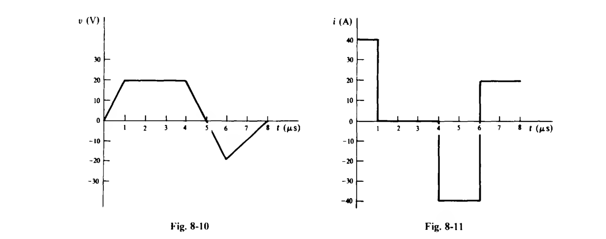
*Fig. 8-10, Fig. 8-11*

---

#### Problem 8.21  *(page 174)*

**Problem:**

8.21 Find the time constant of the circuit shown in Fig. 8-12.
30 kn 9 kn

*Fig. 8-12*

---

#### Problem 8.31  *(page 178)*

**Problem:**

8.31 After a long time in position 1, the switch in the circuit shown in Fig. 8-16 is thrown to position
2 at f = 0s for a duration of 30 s and then returned to position 1. (w) Find the equations for r 
for t > 0 s. (6) Find t at t = 5 s and at t = 40s. (c) Make a sketch of r for 0 s < t < 80 s.
(«) At the time that the switch is thrown to position 2. the initial capacitor voltage is 20 V. the same 
as immediately before the switching; the final capacitor voltage is 70 V. the voltage of the source 
in the circuit; and the time constant is (20 x 10h)(2 x 10 *s) = 40 s. Consequently, while the switch is 
in position 2,
r - 70 + (20 - 70)e"'40 = 70 - 50e o o;!-'V
5 Mfl 1 2 20 Mn

*Fig. 8-16*

---

#### Problem 8.48  *(page 182)*

**Problem:**

8.48 Find each capacitor voltage in the circuit shown in Fig. 8-20.
Ans. F, = 200 V. F,= 100V. F, = 40 V. l4 = 60 F
300 pF 1200 pF

*Fig. 8-20*

---

#### Problem 8.54  *(page 182)*

**Problem:**

8.54 Find the time constant of the circuit shown in F ig. 8-21.
60 ft 6 n 4 kfl 9 kfl
Ans. 60 ps

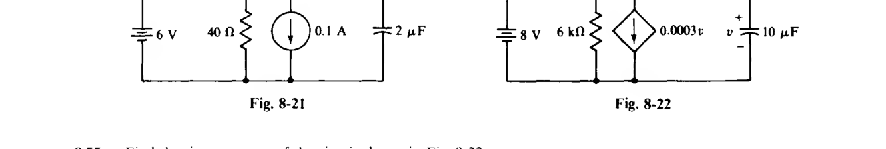
*Fig. 8-21, Fig. 8-22*

**Solution:**

Ans. 66.3 ms

---

## Chapter 9 — Capacitors and Capacitance

### Solved Problems

#### Problem 9.30  *(page 199)*

**Problem:**

9.30 In the circuit of Fig. 9-18, the switch is moved to position 1 at r = 0s and then to position 2 
at t = 2 s. The initial capacitor voltage is i^O) = 20 V. Find i for t > 0 s by hand and also 
by using PSpice.
ioo kn 
WV
100 V -=-

*Fig. 9-18*

**Solution:**

The time constant is
t = RC = (100 x 103X10 x 10-6) = Is
Also, c(0) = 20 V, and for the switch in position 1 the final voltage is i(x)= 100 V. Therefore,
t<f) = r(x) + [r(0) - r(x)> " = 100 + (20 - 100)e '' = 100 - 80e-' V 0 s < t < 2 s
At t = 2 s,
r(2) = 100 - 80t> 2 = 89.2 V
So, for / > 2 s, lit) = 89.2e " 21 = 658.9e ' V.
For the PSpice circuit file, a suitable value for TSTOP is 5 s, which is three time constants after the 
second switching. This time is not critical, of course, and perhaps a preferable time would be 6 s. which is 
four time constants after the second switching. But 5 s will be used. The number of time steps is not critical 
either. For convenience, 20 will be used. Then,
TSTEP = TST0P/20 = 5/20 = 0-25 s
To obtain the effects of switching, a PULSE source will be used, with 0 V being one value and 100 V the 
other. The time duration of the 100 V is 2 s, of course. Alternatively, a PWL source could be used. A .PRINT 
statement will be included to generate a table of values, and a PROBE statement to obtain a plot. Following
is a suitable circuit file.
CIRCUIT FILE FOR THE CIRCUIT OF FIG. 9-18 
VI 
1 0 
PULSE(0, 
100 
R1 
1 2 
100K 
Cl 
2 0 
10U IC = 20 
.TRAN 0.25 5 UIC 
.PRINT TRAN V(C1) 
.PROBE V(C1) 
. END
If a PWL source were used instead of the PULSE source, the VI statement would be
VI 1 0 PWL(0 0 1U 100 2 100 2.000001 0)
The V(C1) specification is included in the .PROBE statement so that Probe will store the V(2) node voltage 
under this name. Alternatively, this specification could be omitted and a trace of V(2) specified in the Probe 
mode.
When PSpice is run with this circuit file, the .PRINT statement generates the table of Fig. 9-19a, and 
the .PROBE statement generates Fig. 9-19/>. Notice that the voltage value at t = 2 s is 89.2 V, which 
completely agrees with the value obtained by hand.

---

#### Fig. 9-19  *(page 200)*

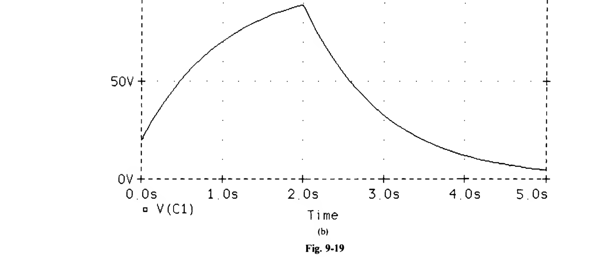
*Fig. 9-19*

**Solution:**

Supplementary Problems

---

## Chapter 10 — Inductors and Inductance

### Solved Problems

#### Fig. 10-2  *(page 206)*

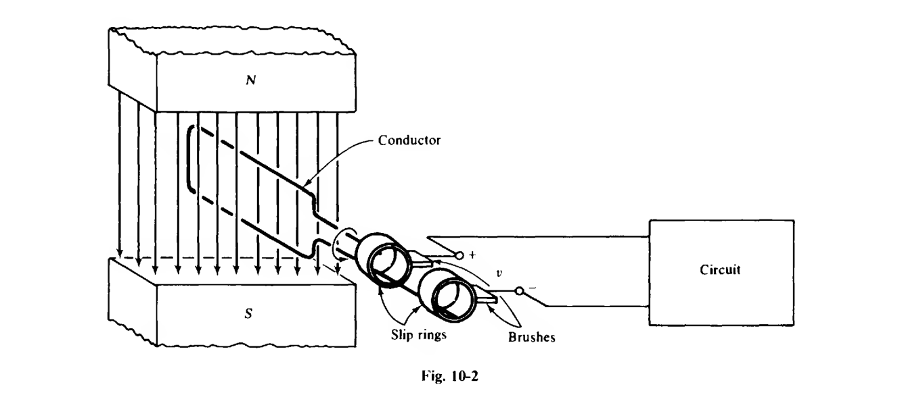
*Fig. 10-2*

**Solution:**

The radian in radian per second is an SI angular unit, with symbol rad, and it is an alternative to 
degrees. A radian is the angle subtended by an arc on the circumference of a circle if the arc has a length 
equal to the radius. Since the circumference of a circle equals 2nr, where r is the radius, it follows that 
In rad equals 360 or
360 180 
1 rad =-=-= 57..3° 
In n
This relation is useful for converting from degrees to radians and from radians to degrees. Specifically,
Angle in radians = x angle in degrees
Angle in degrees =- x angle in radians
n
But, of course, a scientific calculator will perform either conversion at the press of a key. The waveform 
of sin (of has the shape shown in Fig. 10-1«. In each cycle it varies from 0 to a positive peak or maximum 
of 1, back to 0, then to a negative peak or minimum of - 1, and back to 0 again. For any value of the

---

#### Fig. 10-3  *(page 207)*

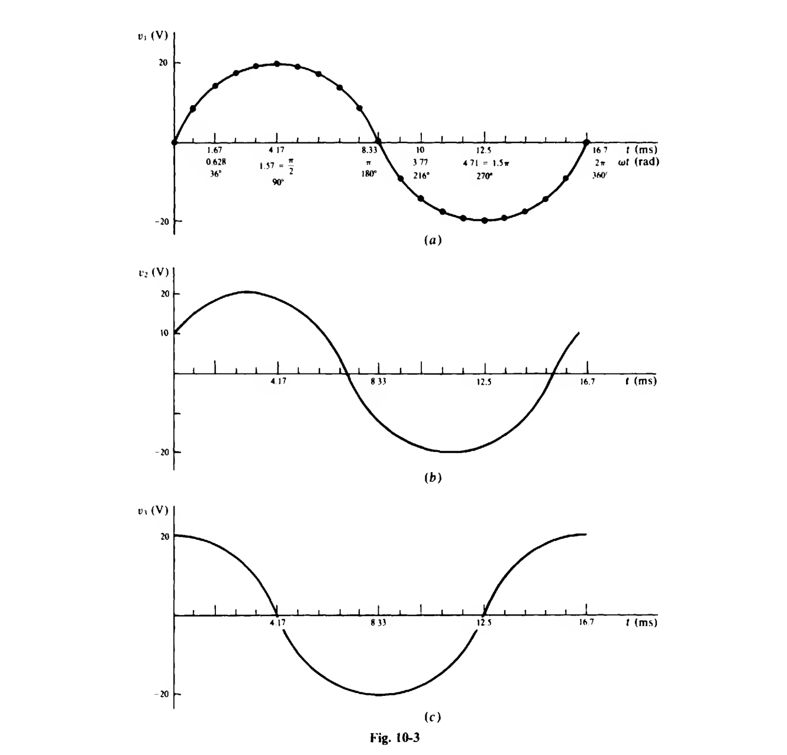
*Fig. 10-3*

---

#### Fig. 10-4  *(page 208)*

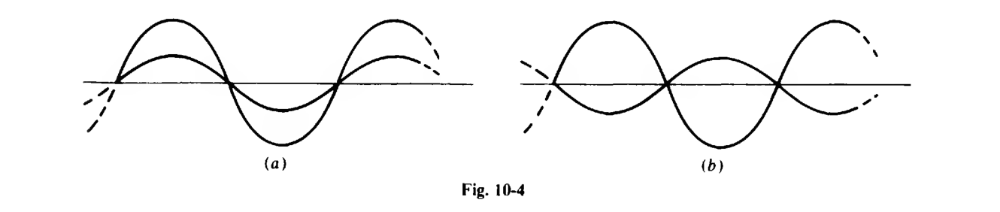
*Fig. 10-4*

---

#### Problem 10.4  *(page 212)*

**Problem:**

10.4 Find the period, the frequency, and the number of cycles shown for the periodic wave illustrated 
in Fig. 10-5.

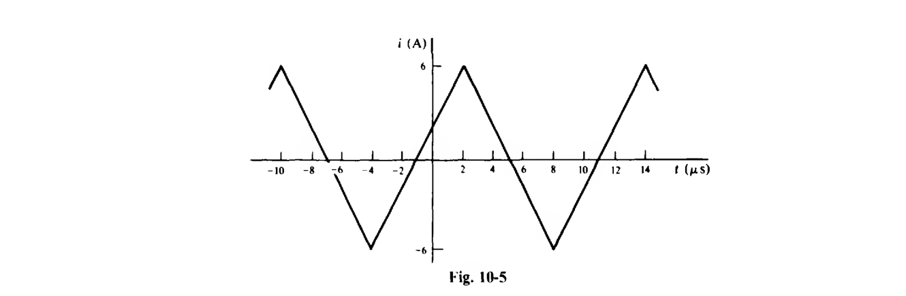
*Fig. 10-5*

**Solution:**

The wave has one positive peak at 2 //s and another positive peak at 14 fis. between which times there 
is one cycle. So, the period is T = 14 - 2 = 12 fts, and the frequency is / = 1 T = 1(12 x 10“h) Hz = 
83.3 kHz. There is one other cycle shown- from - 10 to 2 /is.

---

#### Fig. 10-6  *(page 214)*

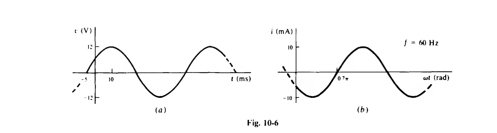
*Fig. 10-6*

**Solution:**

The sinusoid shown in Fig. 10-6u can he considered to be cither a phase-shifted sine wave or a 
phase-shifted cosine wave it does not make any difference. For the selection of a phase-shifted sine wave, 
the general expression is r = 12 sin (or + 01. since the peak value is shown as 12. The radian frequency
to can be found from the period. One-fourth of a period occurs in the 15-ms time interval from - 5 to 10 ms. 
which means that T = 4 x 15 = 60 ms. and so o = 2n T = 2n (60 x 10 •’) = 104.7 rad s. From the 
zero value at r = - 5 ms and the fact that the waveform is going from negative to positive then, just as a 
sine wave does for a zero argument, the argument can be zero at this time: 104.7( -5 x 10“ •’) + 0 = 0, 
from which 0 = 0.524 rad = 30 . The result is r = 12sin(104.7r + 0.524) = 12 sin (104.7r + 30 ) V.
Now consider the equation for the current shown in Fig. 10-66. f rom o = 2nf = 2n(60) = 377 rad. s 
and the peak value of 10 mA. i = 10cos(377r + 0) mA. with the arbitrary selection of a phase-shifted 
cosine wave. The angle 0 can be determined from the zero value at vn = 0.77r. For this value of vit, the 
phase-shifted cosine argument can be 1,5zr rad because at 1.57: rad = 270 a cosine waveform is zero and 
going from negative to positive, as can be seen from Fig. 10-3o. So. for wi =0.7n. the argument can 
be wl +/> = 0.7n + 0 = 1.5n, from which 0 = 0.8n rad = 144 . The result is /' = 10 cos (377r + 0.8zr) =
10 cos (377t + 144 ) mA.

---

#### Problem 10.14  *(page 214)*

**Problem:**

10.14 Sketch a cycle of v = 30 sin (754r + 60 ) V for the period beginning at t = 0 s. Have all three 
abscissa units of time, radians, and degrees.
A fairly accurate sketch can be made from the initial value, the peaks of 30 and -30 V. and the times 
at which the waveform is zero and at its peaks. Also needed is the period, which is T = 2n v> = 2n 754 = 
8.33 ms. The initial value can be found by substituting 0 for / in the argument. The result is v = 
30 sin 60 = 26 V. The waveform is zero for the first time when the argument is n radians since sin ;: = 0. 
This time can be found from the argument with the 60 converted to 7t 3 radians: 754r + n 3 = 7i, from 
which t = 2.78 ms. The next zero is half a period later: 2.78 + 8.33 2 = 6.94 ms. The positive peak for 
this cycle occurs at a time when the sinusoidal argument is n.2: 754/ + 7t 3 - n:2y from which i = 
0.694 ms. The negative peak is half a period later: t = 0.694 + 8.33 2 = 4.86 ms. The radian units for these 
times can be found from wt = 7541 = 2407U. Of course, the corresponding degree units can be found by 
converting from radians to degrees. Figure 10-7 shows the sinusoid.

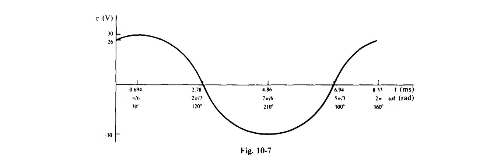
*Fig. 10-7*

---

#### Problem 10.22  *(page 217)*

**Problem:**

10.22 What are the average values of the periodic waveforms shown in Fig. 10-9?

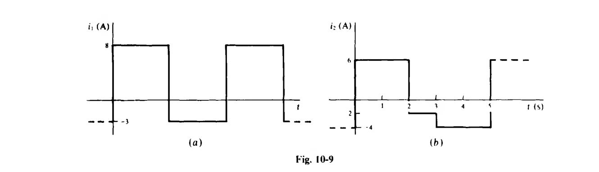
*Fig. 10-9*

**Solution:**

For the cycle starting at r = 0 s, the /, waveform shown in Fig. 10-9// is at 8 A Tor half a period and 
is at -3 A for the next half-period. So, the area for this cycle is 8(7' 2) + I -3)(7 2) = 2.57'. and the 
average value is 2.57/7= 2.5 A.
The i2 waveform shown in Fig. 10-96 has a complete cycle from t = 0 s to r - 5 s. For the first 2 s 
the area under the curve is 6x2 = 12. For the next second it is -2x1 = -2. And for the last 2 s it is 
-4x2= -8. The algebraic sum of these areas is 12 - 2-8 = 2. which divided by the period of 5 
results in an average value of 2/5 = 0.4 A.

---

#### Problem 10.33  *(page 219)*

**Problem:**

10.33 Find the effective value of the periodic current shown in Fig. 10-11 a.

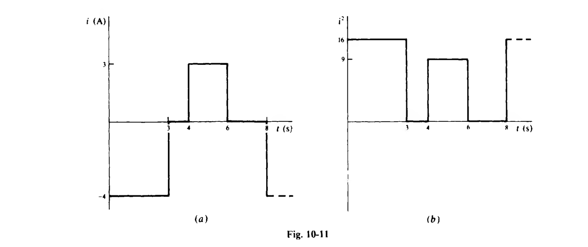
*Fig. 10-11*

---

#### Problem 10.45  *(page 222)*

**Problem:**

10.45 The voltage r = 30 sin (2007it + 30 ) V is across a capacitor that has a reactance of -62 Q. 
Find the capacitor current and plot one cycle of the voltage and current on the same graph.
From lm Im = 1 e;C = iX( |. the current peak equals the voltage peak divided by the magnitude of 
capacitive reactance: !„ = 30 | - 621 = 0.484 A. And. since the current leads the voltage by 90 ,
i = 0.484 sin (200zrf + 30 + 90 ) = 0.484 cos (200zrr + 30 ) A
Notice that the current sinusoid has the same phase angle as the voltage sinusoid, but, because of the 
90 lead, is a phase-shifted cosine wave instead of the phase-shifted sine wave of the voltage.
The voltage graph is the same as that in Fig. 10-10. The current graph differs from that in 
Fig. 10-10 by a shift left by a time corresponding to 90°, which time is one-fourth of a period: 10 4 = 
2.5 ms. The waveforms are shown in Fig. 10-13.

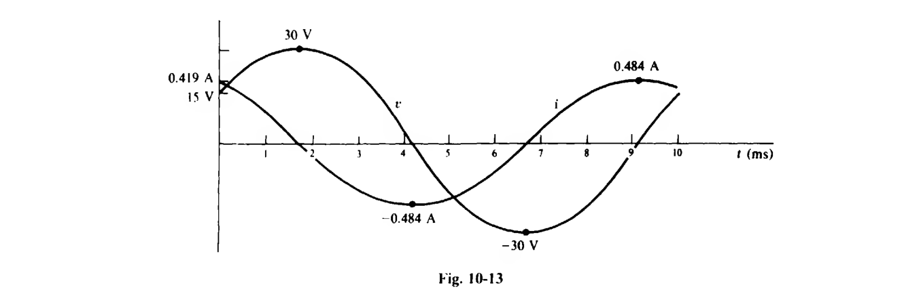
*Fig. 10-13*

---

## Chapter 11 — AC Fundamentals

### Solved Problems

#### Fig. 11-2  *(page 231)*

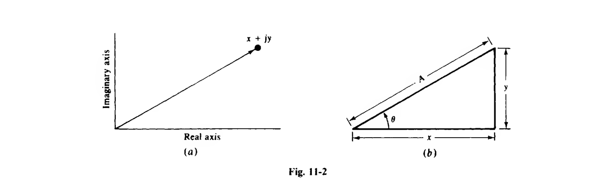
*Fig. 11-2*

**Solution:**

As has been mentioned, the conjugate of a complex number in rectangular form differs only in the 
sign of the imaginary part. In polar form this difference appears as a difference in sign of the angle, as 
can be shown by converting any two conjugates to polar form. For example, 6 + j5 = 7.81/39.8 
and its conjugate is 6 - j5 = 7.81/ - 39.8J.
As stated, the rectangular form is best for adding and subtracting, and the polar form is often best 
for multiplying and dividing. The multiplication and division formulas for complex numbers in polar 
form are easy to derive from the corresponding exponential numbers and the law of exponents. The 
product of the complex numbers Ae’0 and BeJ,p is (AeJ9)(BeJ'p) = /4BeJ<9 + '#,), which has a magnitude AB 
that is the product of the individual magnitudes and an angle 0 + (j> that, by the law of exponents, is 
the sum of the individual angles. In polar form this is A[0 x B/<f> = AB/0 + </>.

---

#### Problem 11.17  *(page 238)*

**Problem:**

11.17 Find vs for the circuit shown in Fig. 11-5.
The voltage vs can be determined from vs = vR + v, + rc after these component voltages are found. 
By Ohm’s law,
vR = [0.234 sin (3000? - 10 )](270) = 63.2 sin (3000r - 10 ) V
The inductor voltage r, leads the current by 90 and has a peak value of wL = 3000(120 x 10“3) = 360 
times the peak value of the current:
vL = 360(0.234) sin (3000? - 10 + 90 ) = 84.2 sin (3000? + 80 ) V
The capacitor voltage vc lags the current by 90' and has a peak value that is 1/mC = 1 (3000 x
6 x 10~6) = 55.6 times the peak value of the current:
vc = 55.6(0.234) sin (3000? - 10 - 90 ) = 13 sin (3000? - 100 ) V
Phasors, which are conveniently based on peak values, can be used to find the sum sinusoid:
Vs = \R + V,. + Vr = 63.2/-10 + 84.2/80' + 13/'-100 = 95.2/38.4 V
-» vs = 95.2 sin (3000? + 38.4 ) V
270 n 120 mH is

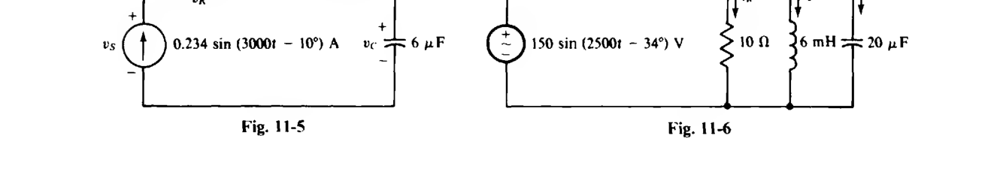
*Fig. 11-5, Fig. 11-6*

---

## Chapter 12 — Series and Parallel AC Circuits

### Solved Problems

#### Fig. 12-1  *(page 243)*

*Fig. 12-1*

**Solution:**

Next, consider an inductor of L henries. As shown in Chap. 10. for a current i = lm sin («f + 0), 
the inductor voltage is r = oLIm cos dot + 0) = <oLIm sin dot + 0 + 90 ). The corresponding phasors 
are
1= Imr [0 A
V = 
„
IQ + 90 
V 
and
V2
v *-

---

#### Fig. 12-7  *(page 247)*

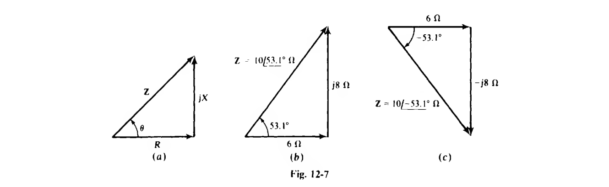
*Fig. 12-7*

**Solution:**

VOLTAGE DIVISION
The voltage division or divider rule for ac circuits should be apparent from this rule for dc circuits. 
Of course, voltage phasors must be used instead of voltages and impedances instead of resistances. So, 
for a series circuit energized by an applied voltage with phasor Vs, the voltage phasor Vv across a

---

#### Fig. 12-9  *(page 251)*

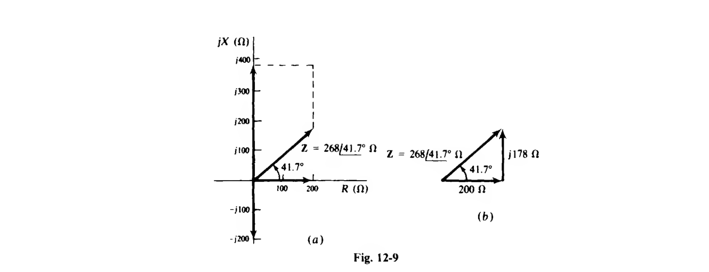
*Fig. 12-9*

**Solution:**

vertical axis to j'377 ft [jX,J, then moving horizontally right to over 200 ft (R), and finally moving vertically 
down by 19912, the magnitude of the capacitive reactance (|A'< |). The impedance triangle construction is 
obvious from the calculated R = 20012 and X = 178 12.

---

#### Problem 3.6  *(page 256)*

**Problem:**

3.6 k(l 
1.2 H 
I 3.6 kSl j'4.8 kil

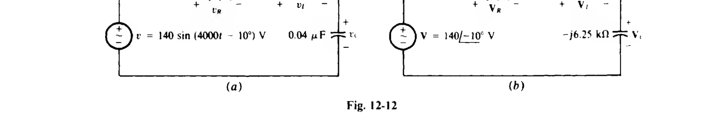
*Fig. 12-12*

**Solution:**

peak rather than on rms values. That is why the source in Fig. 12-12b has a voltage of 140/'- 10 V instead
of 99/- 10' V (99 = 140 v/2). The current is
V 140/-10 140/-10 
I = - =-- = - - A = 36.1 /11.9 m A
Z 3600 +./4800 -76250 3881/-21.9 ‘-
This current can be used to obtain the voltage phasors:
\K = (0.0361/11.9 )(3600) = 130/l 1.9 V
V, = 10.0361/11.9 1(4800/90 ) = 173/102 V
V(. = (0.0361/l_L9 1(6250/-90 ) = 225/’-78.1 V
The corresponding sinusoidal quantities arc
/ = 36.1 sin (4000/ + 11.9 1 mA
i „ = 130 sin 140(H)/ + 11.9 | V
r,. = 173 sin (40(H)/ + 102 I = 173 cos (4000/ f 12 1 V
ty = 225 sin (40(H)/ - 78.1 1 V

---

#### Fig. 12-14  *(page 258)*

*Fig. 12-14*

**Solution:**

Z 51/11.3 , , 
V=-V.=-V= x 184/44.2 = -55.8/38.1 V
Now, all the quantities have been calculated that are needed for the voltage division formula, which is
ZT 168/17.4 L- 1-
The negative sign is required in the formula because the reference polarity of V does not oppose the polarities 
of the sources.

---

#### Problem 12.30  *(page 260)*

**Problem:**

12.30 A 200-Q resistor, a 1-^F capacitor, and a 75-mH inductor are in parallel. Find the total admittance 
in polar form at 400 Hz. Also, draw the admittance diagram and the admittance triangle.
1 -j 1 1 
Y = - + jlnfC + -- = - 
R 2 nfL 200
The total admittance is
+ >2/1(400X1 x 10 fc) + 
-yi
2tt(400X75 x 10 3)
->5.31 x 10~3 = (5 ->2.8X10 J) S = 5.73/-29.2 mS
= 5 x 10“3 + >2.51 x 10'3
The admittance diagram is shown in Fig. 12- 17a and the admittance triangle in Fig. 12-17b. In the 
admittance diagram, the end point for the Y arrow is found by starting at the origin and moving down the 
vertical axis to - >5.31 mS (yB,). and then by moving horizontally to the right to over 5 mS (G) and vertically 
up by 2.51 mS (flc).

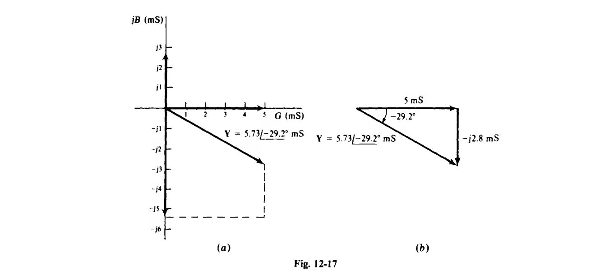
*Fig. 12-17*

---

#### Fig. 12-18  *(page 263)*

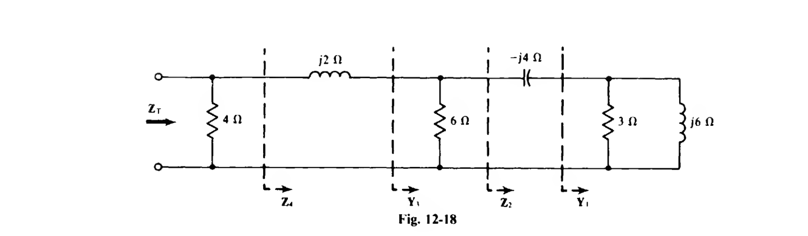
*Fig. 12-18*

**Solution:**

1 1 / 
Y, = - / - = 0.373/ -26.6 S 
3 6 1-
There, the 3- and j6-Q elements have a combined admittance of
which corresponds to an impedance of
= 2.68/26.6 = 2.4 + /l.2 Q 
0.373,/- 26.6 ‘-
This adds to the -;4 C2 of the series capacitor for an impedance of
1 1 / 
Y, =-r - - + - = 0.176 + jO.206 + 0.167 = 0.4/31 S
Z2 = 2.4 + j 1.2 - j4 = 2.4 -y2.8 = 3.69/-49.4 Q
3.69/-49.4 6 L-
The inverse of this added to the conductance of the parallel 6-Q resistor is
0.4/3| L-
The corresponding impedance adds to the j2 Q of the scries inductor:
Z, = , +;2 = 2.14-jl.29 +/2 = 2.26/18.4 n
The corresponding admittance plus the conductance of the 4-Q resistor is Y, :
1 I 
Y7 = -+ - = 0.42
- ;0.14 + 0.25 = 0.684/- 11.8 S
2.26/18.4 4
1 _ 1
1.46/11.8 D
Finally.
Y, ~ 0.684/- 11.8

---

#### Problem 12.40  *(page 263)*

**Problem:**

12.40 Find the input admittance at 50krad/s of the circuit shown in Fig. 12-19u.
The first step is to use -j\/ioL, G,jo)C, and phasors to construct the corresponding phasor-domain 
circuit shown in Fig. 12-196 along with a source of l/O V. With this source, the circuit has an input
Em I

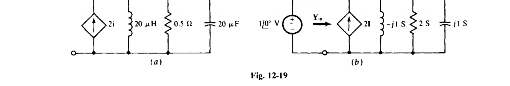
*Fig. 12-19*

---

#### Problem 12.43  *(page 265)*

**Problem:**

12.43 Use current division to find IL for the circuit shown in Fig. 12-21.
Since there are just two branches and the branch impedances are specified, the impedance form of the 
current division formula is preferable: The current in one branch is equal to the impedance of the other 
branch divided by the sum of the impedances, all times the input current. For this circuit, though, a negative 
sign is required because the input current and I, have reference directions into the same node the bottom 
node:
-24/20
-2.22/-36.3 A
1L
10.8/56.3
4V2 sin (400t -

*Fig. 12-21*

---

#### Problem 12.43  *(page 265)*

**Problem:**

12.43 Use current division to find IL for the circuit shown in Fig. 12-21.
Since there are just two branches and the branch impedances are specified, the impedance form of the 
current division formula is preferable: The current in one branch is equal to the impedance of the other 
branch divided by the sum of the impedances, all times the input current. For this circuit, though, a negative 
sign is required because the input current and I, have reference directions into the same node the bottom 
node:
-24/20
-2.22/-36.3 A
1L
10.8/56.3
4V2 sin (400t -

*Fig. 12-22*

---

#### Problem 12.46  *(page 266)*

**Problem:**

12.46 Determine V0 and \0 in the circuit of Fig. 12-24.
6 ku kn

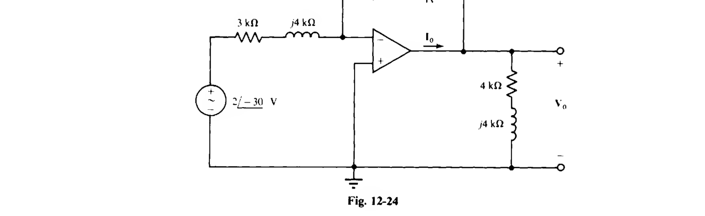
*Fig. 12-24*

**Solution:**

Because this circuit has the same configuration as the inverter op-amp circuit of Fig. 6-4, the same 
formula applies, with the R's replaced by Z’s. The feedback impedance is Zr = 6 - j8 kfl and the input 
impedance is Z, = 3 + ]4 kfi. Therefore, with the impedances expressed in kilohms,
Zf 6 -/8 , , 4/43.7 4/43.7 
V„=--/Vi =-- x 2/-30‘ = 4/43.7 V and 1„ = -L=~= + J==- = 0.762/30.1° mA
Z ,• 3 + j4 4 + j4 6 - ]8

---

#### Fig. 12-25  *(page 267)*

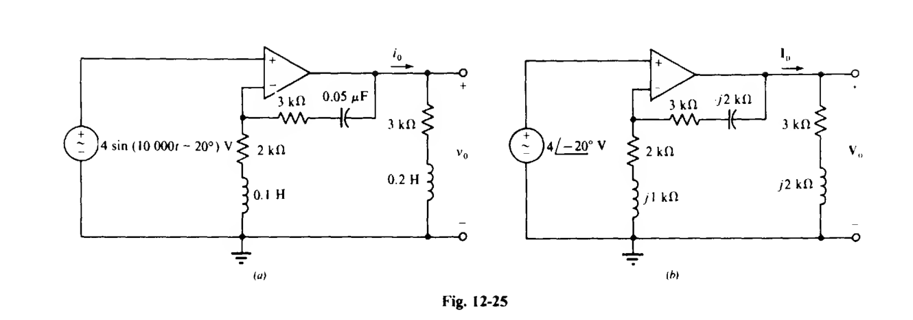
*Fig. 12-25*

**Solution:**

Z„ = 2 +;1 kQ. With the impedances expressed in kilohms.
V, = (' + = (l + \~^j x *1^20° = 9.12/ - 57.9- V
and
3 + J2 L-
9.12/-57.9" 
I„ =-= 2.53/ - 91.6° mA
The corresponding sinusoids are
v0 = 9.12 sin (lOOOOl - 57.9°) V 
and 
/„ = 2.53 sin (lOOOOf - 91.6 ) mA

---

#### Problem 12.48  *(page 267)*

**Problem:**

12.48 Calculate V„ in the circuit of Fig. 12-26.
20/30

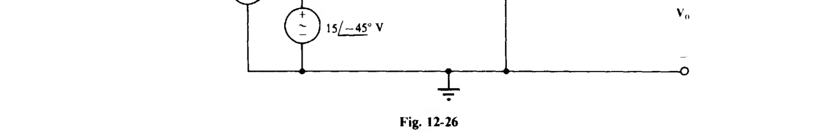
*Fig. 12-26*

**Solution:**

Since the op-amp circuit of Fig. 12-26 has the same configuration as the summer of Fig. 6-5, the same 
formula applies, with the R's replaced by Z’s. So, with the impedances expressed in kilohms,
V„ = x 20/30" + - -- x 15/-45"1 = -29.2/-69.4" V
V7 + /6 9-/10 L-) L-

---

#### Fig. 12-27  *(page 268)*

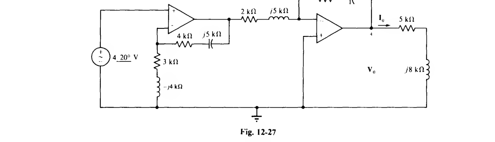
*Fig. 12-27*

**Solution:**

ing and inverting formulas apply, with the R's replaced by Z's. Therefore.
v« = (^> + j _ x 4/20 x ^ = 18.3/99.1 V
V„ 18.3/99.1 
and 1„ = -= i .94/41 j mA 
5 + ]8 5 + j 8 L-
io kn 12 kn

---

#### Problem 12.90  *(page 272)*

**Problem:**

12.90 Find the input admittance at 1 krad's of the circuit shown in Fig. 12-33.
Ans. 4 S
O
O

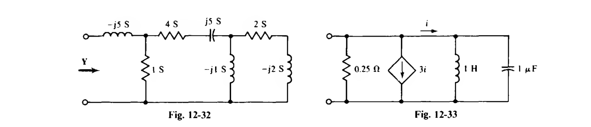
*Fig. 12-33*

---

#### Problem 12.99  *(page 274)*

**Problem:**

12.99 Calculate V„ in the circuit of Fig. 12-38.
Ans. -5.45/- 13.0 V

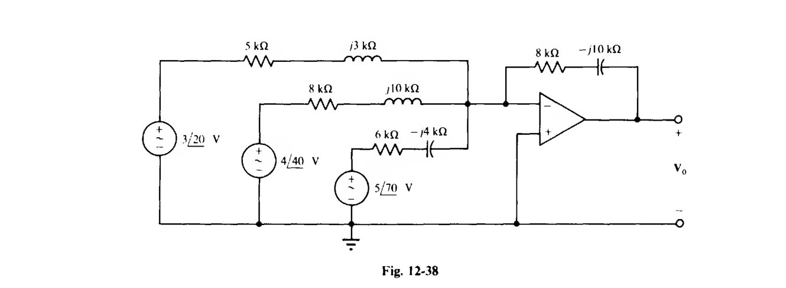
*Fig. 12-38*

---

## Chapter 13 — Mesh, Loop, Nodal, and PSpice Analyses of AC Circuits

### Solved Problems

#### Fig. 13-2  *(page 277)*

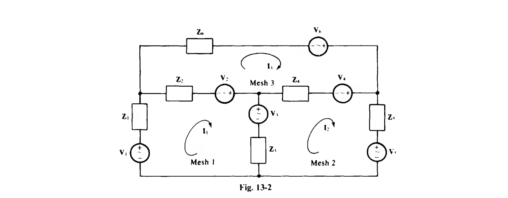
*Fig. 13-2*

**Solution:**

whereljZ,, (I, - I3)Z2, and (I, - I2)Z3 are the voltage drops across the impedances Z,. Z2, and 
Z3. Of course, V, + V2 - V3 is the sum of the voltage rises from voltage sources in mesh 1. As a 
memory aid, a source voltage is added if it "aids" current flow that is. if the principal current has a 
direction out of the positive terminal of the source. Otherwise, the source voltage is subtracted.
This equation simplifies to
(Z, + Z2 + Z3)Ij - Z3I2 - Z2I3 = V, + V2 - V3
The Z( + Z2 + Z3 coefficient of 11 is the self-impedance of mesh 1, which is the sum of the impedances 
of mesh 1. The - Z3 coefficient of I2 is the negative of the impedance in the branch common to meshes
1 and 2. This impedance Z3 is a mutual impedance it is mutual to meshes 1 and 2. Likewise, the - Z2 
coefficient of I3 is the negative of the impedance in the branch mutual to meshes 1 and 3. and so Z2 is 
also a mutual impedance. It is important to remember in mesh analysis that the mutual terms have 
initial negative signs.
It is, of course, easier to write mesh equations using self-impedances and mutual impedances than 
it is to directly apply KVL. Doing this for meshes 2 and 3 results in
and -Z2I( - Z4I2 + (Z2 + Z4 Z(,)I3 = -V, - V4 T Vh
- Z3I[ + (Z3 + Z4 + Z,)I2 - Z413 = V3 -f V4 - V5
(Z,+Z2 + Z3)I,- Z3I2 - Z213 = v,+v2-v3
Placing the equations together shows the symmetry of the I coefficients about the principal diagonal:
- Z31 ] -K (Z3 + Z4 + Z5)l2 - Z4I3 = V3 + V4 - V5 
-Z2I, - Z4I2 4- (Z2 + Z4 + ZJI3 = -v, - v4 + vh
Usually, there is no such symmetry if the corresponding circuit has dependent sources. Also, some of 
the off-diagonal coefficients may not have initial negative signs.
Zt + Z2 + Z3 -Z3 - Z2 I, \ , + V2 - V,
This symmetry of the coefficients is even better seen with the equations written in matrix form:
-z3 z3 + z4 + z5 -z4 I2 = v3 + v4-v, 
-Z2 -Z4 Z2 + Z4 + ZjjJ L-v2-v4 + v6_
For some scientific calculators, it is best to put the equations in this form and then key in the coefficients 
and constants so that the calculator can be used to solve the equations. The calculator-matrix method 
is generally superior to any other procedure such as Cramer’s rule.
Loop analysis is similar except that the paths around which KVL is applied are not necessarily 
meshes, and the loop currents may not all be referenced clockwise. So, even if a circuit has no dependent

---

#### Fig. 13-3  *(page 278)*

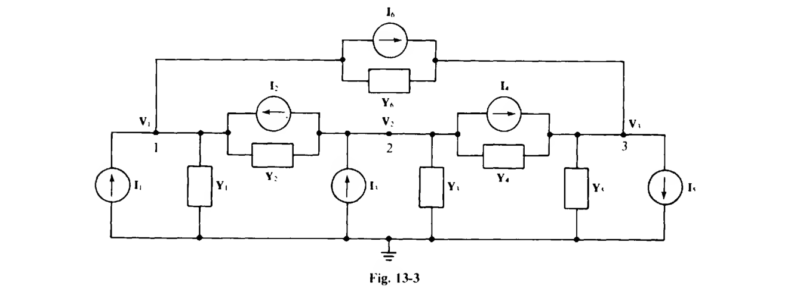
*Fig. 13-3*

**Solution:**

This equation simplifies to
(Y, + Y2 + Y6)V, - Y2V2 - Y6V3 = I, + I2 - I6
The coefficient Y, -I- Y2 + Y6 of V, is the self-admittance of node 1, which is the sum of the 
admittances connected to node 1. The coefficient - Y2 of V2 is the negative of the admittance connected 
between nodes 1 and 2. So, Y2 is a mutual admittance. Similarly, the coefficient - Yh of V3 is the negative 
of the admittance connected between nodes 1 and 3, and so Y6 is also a mutual admittance.
It is, of course, easier to write nodal equations using self-admittances and mutual admittances than 
it is to directly apply KCL. Doing this for nodes 2 and 3 produces
- Y2Vj + (Y2 + Y3 + Y4)V2 - Y4V3 = -I2 + I3 - I4
- Y6V, - Y4V2 + (Y4 + Ys + Y6)V3 = I4 - ls + I„ 
and

---

#### Problem 13.10  *(page 285)*

**Problem:**

13.10 Find the mesh currents for the circuit shown in Fig. 13-16«.
8/-15° v
3 n j4 11 4 a i6 u

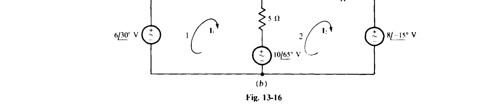
*Fig. 13-16*

**Solution:**

A good first step is to transform the 2/65 -A current source and parallel 5-0 resistor into a voltage 
source and series resistor, as shown in the circuit of Fig. 13-16/?. Note that this transformation eliminates 
mesh 3. The self-impedance of mesh 1 is 3 + /4 + 5 = 8 + ;4 O, and that of mesh 2 is 4 - ;6 + 5 = 
9 - j6Q. The mutual impedance is 5 0. The sum of the voltage rises from sources is 6/30 - 10/65 = 
6.14/ -80.9 V for mesh 1 and 10/65 - 8/ - 15 = 11.7/107 V for mesh 2. The corresponding mesh 
equations are
(8 + /4)I, - 512 = 6.14/-80.9
-51, + (9 - /6)12 = 11.7/107
In matrix form these are
~8 + ;4 
-5 ' V 
"6.14/-80.9 ~ 
-5 
9-y6. _I,_ 
11.7/107
These equations are best solved using a scientific calculator (or a computer). The solutions obtained 
are I, = 0.631/ - 164.4 = -0.63l/l5.6 A and I2 = 1.13/156.1 = - 1.13/-23.9 A.
From the original circuit shown in Fig. 13-16u. the current in the current source is l2 - I, = 2/65 A. 
Consequently,
12 = 12 - 2/65 = - 1.13/-23.9 - 2/65 = 2.3l/- 144.1 = -2.31/35.9 A

---

#### Problem 13.25  *(page 295)*

**Problem:**

13.25 Repeat Prob. 13.24 using PSpice.
For a PSpice circuit file, capacitances are required instead of the capacitive impedances that are specified 
in the circuit of Fig. 13-30. It is often convenient to assume a frequency of a> = 1 rad/s to obtain these 
capacitances. Then, of course, /= \/2n = 0.159 155 Hz is the frequency that must be specified in the circuit
file. For w= 1 rad/s, the capacitor that has an impedance of - j\6Q has a capacitance of 1/16 = 
0.0625 F, and the capacitor that has an impedance of -j8 Q has a capacitance of 1/8 = 0.125 F. Figure 
13.31 shows the PSpice circuit that corresponds to the phasor-domain circuit of Fig. 13-30. The V2 dummy 
source is required to obtain the controlling current for the FI current-controlled current source.
Cl

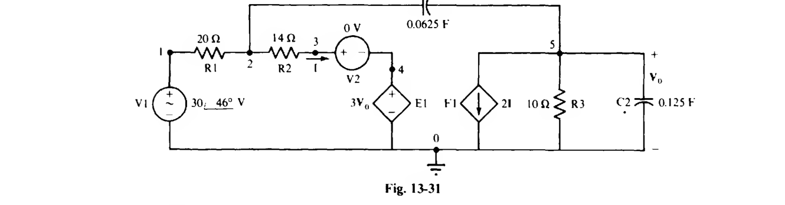
*Fig. 13-31*

**Solution:**

The corresponding circuit file is
CIRCUIT FILE FOR THE CIRCUIT OF 
VI 
1 0 
AC 30-46 
R1 
1 2 
20 
R2 
2 
3 
14 
V2 
3 4 
El 
4 0 
5 0 3 
Cl 
2 5 
0.0625 
FI 
5 0 
V2 2 
R3 
5 0 
10 
C2 
5 0 
0.125 
.AC 
LIN [ 1 0.159155 0.159155 
.PRINT 
AC VM(5) VP(5) 
. END
13-31

---

#### Problem 13.26  *(page 296)*

**Problem:**

13.26 Use PSpice to determine v0 in the circuit of Fig. 12-25a of Prob. 12.47.
Figure 13-32 is the PSpice circuit corresponding to the circuit of Fig. 12-25a. The op amp has been 
deleted and a voltage-controlled voltage source El inserted at what was the op-amp output. This source is, 
of course, a model for the op amp. Also, a large resistor R1 has been inserted from node 1 to node 0 to 
satisfy the PSpice requirement for at least two components connected to each node.

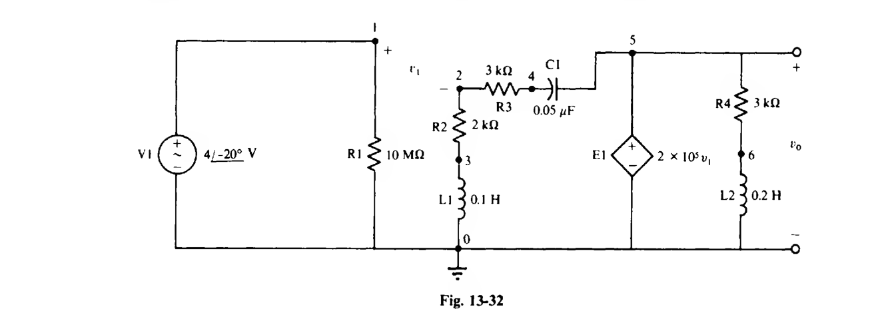
*Fig. 13-32*

**Solution:**

Following is the circuit file. The specified frequency, 1591.55 Hz, is equal to the source frequency of
10 000 rad/s divided by 2n. Also shown is the output obtained when this circuit file is run with PSpice. The 
answer of V(5) = 9.121/- 57.87° V is the phasor for
v„ = 9.121 sin (10 OOOr - 57.87°) V,
which agrees within three significant digits with the v0 answer of Prob. 12.47.
CIRCUIT FILE FOR THE CIRCUIT OF FIG. 13-32 
VI 
1 0 
AC 4-20 
R1 
1 0 
10MEG 
R2 
2 3 
2K 
LI 
3 0 
0.1 
R3 
2 4 
3K 
Cl 
4 5 
0.05U 
El 
5 0 
1 2 2E5 
R4 
5 6 
3K 
L2 
6 0 
0.2 
.AC LIN 1 1591.55 1591.55 
.PRINT AC VM(5) VP(5) 
.END
**** AC ANALYSIS 
*************************************************************************
VM(5) VP (5) 
9.121E+00 -5.787E+01 
FREQ 
1.592E+03

---

#### Problem 13.28  *(page 297)*

**Problem:**

13.28 Repeat Prob. 13.27 using PSpice.
Figure 13-34 is the PSpice circuit corresponding to the circuit of Fig. 13-33. with the op amps replaced 
by voltage-controlled voltage sources that are connected across the former op-amp output terminals. In 
addition, a large resistor RI has been inserted from node 1 to node 0 to satisfy the PSpice requirement for 
at least two components connected to each node. The large resistors R4 and R6 have been inserted to 
provide dc paths from nodes 4 and 7 to node 0, as is required from every node. Without these resistors, the 
circuit has no such dc paths because of dc blocking by capacitors. The capacitances have been determined 
using an arbitrary source frequency of 1000 rad/'s, which corresponds to 1000 27r = 159.155 Hz. As an 
illustration, for the capacitor which an impedance of -/4 kQ, the magnitude of the reactance is
= 4000 from which C = 0.25 nf 
1000C
1

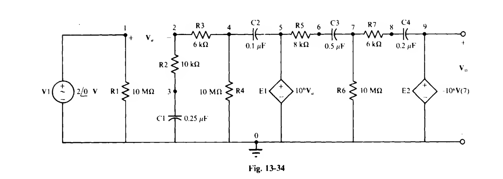
*Fig. 13-34*

---

#### Problem 13.37  *(page 299)*

**Problem:**

13.37 Find the mesh currents in the circuit shown in Fig. 13-38.
Ans. 1, = 1.46/46.5" A, 12 = -0.945/-43.2" A
13-38 Find the mesh currents in the circuit shown in Fig. 13-39.
Ans. I, = 1.26/10.6" A, I2 = 4.63/30.9" A, I., = 2.25/-28.9 A

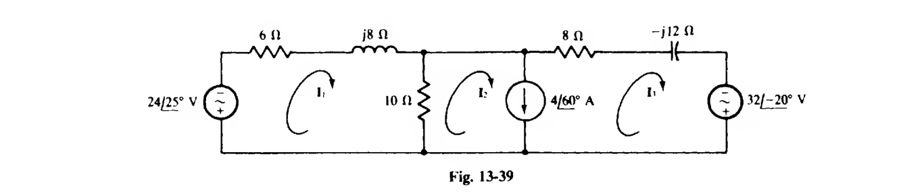
*Fig. 13-39*

---

#### Problem 13.44  *(page 300)*

**Problem:**

13.44 Use loop analysis to find 1 in the circuit shown in Fig. 13-42.
Ans. 2.71/ -55.8° A
i6 n

*Fig. 13-42*

---

#### Problem 13.46  *(page 301)*

**Problem:**

13.46 Find the node voltages in the circuit shown in Fig. 13-43.
Arts. V, = -10.8/25 V, V2 = -36//15 V
22.5/0° A

*Fig. 13-43*

---

#### Problem 13.47  *(page 301)*

**Problem:**

13.47 Find the node voltages in the circuit shown in Fig. 13-44.

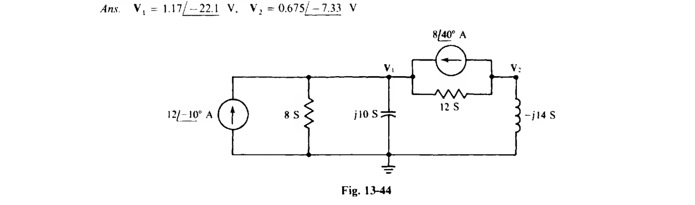
*Fig. 13-44*

---

#### Problem 13.48  *(page 301)*

**Problem:**

13.48 Solve for the node voltages in the circuit shown in Fig. 13-45.

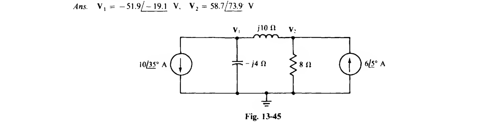
*Fig. 13-45*

---

#### Problem 13.52  *(page 302)*

**Problem:**

13.52
o.2 a -j'o.4 n
Am. - 253/34 A

*Fig. 13-49*

---

## Chapter 14 — Transformers

### Solved Problems

#### Fig. 14-1  *(page 305)*

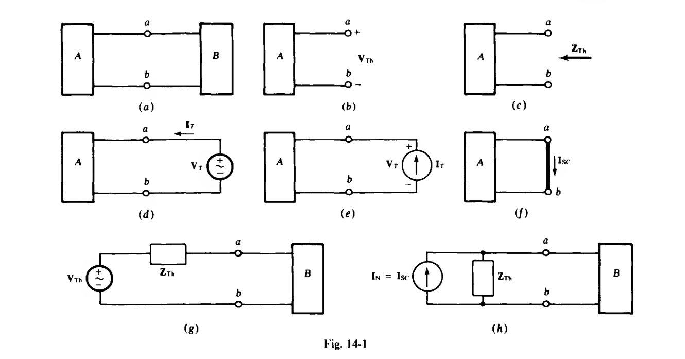
*Fig. 14-1*

**Solution:**

294

---

#### Problem 14.5  *(page 310)*

**Problem:**

14.5 Find ZTh and VTh for the Thevenin equivalent of the circuit shown in Fig. 14-7.
15/-45° V

*Fig. 14-7*

---

#### Fig. 14-12  *(page 314)*

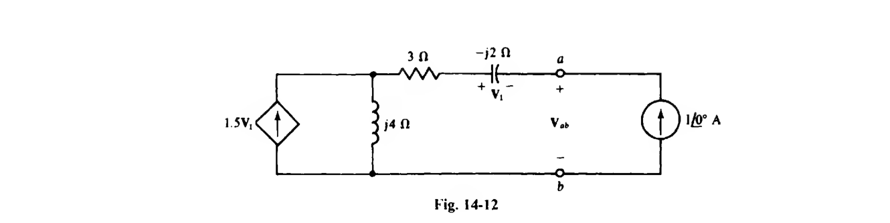
*Fig. 14-12*

**Solution:**

The output impedance is the same as the Thevenin impedance. The only way of finding ZTh is by 
applying a source and finding the ratio of the voltage and current at the source terminals. This impedance 
cannot be found from Z[h = VTh IN because Vlh and IN are both zero since there are no independent 
sources to the left of terminals a and h. And, of course, circuit reduction cannot be used because of the 
presence of the dependent source. The most convenient source to apply is a l/0c-A current source with a 
current direction into terminal u, as shown in Fig. 14-12. Then, ZTh = Vo(,/l/0° = V^.
The first step in calculating ZTh is to find the control voltage V,. It is V, = - {- )2)(l/0o) = j2 V, with 
the initial negative sign occurring because the capacitor voltage and current references are not associated 
(The 1 £0f-A current is directed into the negative terminal of V,.). The next step is to find the current flowing 
down through the j4-Q impedance. This is the 1/0 -A current from the independent current source plus 
the 1.5Vi = 1.502) =;3-A current from the dependent current source, a total of 1 + ]3 A. With this 
current known, the voltage Vah can be found from the sum of the voltage drops across the three impedances:
V0„ = (1/0 K3 - ,/2) + (1 +mj4) = 3 -j2 +j4 - 12 = -9 +;2 V
which, as mentioned, means that Zlh = - 9 + j2 fl. The negative resistance (- 9 O) is the result of the 
action of the dependent source. In polar form this impedance is
Z|h = -9 + j2 = 9.22/167.5 = -9.22/- 12.5 Q

---

#### Problem 23.1  *(page 322)*

**Problem:**

23.1 A
I =
3 + /4
With this I known, V’ can be found from the voltage drops across the 2- and /4-Q impedances:
V" = V, + V, = 2(31) + /4I = (6 + /4H3/-23.1 ) = 21.6/10.6 V
2 n
If the voltage source in the circuit of Pig. 14-25 is replaced by a short circuit, the circuit is as shown 
in Fig. 14-27. where V" is the component of V from the independent current source. As a reminder, the 
current to the left of the parallel resistor and dependent-source combination is shown as 5/ -45' A, the 
same as the independent source current, as it must be. Because this current flows into the parallel 3-D and 
/4-Q combination, the current I in the 3-Q resistor can be found by current division:
j4 . . 
I =--- x 5/-45 = 4/- 188.1 A
3 + /4 L- L-
With I known. V" can be found from the voltage drops V, and V2 across the 2-Q resistor and the parallel 
3-Q and /4-Q impedances. Since the 2-Q resistor current is 31 + 5/ -45 .
V, = [3(4/- 188.1 ) + 5/ -45 ](2) = - 17.1/114 V
2n

*Fig. 14-27*

---

#### Problem 14.24  *(page 323)*

**Problem:**

14.24 Transform the A shown in Fig. 14-28w to the Y in Fig. 14-286 for («) Z, = Z, = Z, = 
12/36 £2, and (6) Z,=3+ /5fi, Z2 = 6/20 £2. and Z, - 4/-30 Q.

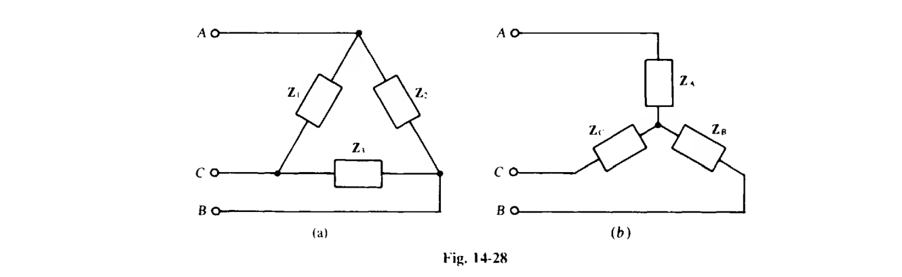
*Fig. 14-28*

**Solution:**

(u) Because all three A impedances are the same, all three Y impedances are the same and each is 
equal to one-third of the common A impedance:
12 36 
Z ( = X„ /.< y =. 4^6 £2
(6) All three A-to-Y transformation formulas have the same denominator, which is
/., + Z, 4 /., = (3 4/5) 4 6 20 f 4 -30 = 13.1 22.66 £2
Z,Z2 (3 + /5X6/20 ) 
Z< = = , = 2.67/56.4 Q 
Z,+Z, + Z, 1.7.1/22.66 L-
By these formulas.
z,z, 
(6 20 )(4; - 30 I

---

#### Problem 14.26  *(page 324)*

**Problem:**

14.26 Using a A -to-Y transformation, find I for the circuit shown in Fig. 14-29.
-/4 n

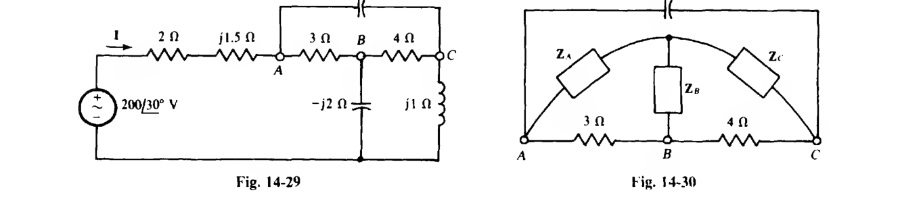
*Fig. 14-30*

**Solution:**

Extending between nodes A. B, and C there is a A. as shown in Fig. 14-30. that can be transformed to 
the shown Y. with the result that the entire circuit becomes series-parallel and so can be reduced by combining 
impedances. The denominator of each A-to-Y transformation formula is 3 + 4 - j4 - 7-/4 = 
8.062/ - 29.7 ft. And by these formulas.
Z, 
_/H-/4)__
3(4)
1.49/- 60.3 ft
1.49, 29.7 ft
S 8.062/-29.7
8.062/- 29.7
4( -/4)
1.98/ -60.3 ft
Z <■ =
8.062/- 29.7
With this A-to-Y transformation, the circuit is as shown in Fig. 14-31. Since this circuit is in series-parallel 
form, the input impedance Z,„ can be found by circuit reduction. And then Zin can be divided into the

---

#### Problem 14.26  *(page 324)*

**Problem:**

14.26 Using a A -to-Y transformation, find I for the circuit shown in Fig. 14-29.
-/4 n
A B C
Extending between nodes A. B, and C there is a A. as shown in Fig. 14-30. that can be transformed to 
the shown Y. with the result that the entire circuit becomes series-parallel and so can be reduced by combining 
impedances. The denominator of each A-to-Y transformation formula is 3 + 4 - j4 - 7-/4 = 
8.062/ - 29.7 ft. And by these formulas.
Z, 
_/H-/4)__
3(4)
1.49/- 60.3 ft
1.49, 29.7 ft
S 8.062/-29.7
8.062/- 29.7
4( -/4)
1.98/ -60.3 ft
Z <■ =
8.062/- 29.7
With this A-to-Y transformation, the circuit is as shown in Fig. 14-31. Since this circuit is in series-parallel 
form, the input impedance Z,„ can be found by circuit reduction. And then Zin can be divided into the

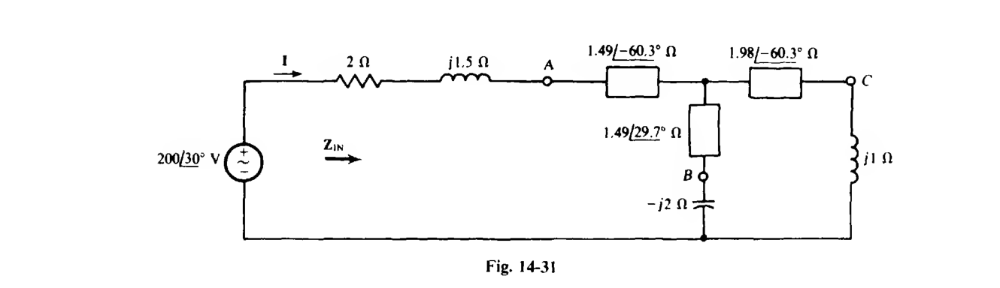
*Fig. 14-31*

---

#### Fig. 14-33  *(page 326)*

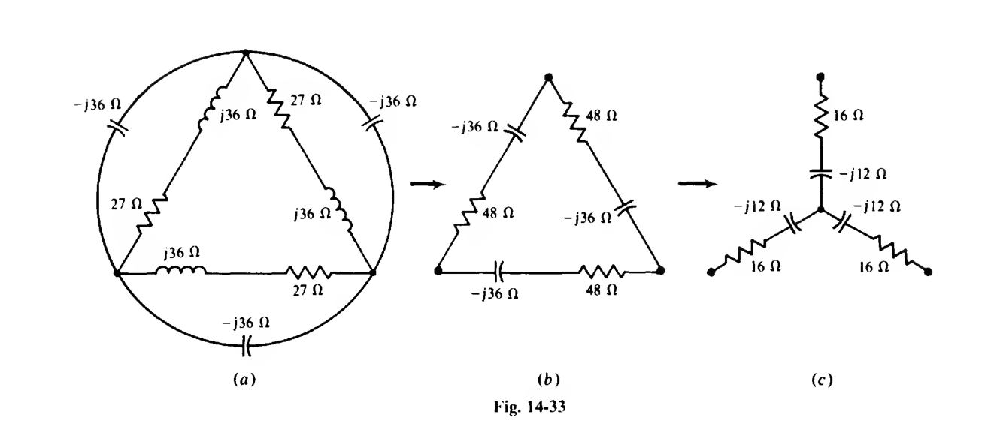
*Fig. 14-33*

**Solution:**

By Cramer's rule.
240/0 -|20 - >12)
240/120 40 - ;24
96%/-0.96
5.94/61 A
40 -/24 -(20 -/12) 
-(20 -/12) 40 -/24
1632/-61.93
In reducing the A-Y circuit, it would have been easier to transform the A of -/36-D impedances to a 
Y of -/36 3 = -/12-Q impedances. Then, although not obvious, the impedances of this Y would be in 
parallel with corresponding impedances of the other Y as a result of the two center nodes being at the same 
potential, which occurs because of equal impedance arms in each Y. If the parallel impedances are combined, 
the result is a Y of equal impedances of
- /12(9 + /12| 
-/12 + 9 +7l2
16 -jl2Q
the same as shown in Fig. 14-33c.
4 fl

---

#### Problem 14.33  *(page 329)*

**Problem:**

14.33 What resistor will draw an 8-A rms current when connected across terminals a and b of the circuit shown 
in Fig. 14-37?
9 n 4 n i7 n ~i6 n 4 n
Ans. 8.44 £2

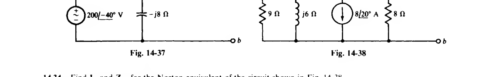
*Fig. 14-37, Fig. 14-38*

**Solution:**

Ans. - 3.09/5.07 A, 6.3/-9.03 £2

---

#### Problem 14.35  *(page 329)*

**Problem:**

14.35 Find VTh and ZTh for the Thevenin equivalent of the circuit shown in Fig. 14-39 for R - 0 £2.
Ans. 3.47/^23 V, 3.05/29,2 £2
3 fi j'4 £2

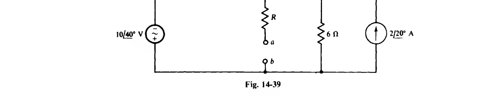
*Fig. 14-39*

---

#### Problem 14.37  *(page 329)*

**Problem:**

14.37 Find VTh and ZTh for the Thevenin equivalent of the circuit shown in Fig. 14-40 for R, = R, = 
0 £2 and Vs = 0 V.
Ans. -40.4/-41.4 V, 1.92/19,4 £2

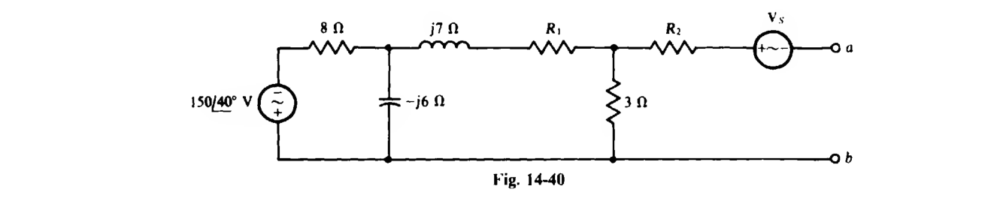
*Fig. 14-40*

---

#### Problem 14.42  *(page 330)*

**Problem:**

14.42 Find I for the bridge circuit shown in Fig. 14-42 if ls = 10/30 A and ZL = 40/-40 ft.
Ans. 15/6.3 A
i a

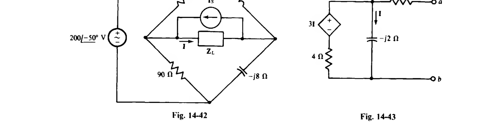
*Fig. 14-43*

---

#### Problem 14.54  *(page 332)*

**Problem:**

14.54 F or the circuit shown in Fig. 14-49, find the average power dissipated in the .3-D resistor using superposition 
and then without using superposition. Repeat this with the 10 phase angle changed to 40 for the one 
voltage source. (This problem illustrates the fact that superposition can be used to find the average power
.3 (1 
2 H
15Vl sin (2t

*Fig. 14-49*

---

#### Problem 14.55  *(page 333)*

**Problem:**

14.55 Find t for the circuit shown in Fig. 14-50.
.4ns. 5.24 sin (5000r - 61.6 I - 4.39 sin (8(X)0r - 34.6 ) V
5 n 
J 
10 sin (5000t - 30°) V ( ~

*Fig. 14-50*

---

#### Problem 14.57  *(page 333)*

**Problem:**

14.57 Find i for the circuit shown in Fig. 14-51.
A ns. -2 sin (5000; + 23.1 ) - 4.96 sin (104t - 2.X7 ) A
100 fl i

*Fig. 14-51*

---

#### Problem 14.59  *(page 333)*

**Problem:**

14.59 Transform the T shown in Fig. l4-52a to the FI in Fig. 14-526 for (u) 'ZA - Zs = Z( = 10/ - 50 ft. and
(h\ Z t = 5/-30 ft. Z„ = 6/40 ft. Zf- = 6-/7 ft.
Ans. («) Z, = Z2 = Z3 = 30/- 50 ft; (b) 7, = 17.5/-68 ft, Z2 = 11.4/21.4 ft. Z, = 21/105 ft

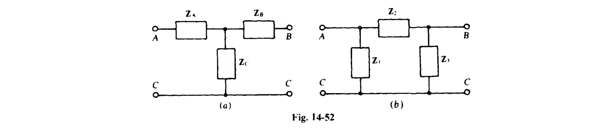
*Fig. 14-52*

---

## Chapter 15 — Transient Analysis

### Solved Problems

#### Fig. 15-3  *(page 337)*

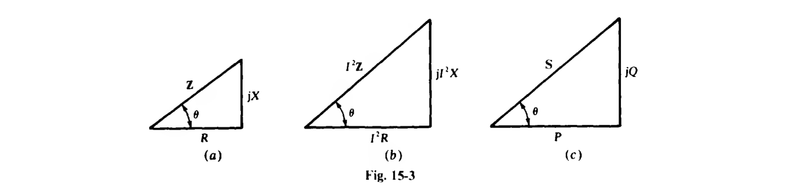
*Fig. 15-3*

---

#### Problem 15.15  *(page 344)*

**Problem:**

15.15 In the circuit shown in Fig. 15-5. find the total power absorbed by the three resistors. Then find 
the sum of the readings of the two wattmeters. Compare results.
WM i

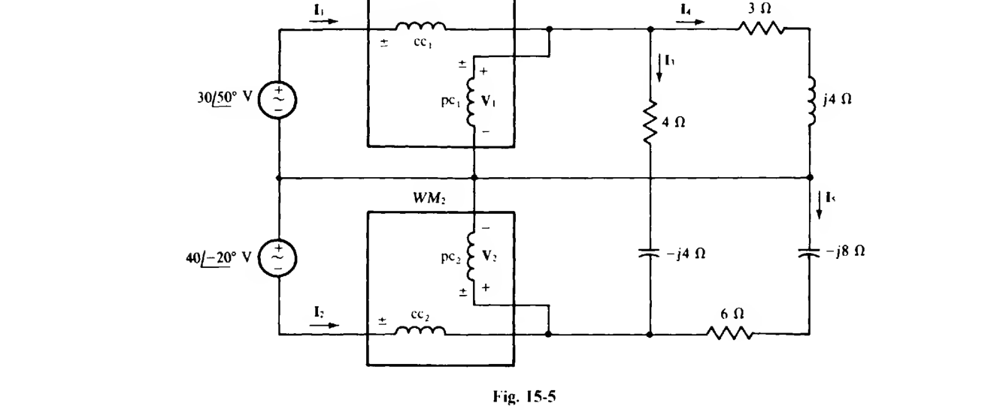
*Fig. 15-5*

**Solution:**

The powers absorbed by the resistors can be found by using P = I2R. The current through the resistors
30/50 4- 40/-20 57.6/9.29
4-/4 ~~ 5.66/ -45
10.19/54.3 A
40/ - 20 
U= ^- =4/33.1 A
6 - /X ‘-
= 6/-3.1 3 A
Of course, only the rms values of these currents are used in P = I2R:
P, = /“(4) + /;|3) + /^(6) = 10.192(4) + 62(3) + 42(6) = 619 W
The currents I, and I2 are needed in finding the wattmeter readings since these arc the currents that 
flow through the current coils:
I, = I, + C = 10.19/54.3 -f 6 3 13 = 14.34/33.6 A
I, = -I, - C = - 10.19/54.3 - 4/33.1 = 14/- 131.6 A

---

#### Problem 15.33  *(page 350)*

**Problem:**

15.33 In the circuit shown in Fig. 15-6, load 1 absorbs 2.4 kW and 1.8 kVAR, load 2 absorbs 1.3 kW 
and 2.6 kVAR, and load 3 absorbs I kW and generates 1.2kVAR. Find the total power 
components, the source current I,, and the impedance of each load.

*Fig. 15-6*

**Solution:**

The total complex power is the sum of the individual complex powers:
S, = S, + S: + S, = (24(X) + /1800| + (1300 + /2600) + (1000 - >1200)
= 4700 + ./3200 VA = 5.69/34.2 kVA
From the total complex power, the total apparent power is S,=5.69kVA, the total real power 
is P, = 4.7 kW. and the total reactive power is Q, = 3.2 kVAR. The source current magnitude /t is 
equal to the apparent power divided by the source voltage: /, = (5.69 x 103) 600 = 9.48 A. And the angle 
of I, is the angle or the voltage minus the power factor angle: 20 - 34.2 = -14.2 . So. 1, = 
9.48/-14.2 A.
The angle of the load 1 impedance Z, is the load power factor angle, which is also the angle 
of the complex power S,. Since S, = 24(Xf + /1800 = 3000/36.9 VA, this impedance angle is 0 = 36.9 . 
Because the load 1 voltage is known, the magnitude Z, can be found from S, = V2 Z,:
V2
6002
120 a
3000
Si
So. Z[ = Z|/0 = 120/36.9 ft. The impedances Z, and Z, of loads 2 and 3 cannot be found in a similar 
manner because the load voltages are not known. But the rms current I2 can be found from the sum of the 
complex powers of loads 2 and 3. and used in S = I2Z to find the impedances. This sum is
S2., = (13()0 + /26(H)) + (1000 - /1200) = 2300 + T1400 = 2.693/31,3 kVA
The apparent power S,, can be used to obtain /, from S2i
= Vl2.
5,, 2.693 x 10-’ 
I - -1
= 4.49 A 
V 600
Since S, = 1300 + ;2600 VA = 2.91/63.4 kVA, the impedance of load 2 is
_ S2 _ 2.91 x 10-V63.4
2 ~ /f ~ 4.492
144/63.4 ft
S, = 1000 -/1200VA = 1.562/-50.2 kVA, and
Similarly.
S., _ 1.562 x 10-V-50.2
/] ^ 4.492
77.6/-50.2 ft

---

#### Problem 15.38  *(page 352)*

**Problem:**

15.38 At 60 Hz, what is the power factor of the circuit shown in Fig. 15-7? What capacitor connected 
across the input terminals causes the overall power factor to be 1 (unity) ? What capacitor causes 
the overall power factor to be 0.85 lagging?
4 n 
o-Wv-»-1

*Fig. 15-7*

**Solution:**

Because a circuit is specified, the power factor and capacitor are probably easier to find using impedance 
and admittance instead of powers. The power factor is the cosine of the impedance angle. Since the reactance 
of the inductor is 27r(60K0.03| = 1 1.3 fi, the impedance of the circuit is
!5( /11.3) 
Z = 4 + =11.
/ 3 7.3 8 Q
15 +./11.3
And the power factor is PF = cos 37.38 = 0.795 lagging.
Because the capacitor is to be connected in parallel, the circuit admittance should be used to determine 
the capacitance. Before the capacitor is added, this admittance is
Z 11.9/37.38 ‘-
Y = =-r-= 0.0842/-37.38 = 66.9 - ,51.1 mS

---

#### Problem 15.55  *(page 355)*

**Problem:**

15.55 Find the wattmeter reading for the circuit shown in Fig. 15-8.
Ans. 16 W
2 n j5 n in

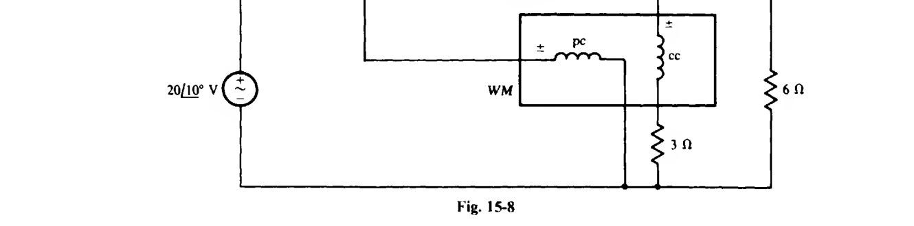
*Fig. 15-8*

---

#### Problem 15.56  *(page 356)*

**Problem:**

15.56 Find each wattmeter reading for the circuit shown in Fig. 15-9.
Ans. WM, = 1.54 kW, WM2 = 656 W
WM,

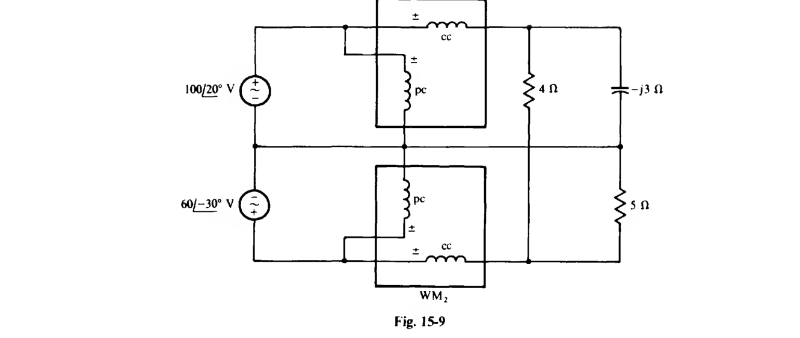
*Fig. 15-9*

---

## Chapter 16 — Complex Frequency, Filters, and Bode Plots

### Solved Problems

#### Fig. 16-1  *(page 360)*

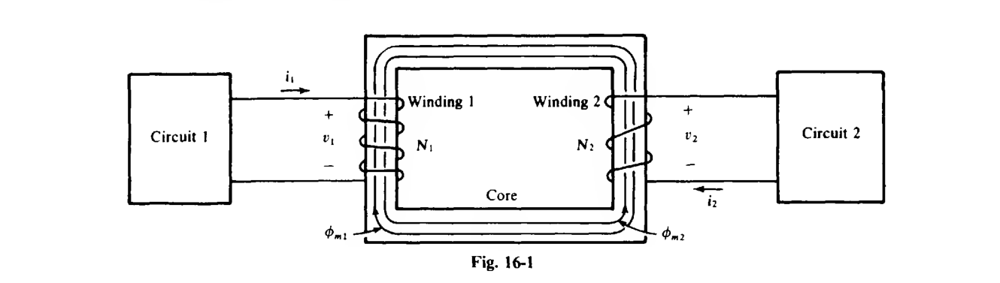
*Fig. 16-1*

**Solution:**

In the operation, current it flowing in winding 1 produces a magnetic flux </>ml that, for power 
transformers, is ideally confined to the core and so passes through or couples winding 2. The m in the 
subscript means “mutual” the flux is mutual to both windings. Similarly, current i2 flowing in winding
2 produces a flux <}>m2 that couples winding 1. When these currents change in magnitude or direction, 
they produce corresponding changes in the fluxes and these changing fluxes induce voltages in the 
windings. In this way, the transformer couples circuit 1 and circuit 2 so that electric energy can flow 
from one circuit to the other.
Although flux is a convenient aid for understanding transformer operation, it is not used in the 
analyses of transformer circuits. Instead, either transformer turns ratios or inductances are used, as will 
be explained.
Transformers are very important electrical components. At high efficiencies, they change voltage and 
current levels, which is essential for electric power distribution. In electronic applications they match 
load impedances to source impedances for maximum power transfer. And they couple amplifiers together 
without any direct metallic connections that would conduct dc currents. At the same time they may act 
with capacitors to filter signals.
RIGHT-HAND RULE
In Fig. 16-1 the flux <f>ml produced by i, has a clockwise direction, but <pm2 produced by i2 has a 
counterclockwise direction. The direction of the flux produced by current flowing in a winding can be 
determined from a version of the right-hand rule that is different from that presented in Chap. 9 for a 
single wire. As shown in Fig. 16-2, if the fingers of a right hand encircle a winding in the direction of 
the current, the thumb points in the direction of the flux produced in the winding by the current.
349

---

#### Fig. 16-7  *(page 366)*

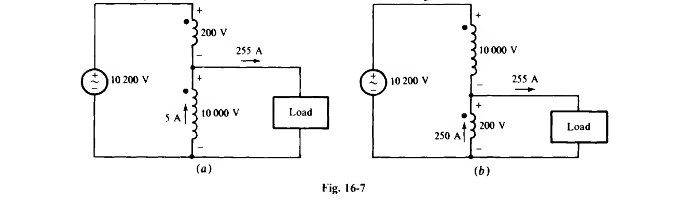
*Fig. 16-7*

**Solution:**

The explanation for this increase is that the original 50-kVA transformer had no metallic connections 
between the two windings, and so the 50kVA of a full load had to pass through the transformer by 
magnetic coupling. But with the windings connected to provide autotransformcr operation, there is a 
metallic connection between the windings that passes 2550 - 50 = 2500 kVA without being magneti¬ 
cally transformed. So, it is the direct metallic connection that provides the kVA increase. Although 
advantageous in this respect, such a connection destroys the isolation property that conventional 
transformers have, which in turn means that autotransformers cannot be used in every transformer 
application.
If the windings are connected as in Fig. \6-lb, the kVA rating is just 10 200 x 5 = 200 x 255 =
51 kVA. This slight increase of 2 percent in kVA rating is the result of the greatly different voltage levels of 
the two circuits connected to the autotransformer. In general, the closer the voltage levels are to being 
the same, the greater the increase in kVA rating. This is why autotransformers are used as links between 
power systems usually only if the systems are operating at nearly the same voltage levels.
In Fig. 16-7u, the load and the voltage source can be interchanged. Then the load is connected across 
both windings and the voltage source across just one. This arrangement is used when the load voltage 
is greater than the source voltage. The increase in kVA rating is the same.
In the analysis of a circuit containing an autotransformer, an ideal transformer model can be assumed, 
and its turns ratio used in much the same way as for a conventional transformer connection. Along with 
this can be used the fact that the lines with the lower voltage carry the sum of the two winding currents. 
Also, part of the winding carries only the difference of the source and load currents. This is the part that 
is common to both the source and load circuits.
Contrary to what Fig. 16-7 suggests, autotransformers are preferably purchased as such and not 
constructed from conventional power transformers. An exception, however, is the “buck and boost” 
transformer. A typical one can be used to reduce 120 or 240 V to 12 or 24 V. The principal use, though.

---

#### Fig. 16-8  *(page 367)*

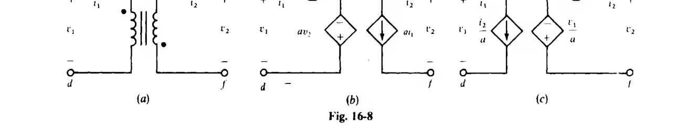
*Fig. 16-8*

**Solution:**

PSpice does provide for an air-core transformer. Self-inductance statements are used for the two 
windings in the same manner as for ordinary inductors. The ordering of the node numbers informs 
PSpice of the dot locations, with the first node being at the dot location. The only other requirement is 
a coefficient of coupling statement that has a name beginning with the letter K. Following this name 
are the names of the two coupled inductors, in either order. Last is the coefficient of coupling. For 
example, the following statements could be used for the air-core transformer of Fig. 16-9.
LI 7 8 90M
L2 11 5 40M
K1 LI L2 0.5
The indicated coefficient of coupling of 0.5 is obtained from k = MjslLxL1 = 30/v/90 x 40 = 0.5, 
where the inductances are expressed in millihenries.

---

#### Fig. 16-9  *(page 367)*

*Fig. 16-9*

---

#### Problem 16.2  *(page 368)*

**Problem:**

16.2 Supply the missing dots for the transformers shown in Fig. 16-11.

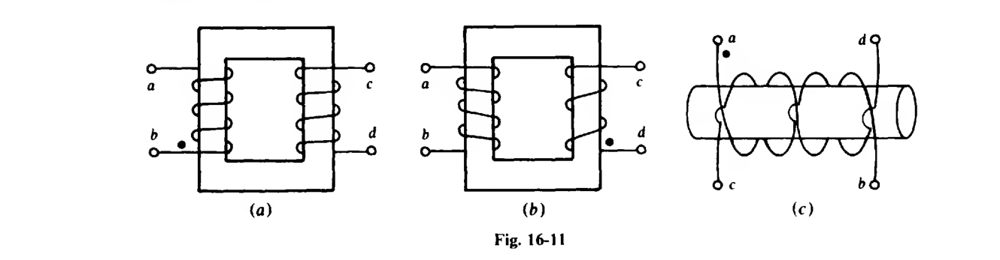
*Fig. 16-11*

**Solution:**

(а) By the right-hand rule, current flowing into dotted terminal b produces clockwise flux. By trial and 
error it can be found that current flowing into terminal c also produces clockwise flux. So, terminal
c should have a dot.
(б) Current flowing into dotted terminal d produces counterclockwise flux. Since current flowing into 
terminal b also produces counterclockwise flux, terminal b should have a dot.
(c) Current flowing into dotted terminal a produces flux to the right inside the core. Since current flowing 
into terminal d also produces flux to the right inside the core, terminal d should have a dot.

---

#### Problem 16.12  *(page 370)*

**Problem:**

16.12 In the circuit shown in Fig. 16-12, find R for maximum power absorption. Also, find I 
for R = 3 fi. Finally, determine if connecting a conductor between terminals d and / would 
change these results.
The value of R for maximum power absorption is that value for which the reflected resistance a2R is 
equal to the source resistance of 27 f2. Since the primary winding has 4 turns, and the secondary winding 
has 2 turns, the turns ratio is a = .V, S'2 =42 = 2. And. from 27 = 22R. the value of R for maximum 
power absorption is R = 27 4 = 6.75 F2.
For R = 3 Q, the reflected resistance is 22(3) = 12 fi. So the primary current directed into terminal 
c is (216/0 ) (27 + 12) = 5.54/0 A. If terminal c is dotted, then terminal c should be dotted, as is evident 
from the right-hand rule. And. since I is directed out of terminal e w hile the calculated current is into terminal 
c, I is just the turns ratio times the current entering terminal c: I = 2(5.54/0 ) = 1 l.l/O A.
A conductor connected between terminals d and / does not affect these results since current cannot 
flow in a single conductor. For current to flow there would have to be another conductor to provide a 
return path.

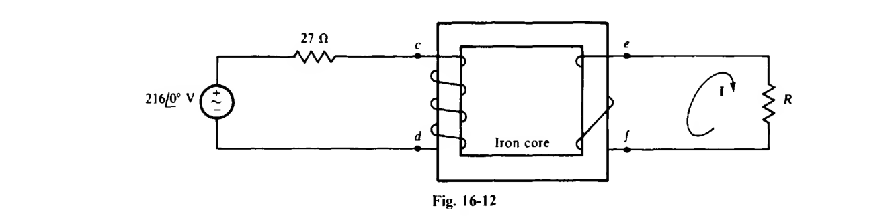
*Fig. 16-12*

---

#### Problem 16.13  *(page 371)*

**Problem:**

16.13 Find /,,/ and 
for the circuit shown in Fig. 16-13. The transformers are ideal.

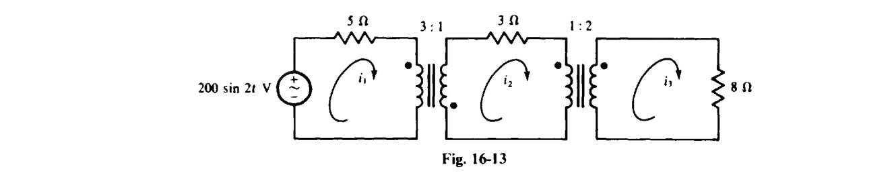
*Fig. 16-13*

**Solution:**

A good procedure is to find /, using reflected resistances, then find i2 from f,. and last find i} from i2. 
The 8 ft reflects into the middle circuit as 8,22 = 2 ft, making a total resistance of 2 + 3 = 5 ft in the 
middle circuit. This 5 ft reflects into the source circuit as 32(5) = 45 ft. Consequently,
200 sin 2f 
= -= 4 sin 21 A
5 + 45
Because i, and i2 both have reference directions into dotted terminals of the first transformer, i2 is equal to 
the negative of the turns ratio times i,: i2 = - 3(4 sin 2r) = - 12 sin 2r A. Finally, since i2 has a reference 
direction into a dotted terminal of the second transformer, and i3 has a reference direction out of a dotted 
terminal of this transformer, i, is equal to the turns ratio (12 = 0.5) times i2: i3 = 0.5( - 12 sin 2r) = 
- 6 sin 2r A.

---

#### Problem 16.14  *(page 371)*

**Problem:**

16.14 Find I, and I2 for the circuit shown in Fig. 16-14.
2/-45° n

*Fig. 16-14*

**Solution:**

Because the primary has 6 turns and the secondary has 2 turns, the turns ratio is a = 6/2 = 3 and 
so the impedance reflected into the primary circuit is 32{2/ - 45 ) = 18/ - 45 ft. Thus,
240/20 240/20
9.41/33 A
I,
14/30 + 18/ -45 ~ 25.5/-13
If the upper primary terminal is dotted, the bottom secondary terminal should be dotted. Then both I, and 
1, will be referenced into dots, and so 1, is equal to the negative of the turns ratio times I,:
1, = -31, = - 3(9.41/33 ) = -28.2/33 A

---

#### Fig. 16-15  *(page 372)*

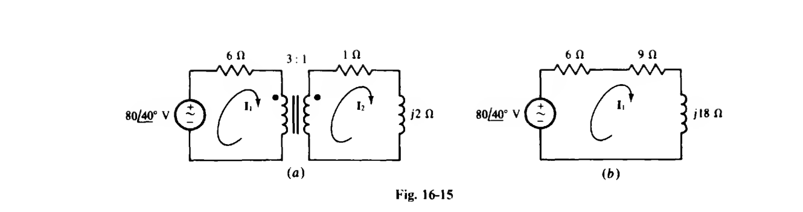
*Fig. 16-15*

**Solution:**

effect, these reflected elements replace the primary winding. From the simplified circuit, the primary current is
80/40 80/40 
- - = - V = 3.41/-10.2 A 
6 + 9 + /18 23.43/50.2 L-
I.
Because I, is referenced into a dotted terminal and I2 is referenced out of a dotted terminal, I2 is equal to 
just the turns ratio times 1, (no negative sign):
I2 = 31 j = 3(3.41/-10,2 ) = 10.2/- 10.2 A
in ,.2 12 0 2 0 3 0

---

#### Problem 16.16  *(page 372)*

**Problem:**

16.16 Find I,, I2, and I3 for the circuit shown in Fig. 16-16a.

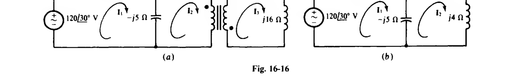
*Fig. 16-16*

**Solution:**

The 12-0 resistance and the /'16-fi inductive impedance reflect into the primary circuit as a (l/2)2( 12) = 
3-0 resistance and a series (l/2)2(jl6) = j4-£i inductive impedance in parallel with the -y'5-fi capacitive 
impedance, as shown in Fig. 16-166. The impedance of the parallel combination is
~j5(3+j4) 20 - j 15 , 
--- = 7.91. 18.4 £2
-/5 + 3+j4 3-jl
120/30 , 
I, =--= 12.2/44.7 A
2 + 7.91/-18.4 1-
So,
3+74-75 L- L-
I2 =-^5- x 12.2/44.7 = 19.3/ - 26.8 A
By current division,
Finally, since I2 and 13 both have reference directions into dotted terminals, 13 is equal to the negative of 
the turns ratio times I2:
I3 = -0.5(19.3/ -26.8 ) = -9.66/-26.8 A

---

#### Fig. 16-17  *(page 373)*

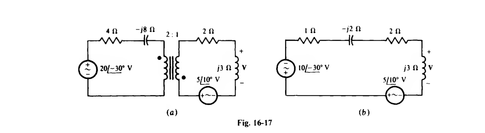
*Fig. 16-17*

**Solution:**

original impedance, and the voltage of the reflected voltage source is 1 ■ a times the original voltage. Also, 
the polarity of the reflected voltage source is reversed because the dots are located at opposite ends of 
the windings. The result is shown in Fig. 16-176. By voltage division,
fl , , 20.9/212 
V =--- x (5/10 - 10/-30 ) =-= 6.6/194 = -6.6/14 V 
\-}2 + 2+fi '- 3.16/]8 - '-

---

#### Problem 16.18  *(page 373)*

**Problem:**

16.18 Use PSpice to determine V in the circuit of Fig. 16-17a of Prob. 16.17.

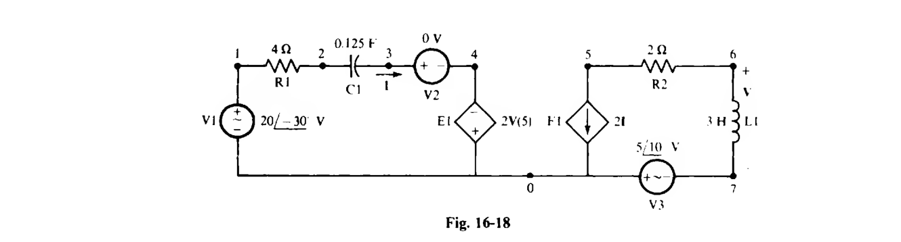
*Fig. 16-18*

**Solution:**

Figure 16-18 shows the corresponding PSpice circuit for a frequency of <o = 1 rad s. Following is the 
circuit file and the answers obtained from the output file when this circuit file is run with PSpice. The answer 
of V = 6.6/- 166" = -6.6/14 V agrees with the answer obtained in the solution to Prob 16.17.
CIRCUIT FILE FOR THE CIRCUIT OF FIG. 16-18 
VI 
1 0 
AC 20 -30 
R1 
1 2 
4 
Cl 
2 
3 
0.125 
V2 
3 4 
El 
0 4 
5 0 2 
FI 
5 0 
V2 2 
R2 
5 6 
2 
LI 
6 7 
3 
V3 
0 7 
AC 5 10 
•AC LIN 1 0.159155 0.159155 
.PRINT AC VM(L1) VP(L1) 
.END
FREQ VM(LI) VP(LI) 
1.592E-01 6.600E+00 -1.660E+02

---

#### Problem 16.20  *(page 374)*

**Problem:**

16.20 Repeat Prob. 16.19 using PSpice.
Figure 16-20 is the PSpice circuit corresponding to the circuit of Fig. 16-19. with the inductor and 
capacitor values based on a frequency of m = I rad s. Resistor R4 is inserted to prevent a capacitor (Cl)

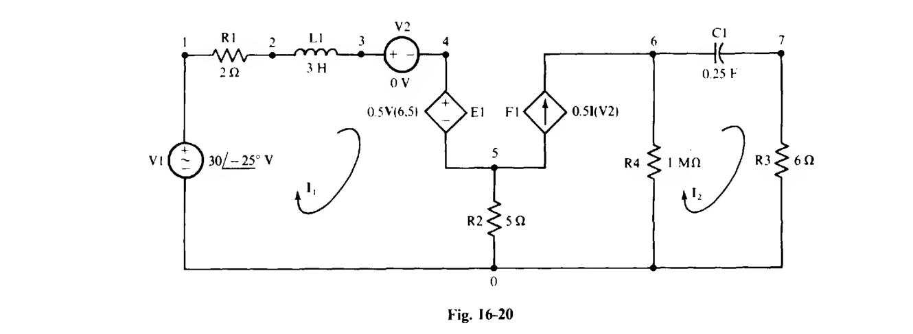
*Fig. 16-20*

---

#### Problem 16.36  *(page 381)*

**Problem:**

16.36 What is the total inductance of an air-core transformer with its windings connected in parallel if 
both dots are at the same end and if the mutual inductance is 0.1 H and the self-inductances are 
0.2 and 0.4 H7
Because of the mutual-inductance effects, it is not possible to simply combine inductances. Instead, a 
source must be applied and the total inductance found from the ratio of the source voltage to source current, 
which ratio is the input impedance. Of course a phasor-domain circuit will have to be used. For this circuit 
the most convenient frequency is o = 1 rad s, and the most convenient souree is lv = l/O A. The 
circuit is shown in F ig. 16-25. The transformer impedances should be obvious from the specified inductances 
and the radian frequency of c> - 1 rad s. As shown. I, of the 1/0 A input current flows through the 
left-hand winding, leaving a current of 1/0 - 1, for the right-hand winding.
The voltage drops across the windings arc
V = 70.21, + ,/0.1(1/0 - I,) and V =70.11, + /0.4(l/0 - I,).

*Fig. 16-25*

---

#### Problem 16.39  *(page 384)*

**Problem:**

16.39 Repeat the first part of Prob. 16.38 using PSpice.
20 n 2 10 H 3
0

*Fig. 16-28*

**Solution:**

Figure 16-28 shows the PSpice circuit corresponding to the phasor-domain circuit of Fig. 16-27. The 
inductance values are based on a frequency of to = 1 rad/s, which is selected for convenience. The
coefficient of coupling needed for the circuit file is k = M/v L,L2 = 5 N 20 x 10 = 0.35.7 553.
Following is the corresponding circuit file along with the answer from the output file obtained 
when PSpice is run with this circuit file. The answer of V = 37.97/10.12 V agrees to three significant 
digits with the first answer of Prob. 16.38.
CIRCUIT FILE FOR THE CIRCUIT OF FIG. 16-28 
VI 10 AC 120 
R1 12 20 
LI 20 20 
L2 23 10 
K1 LI L2 0.353553 
R2 30 15
.AC LIN 1 0.159155 0.159155 
.PRINT AC VM(R2) VP(R2) 
.END
FREQ VM(R2) VP(R2) 
1.592E-01 3.797E+01 1.012E+01

---

#### Problem 16.39  *(page 384)*

**Problem:**

16.39 Repeat the first part of Prob. 16.38 using PSpice.
20 n 2 10 H 3
0
Figure 16-28 shows the PSpice circuit corresponding to the phasor-domain circuit of Fig. 16-27. The 
inductance values are based on a frequency of to = 1 rad/s, which is selected for convenience. The
coefficient of coupling needed for the circuit file is k = M/v L,L2 = 5 N 20 x 10 = 0.35.7 553.
Following is the corresponding circuit file along with the answer from the output file obtained 
when PSpice is run with this circuit file. The answer of V = 37.97/10.12 V agrees to three significant 
digits with the first answer of Prob. 16.38.
CIRCUIT FILE FOR THE CIRCUIT OF FIG. 16-28 
VI 10 AC 120 
R1 12 20 
LI 20 20 
L2 23 10 
K1 LI L2 0.353553 
R2 30 15
.AC LIN 1 0.159155 0.159155 
.PRINT AC VM(R2) VP(R2) 
.END
FREQ VM(R2) VP(R2) 
1.592E-01 3.797E+01 1.012E+01

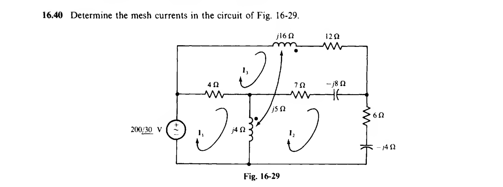
*Fig. 16-29*

---

#### Problem 16.41  *(page 385)*

**Problem:**

16.41 Repeat Prob. 16.40 using PSpice.
16 H 6 I2S1

*Fig. 16-30*

**Solution:**

Figure 16-30 shows the PSpice circuit corresponding to the phasor-domain circuit of Fig. 16-29 of Prob. 
16.40. As usual, the inductances and capacitances are based on the frequency w = 1 rad s. The coefficient of
coupling needed for the circuit file is k = ,V/ v L, L2 = 5 N 4 x 16 = 0.625.
Following is the corresponding circuit file along with the answers from the output file obtained when 
PSpice is run with this circuit file. The answers agree with those obtained in the solution to Prob. 16.40.
CIRCUIT FILE FOR THE CIRCUIT OF FIG. 16-30 
VI 01 AC -200 30 
R1 1 2 4 
LI 2 0 4 
R2 2 3 7 
Cl 34 0.125 
R3 4 5 6 
C2 50 0.25 
L2 6 1 16 
K1 LI L2 0.625 
R4 64 12
.AC LIN 1 0.159155 0.159155 
•PRINT AC IM(V1) IP(V1) IM(R3) IP(R3) IM(R4) IP(R4) 
. END
FREQ IM(V1) IP(V1) IM(R3) IP(R3) IM(R4) 
1.592E-01 5.137E+01 5.836E+00 1.006E+01 4.479E+01 1.628E+01
FREQ IP(R4) 
1.592E-01 1.687E+01

---

#### Problem 16.45  *(page 386)*

**Problem:**

16.45 Find the three currents /2, and /3 for the circuit shown in Fig. 16-32.

*Fig. 16-32*

---

#### Problem 16.47  *(page 387)*

**Problem:**

16.47 Supply the missing dots for the transformers shown in Fig. 16-34.
Ans. (a) Dot on terminal d; (6) dot on terminal h: (c) dots on terminals b. c. and i/.

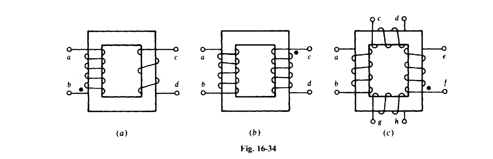
*Fig. 16-34*

---

#### Problem 16.58  *(page 389)*

**Problem:**

16.58 Find i2, and i3 in the circuit shown in Fig. 16-36.
Arts. = 4 sin (3t - 36.9°) A
i2 = 8 sin (3t - 36.9°) A
i'j = - 24 sin (3f - 36.9°) A
^ 2ft

*Fig. 16-36*

---

#### Problem 16.61  *(page 389)*

**Problem:**

16.61 What is v in the circuit shown in Fig. 16-39?
Arts. -23.7 sin (2f - 6.09°) V

*Fig. 16-39*

---

#### Problem 16.91  *(page 394)*

**Problem:**

16.91 Find the currents /1( /2, and /3 in the circuit of Fig. 16-46.
Ans. /, = 800 A, I2 = 343 A, /3 = 1.14 kA
7i

*Fig. 16-46*

---

## Chapter 17 — Two-Port Networks

### Solved Problems

#### Fig. 17-1  *(page 395)*

*Fig. 17-1*

**Solution:**

THREE-PHASE VOLTAGE GENERATION
Figure I7-2« is a cross-sectional view of a three-phase alternator having a stationary stator and a 
counterclockwise rotating rotor. Physically displaced by 120 around the inner periphery of the stator 
are three sets of armature windings with terminals .4 and A\ B and B'. and C and C. It is in these 
windings that the three-phase sinusoidal voltages are generated. The rotor has a field winding in which 
the flow of a dc current produces a magnetic field.
As the rotor rotates counterclockwise at 3600 r/min, its magnetic field cuts the armature windings, 
thereby inducing in them the sinusoidal voltages shown in Fig. 17-26. These voltages have peaks at 
one-third of a period apart, or 120 apart, because of the 120 spatial displacement of the armature 
windings. As a result, the alternator produces three voltages of the same rms value, which may be as
384

---

#### Fig. 17-2  *(page 396)*

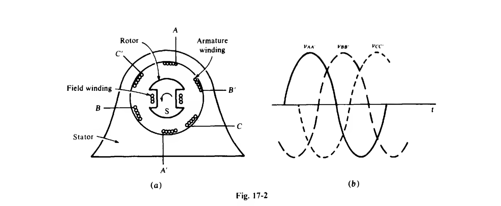
*Fig. 17-2*

**Solution:**

great as 30 kV, and of the same frequency (60 Hz), but phase-shifted by 120 . These voltages might be, 
for example,
vAA- = 25 000 sin 377r V
iBB. = 25 000 sin (377r - 120') V
and
vcr = 25 000 sin (377; + 120 ) V
If the voltages shown in Fig. 17-26 are evaluated at any one time, it will be found that they add to 
zero. This zero sum can also be shown by vector graphical addition of the phasors corresponding to 
these voltages. Figure 17-3a is a phasor diagram of the three phasors V^., \BB , and Vcc., corresponding 
to the generated voltages. These three phasors are added in Fig. 17-36 by connecting the tail of VBB to 
the tip of V^., and the tail of Vcc. to the tip of \BB-. Since the tip of Vcr touches the tail of V^., the 
sum is zero. And since the sum of the phasor voltages is zero, the sum of the corresponding instantaneous 
voltages is zero for all times.
Vaa + Vbb + Vrr
In general, three sinusoids have a sum of zero if they have the same frequency and peak value but 
are phase-displaced by 120 . This is true regardless of what, if anything, that the sinusoids correspond 
to. In particular, it is true for currents.
GENERATOR WINDING CONNECTIONS
The ends of the generator windings are connected together to decrease the number of lines required 
for connections to loads. The primed terminals can be connected together to form the Y (wye) shown

---

#### Fig. 17-4  *(page 397)*

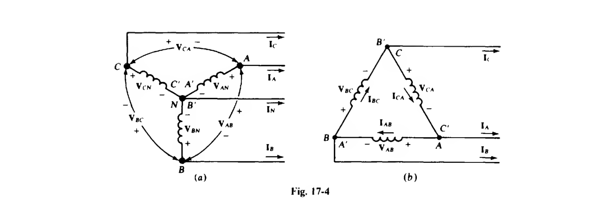
*Fig. 17-4*

**Solution:**

in Fig. 17-4a, or primed terminals can be connected to unprimed terminals to form the A (delta) shown 
in Fig. 17-46. The primed letters are included this once to show these connections. But since the terminals 
at which they are located also have unprimed letters, the primed letters are not necessary. These 
Y and A connections are not limited to generator windings but apply as well to transformer windings 
and load impedances. There are some practical reasons for preferring the Y connection for alternator 
windings, but both the Y and A connections are used for transformer windings and for load impedances. 
Incidentally, in circuit diagrams, sometimes circular ac generator symbols are used instead of the coil 
symbols.
In the Y connection shown in Fig. 17-4«, the primed terminals are joined at a common terminal 
marked N for neutral. There may be a line connected to this terminal, as shown, in which case there are 
four wires or lines. If no wire is connected to the neutral, the circuit is a three-wire circuit. The A 
connection illustrated in Fig. 17-46 inherently results in a three-wire circuit because there is no neutral 
terminal.
For the Y connection, the line currents are also the winding currents, also called phase currents. A 
line current is a current in one of the lines and by convention is referenced from the source to the load.
A phase current is a current in a generator or transformer winding or in a single load impedance, which 
is also called a phase of the load.
A Y connection of windings or of impedances has two sets of voltages. There are the voltages V^v, 
Vfljv, and Vcjv from terminals A, B, and C to the neutral terminal N. These are phase voltages. These 
differ from the line-to-line voltages, or just line voltages, V/tJJ, VW( , and V't <, across terminals A. B, and 
C. There are three other line voltages that have a 120’ angle difference. These are V .K, Vj,^, and VCij, 
which are the negatives of the other line voltages. In each set of line voltages, no two subscripts begin 
or end with the same letter. Also, no two pairs of subscripts have the same letters.
For the A shown in Fig. 17-46, the line voltages are the same as the phase voltages. But the line 
currents 1^, IB, and It differ from the phase currents lfl(, and I( that flow through the windings. 
There is another suitable set of phase currents: l^t , lBA, and l£B. which are the negatives of the currents 
in the first set.
PHASE SEQUENCE
The phase sequence of a three-phase circuit is the order in which the voltages or currents attain their 
maxima. For an illustration. Fig. 17-26 shows that vAA. peaks first, then vBB., then i£( . then vAA , etc., 
which is in the order of... ABC ABC AB.... Any three adjacent letters can be selected to designate the 
phase sequence, but usually the three selected are ABC. This is sometimes called the positive phase 
sequence. If in Fig. 17-2a the labels of two windings are interchanged, or if the rotor is rotated clockwise 
instead of counterclockwise, the phase sequence is ACB (or CBA or BAC), also called the negative phase 
sequence. Although this explanation of phase sequence has been with respect to voltage peaking, phase 
sequence applies as well to current peaking.

---

#### Fig. 17-7  *(page 399)*

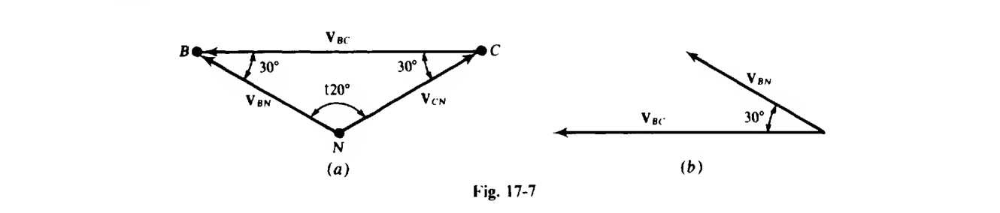
*Fig. 17-7*

**Solution:**

Figure 17-8 has all the possible phasor diagrams that relate the Y phase voltages and the two sets 
of line voltages for the two phase sequences. Thus, all angle relations between the line and Y phase 
voltages can be determined from them. From the subscripts it should be apparent that Figs. 17-8« and 
b are for an ABC phase sequence and Figs. 17-8c and d are for an ACB phase sequence. Only relative 
angles are shown. For actual angles, the appropriate diagram would have to be rotated until any one 
phasor is at its specified angle, but this is seldom necessary.

---

#### Fig. 17-8  *(page 400)*

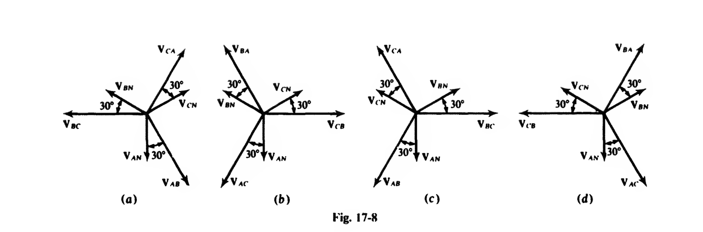
*Fig. 17-8*

**Solution:**

There is also a relation between the magnitudes of the line and phase voltages. From Fig. 17-7« and 
the law of sines.
_ sin HO _ v'3/2 = /3
VgN sin 30 1/2 V
or VBC = v 3K/,;V. In general, for a balanced Y load the line voltage magnitude I] is v 3 times 1 j,.
the phase voltage magnitude: V, =v 3lj,.
Incidentally, in the description of a three-phase circuit the .specified voltage should be assumed to 
be the rms line-to-line voltage.
BALANCED A LOAD
Figure 17-9 shows a balanced A load connected by three wires to a three-phase source. As a practical 
matter, this source is either a Y-connected alternator or, more probably, a Y- or A-connccted secondary 
of a three-phase transformer. There is. of course, no neutral wire because a A load has only three terminals.

---

#### Fig. 17-9  *(page 400)*

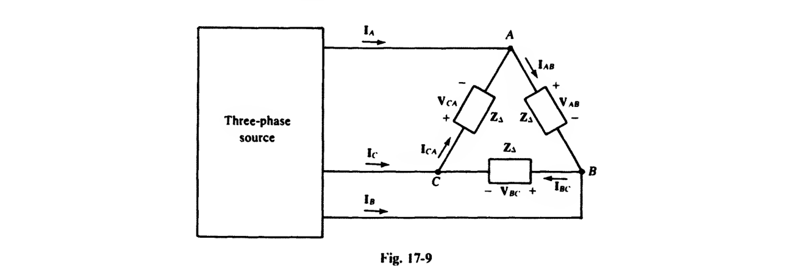
*Fig. 17-9*

**Solution:**

The general procedure for finding the A phase currents is to first find one phase current and then 
use it with the phase sequence to find the other two. For example, the phase current I ,B can be found 
from lAB = V4B ZA and then IB(- and !<., from I ,B and the phase sequence: These have the same 
magnitude as 1^, but lead and lag lAB by 120 as determined from the phase sequence.
The set of line currents and either set of phase currents for a balanced A have certain angle and 
magnitude relations that are independent of the had impedance. These can be found by applying KCl.

---

#### Fig. 17-11  *(page 401)*

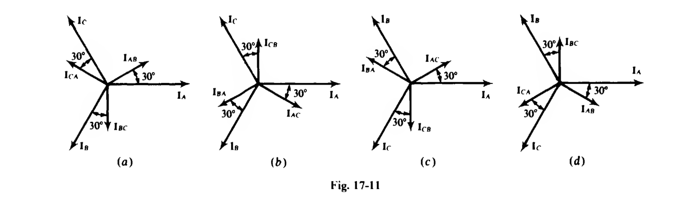
*Fig. 17-11*

**Solution:**

PARALLEL LOADS
If a three-phase circuit has several loads connected in parallel, a good first step in an analysis is to 
combine the loads into a single Y or A load. Then, the analysis methods for a single Y or A load can 
be used. This combining is probably most obvious for two A loads, as shown in Fig. 17-12a. Being in 
parallel, corresponding phase impedances of the two A’s can be combined to produce a single equivalent 
A.

---

#### Fig. 17-13  *(page 403)*

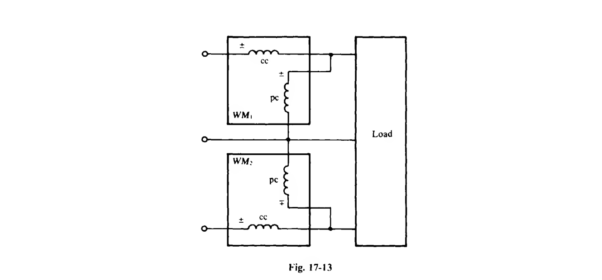
*Fig. 17-13*

**Solution:**

It can be shown that the total average power absorbed by the load is equal to the algebraic sum of 
the two wattmeter readings. So, if one reading is negative, it is added, sign and all. to the other wattmeter 
reading. (Of course, it may be necessary to reverse a coil to obtain this reading.) This two-wattmeter 
method is completely general. The load does not have to be balanced. In fact, the circuit does not have 
to be three-phase or even sinusoidally excited.
From the line voltage and current phasors, it can be calculated that, for a balanced load with 
an impedance angle of 0, one wattmeter reading is VLIL cos(30 + 0) and the other is 
V, I, cos (30 - 0). The wattmeter with the V, I, cos (30 + 0) reading has a current coil in the 
line corresponding to the phase sequence letter that immediately precedes the letter of the line in which 
there is no current coil. If, for example, there is no current coil in line C, and if the phase sequence is 
ABC, then, since B precedes C in the phase sequence, the wattmeter with its current coil in line B has the 
V, IL cos (30 + (?) reading.
The impedance angle for the phase impedance of a balanced load can be found from the readings 
of wattmeters connected for the two-wattmeter method. There are six formulas that relate the tangent 
of the impedance angle to the power readings. The appropriate formula depends on the phase sequence 
and the lines in which the current coils are connected. If PA, PB, and Pc are the readings of wattmeters 
with current coils in lines A, B, and C, then, for an ABC phase sequence,
tan 0 = 
P, - P H , Pg - Pc / Pr - Pi 
3 4-H = 3 J. < = 3 < •<
Pa + Pb V Pb + Pc V Pc+Pa
For an ACB phase sequence, tan 0 equals the negative of these.

---

#### Fig. 17-18  *(page 420)*

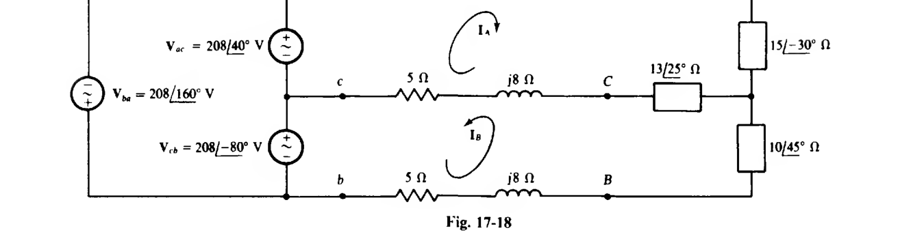
*Fig. 17-18*

**Solution:**

Notice in Fig. 17-18 the use of lowercase letters at the source terminals to distinguish them from the 
load terminals, as is necessary because of the line impedances.

---

#### Problem 17.49  *(page 420)*

**Problem:**

17.49 In a three-wire, ACB circuit in which one phase voltage at the Y-connected source is
Van = 120/ - 30° V, determine the phasor line currents to a A load in which ZAB = 30/ - 40° fi, 
ZBC = 40/30° fi, and ZCA = 35/60 fi. Each line has an impedance of 4 + jl fi.
A good approach is to transform the A to a Y and then use loop analysis. The three A-to-Y 
transformation formulas have the same denominator of
ZAB + zbc + zca = 30/ - 40° + 40/30; + 35/60 = 81.3/214'
With this inserted, the transformation formulas are
(30/-40cK35/60~) _ 1050/20
81.3/224r ~ 81.3/2274
' 81.3/22.4
(30/-40'X40/30:) _ 1200/-10
81.3/22.4' “ 81.3/22.4'
ZABZKC
= 14.8/-32.4 fi
81.3/22.4°
(35/60 X40/30) 1400/90
81.3/22.4 81.3/22.4
zca Zbc
= 17.2/67.6 fi
81.3/22.4°
With the equivalent Y inserted for the A, the circuit is as shown in Fig. 17-19. Because of the ACB phase 
sequence, V,,n leads V,,, by 120c and Vcll lags Von by 120c, as shown.

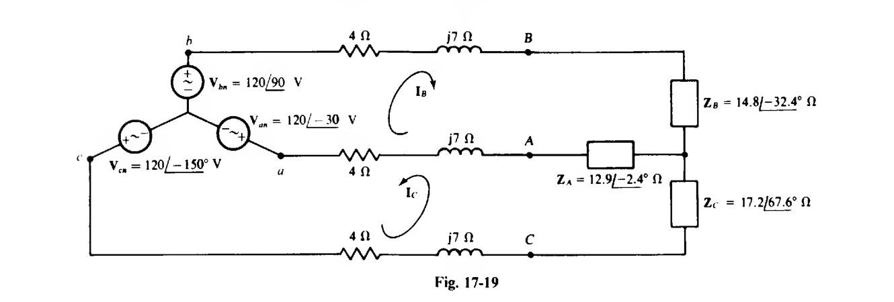
*Fig. 17-19*

---
